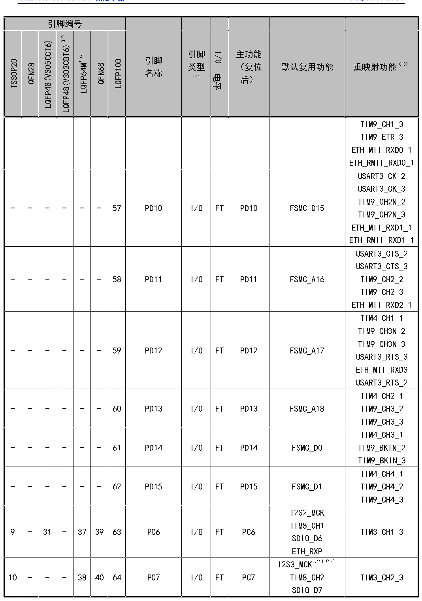

<!-- source-page: 30 -->

[← p.29](0029.md) · [index](../README.md) · [PDF p.30](https://ch32-riscv-ug.github.io/CH32V307/datasheet_zh/CH32V20x_30xDS0.PDF#page=30) · [p.31 →](0031.md)

<!-- header: CH32V303/305/307/317数据手册 https://wch.cn -->

 <!-- p30-cluster-01 uncaptioned graphics, rendered from the PDF; verify at https://ch32-riscv-ug.github.io/CH32V307/datasheet_zh/CH32V20x_30xDS0.PDF#page=30 -->

🖼 Text parsed from the figure above

<!-- p30-table-001 (table-3-1@1) -->
<table><tr><th colspan="7">引脚编号</th><th rowspan="2" style="text-align:left">引脚名称</th><th rowspan="2" style="text-align:left">引脚类型 （1）</th><th rowspan="2">I/O电平</th><th rowspan="2" style="text-align:left">主功能 （复位后）</th><th rowspan="2">默认复用功能</th><th rowspan="2">重映射功能（13）</th></tr><tr><td>TSSOP20</td><td>QFN28</td><td>LQFP48(V305CCT6)</td><td>LQFP48(V303CBT6)(17)</td><td>LQFP64M(17)</td><td>QFN68</td><td>LQFP100</td></tr><tr><td></td><td></td><td></td><td></td><td></td><td></td><td></td><td></td><td></td><td></td><td></td><td></td><td style="text-align:left">TIM9_CH1_3TIM9_ETR_3ETH_MII_RXD0_1ETH_RMII_RXD0_1</td></tr><tr><td>-</td><td>-</td><td>-</td><td>-</td><td>-</td><td>-</td><td>57</td><td>PD10</td><td>I/O</td><td>FT</td><td>PD10</td><td>FSMC_D15</td><td style="text-align:left">USART3_CK_2USART3_CK_3TIM9_CH2N_2TIM9_CH2N_3ETH_MII_RXD1_1ETH_RMII_RXD1_1</td></tr><tr><td>-</td><td>-</td><td>-</td><td>-</td><td>-</td><td>-</td><td>58</td><td>PD11</td><td>I/O</td><td>FT</td><td>PD11</td><td>FSMC_A16</td><td style="text-align:left">USART3_CTS_2USART3_CTS_3TIM9_CH2_2TIM9_CH2_3ETH_MII_RXD2_1</td></tr><tr><td>-</td><td>-</td><td>-</td><td>-</td><td>-</td><td>-</td><td>59</td><td>PD12</td><td>I/O</td><td>FT</td><td>PD12</td><td>FSMC_A17</td><td style="text-align:left">TIM4_CH1_1TIM9_CH3N_2TIM9_CH3N_3USART3_RTS_3ETH_MII_RXD3USART3_RTS_2</td></tr><tr><td>-</td><td>-</td><td>-</td><td>-</td><td>-</td><td>-</td><td>60</td><td>PD13</td><td>I/O</td><td>FT</td><td>PD13</td><td>FSMC_A18</td><td style="text-align:left">TIM4_CH2_1TIM9_CH3_2TIM9_CH3_3</td></tr><tr><td>-</td><td>-</td><td>-</td><td>-</td><td>-</td><td>-</td><td>61</td><td>PD14</td><td>I/O</td><td>FT</td><td>PD14</td><td>FSMC_D0</td><td style="text-align:left">TIM4_CH3_1TIM9_BKIN_2TIM9_BKIN_3</td></tr><tr><td>-</td><td>-</td><td>-</td><td>-</td><td>-</td><td>-</td><td>62</td><td>PD15</td><td>I/O</td><td>FT</td><td>PD15</td><td>FSMC_D1</td><td style="text-align:left">TIM4_CH4_1TIM9_CH4_2TIM9_CH4_3</td></tr><tr><td>9</td><td>-</td><td>31</td><td>-</td><td>37</td><td>39</td><td>63</td><td>PC6</td><td>I/O</td><td>FT</td><td>PC6</td><td style="text-align:left">I2S2_MCKTIM8_CH1SDIO_D6ETH_RXP</td><td>TIM3_CH1_3</td></tr><tr><td>10</td><td>-</td><td>-</td><td>-</td><td>38</td><td>40</td><td>64</td><td>PC7</td><td>I/O</td><td>FT</td><td>PC7</td><td style="text-align:left">I2S3_MCK（11）（12） TIM8_CH2SDIO_D7</td><td>TIM3_CH2_3</td></tr></table>

<!-- image: p30-draw-image-00001 bbox=[500.88, 779.28, 520.32, 789.6] -->
<!-- footer: V3.9 29 -->
