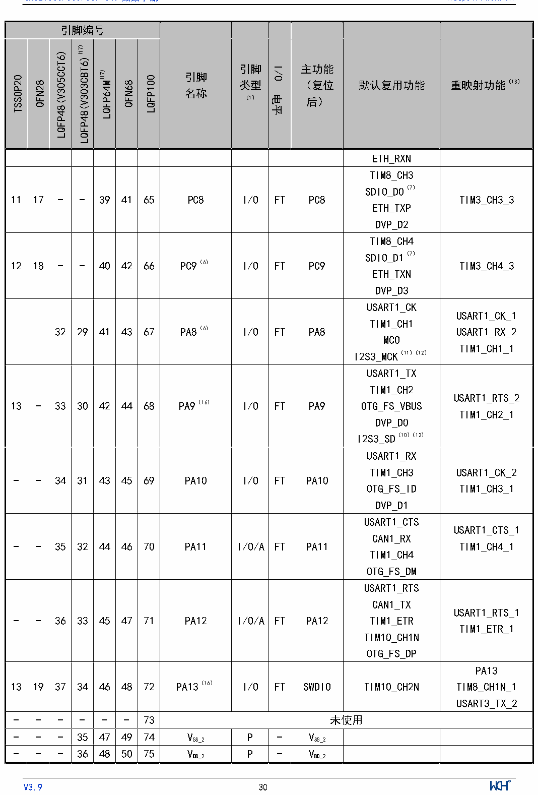

<!-- source-page: 31 -->

[← p.30](0030.md) · [index](../README.md) · [PDF p.31](https://ch32-riscv-ug.github.io/CH32V307/datasheet_zh/CH32V20x_30xDS0.PDF#page=31) · [p.32 →](0032.md)

<!-- header: CH32V303/305/307/317数据手册 https://wch.cn -->

 <!-- p31-cluster-01 uncaptioned graphics, rendered from the PDF; verify at https://ch32-riscv-ug.github.io/CH32V307/datasheet_zh/CH32V20x_30xDS0.PDF#page=31 -->

🖼 Text parsed from the figure above

<!-- p31-table-001 (table-3-1@1) -->
<table><tr><th colspan="7">引脚编号</th><th rowspan="2" style="text-align:left">引脚名称</th><th rowspan="2" style="text-align:left">引脚类型 （1）</th><th rowspan="2">I/O电平</th><th rowspan="2" style="text-align:left">主功能 （复位后）</th><th rowspan="2">默认复用功能</th><th rowspan="2">重映射功能（13）</th></tr><tr><td>TSSOP20</td><td>QFN28</td><td>LQFP48(V305CCT6)</td><td>LQFP48(V303CBT6)(17)</td><td>LQFP64M(17)</td><td>QFN68</td><td>LQFP100</td></tr><tr><td></td><td></td><td></td><td></td><td></td><td></td><td></td><td></td><td></td><td></td><td></td><td>ETH_RXN</td><td></td></tr><tr><td>11</td><td>17</td><td>-</td><td>-</td><td>39</td><td>41</td><td>65</td><td>PC8</td><td>I/O</td><td>FT</td><td>PC8</td><td style="text-align:left">TIM8_CH3SDIO_D0（7） ETH_TXPDVP_D2</td><td>TIM3_CH3_3</td></tr><tr><td>12</td><td>18</td><td>-</td><td>-</td><td>40</td><td>42</td><td>66</td><td>PC9（6）</td><td>I/O</td><td>FT</td><td>PC9</td><td style="text-align:left">TIM8_CH4SDIO_D1（7） ETH_TXNDVP_D3</td><td>TIM3_CH4_3</td></tr><tr><td></td><td></td><td>32</td><td>29</td><td>41</td><td>43</td><td>67</td><td>PA8（6）</td><td>I/O</td><td>FT</td><td>PA8</td><td style="text-align:left">USART1_CKTIM1_CH1MCOI2S3_MCK（11）（12）</td><td style="text-align:left">USART1_CK_1USART1_RX_2TIM1_CH1_1</td></tr><tr><td>13</td><td>-</td><td>33</td><td>30</td><td>42</td><td>44</td><td>68</td><td>PA9（16）</td><td>I/O</td><td>FT</td><td>PA9</td><td style="text-align:left">USART1_TXTIM1_CH2OTG_FS_VBUSDVP_D0I2S3_SD（10）（12）</td><td style="text-align:left">USART1_RTS_2TIM1_CH2_1</td></tr><tr><td>-</td><td>-</td><td>34</td><td>31</td><td>43</td><td>45</td><td>69</td><td>PA10</td><td>I/O</td><td>FT</td><td>PA10</td><td style="text-align:left">USART1_RXTIM1_CH3OTG_FS_IDDVP_D1</td><td style="text-align:left">USART1_CK_2TIM1_CH3_1</td></tr><tr><td>-</td><td>-</td><td>35</td><td>32</td><td>44</td><td>46</td><td>70</td><td>PA11</td><td>I/O/A</td><td>FT</td><td>PA11</td><td style="text-align:left">USART1_CTSCAN1_RXTIM1_CH4OTG_FS_DM</td><td style="text-align:left">USART1_CTS_1TIM1_CH4_1</td></tr><tr><td>-</td><td>-</td><td>36</td><td>33</td><td>45</td><td>47</td><td>71</td><td>PA12</td><td>I/O/A</td><td>FT</td><td>PA12</td><td style="text-align:left">USART1_RTSCAN1_TXTIM1_ETRTIM10_CH1NOTG_FS_DP</td><td style="text-align:left">USART1_RTS_1TIM1_ETR_1</td></tr><tr><td>13</td><td>19</td><td>37</td><td>34</td><td>46</td><td>48</td><td>72</td><td>PA13（16）</td><td>I/O</td><td>FT</td><td>SWDIO</td><td>TIM10_CH2N</td><td style="text-align:left">PA13TIM8_CH1N_1USART3_TX_2</td></tr><tr><td>-</td><td>-</td><td>-</td><td>-</td><td>-</td><td>-</td><td>73</td><td colspan="6">未使用</td></tr><tr><td>-</td><td>-</td><td>-</td><td>35</td><td>47</td><td>49</td><td>74</td><td style="text-align:left">VSS_2</td><td>P</td><td>-</td><td style="text-align:left">VSS_2</td><td></td><td></td></tr><tr><td>-</td><td>-</td><td>-</td><td>36</td><td>48</td><td>50</td><td>75</td><td style="text-align:left">VDD_2</td><td>P</td><td>-</td><td style="text-align:left">VDD_2</td><td></td><td></td></tr></table>

<!-- image: p31-draw-image-00001 inside the figure -->
<!-- footer: V3.9 30 -->

