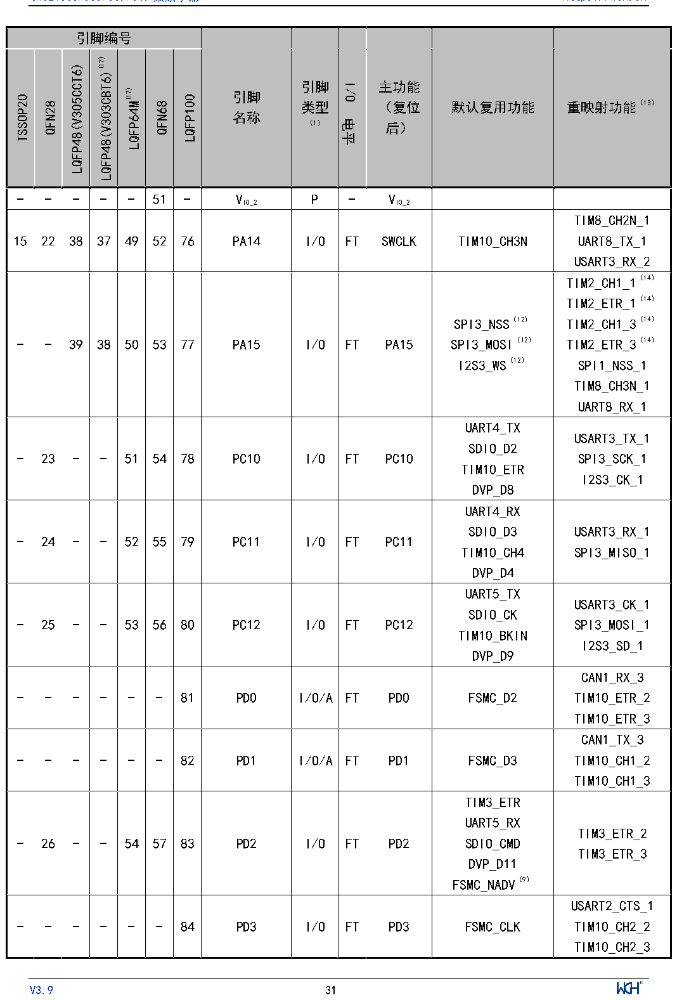

<!-- source-page: 32 -->

[← p.31](0031.md) · [index](../README.md) · [PDF p.32](https://ch32-riscv-ug.github.io/CH32V307/datasheet_zh/CH32V20x_30xDS0.PDF#page=32) · [p.33 →](0033.md)

<!-- header: CH32V303/305/307/317数据手册 https://wch.cn -->

 <!-- p32-cluster-01 uncaptioned graphics, rendered from the PDF; verify at https://ch32-riscv-ug.github.io/CH32V307/datasheet_zh/CH32V20x_30xDS0.PDF#page=32 -->

🖼 Text parsed from the figure above

<!-- p32-table-001 (table-3-1@1) -->
<table><tr><th colspan="7">引脚编号</th><th rowspan="2" style="text-align:left">引脚名称</th><th rowspan="2" style="text-align:left">引脚类型 （1）</th><th rowspan="2">I/O电平</th><th rowspan="2" style="text-align:left">主功能 （复位后）</th><th rowspan="2">默认复用功能</th><th rowspan="2">重映射功能（13）</th></tr><tr><td>TSSOP20</td><td>QFN28</td><td>LQFP48(V305CCT6)</td><td>LQFP48(V303CBT6)(17)</td><td>LQFP64M(17)</td><td>QFN68</td><td>LQFP100</td></tr><tr><td>-</td><td>-</td><td>-</td><td>-</td><td>-</td><td>51</td><td>-</td><td style="text-align:left">VIO_2</td><td>P</td><td>-</td><td style="text-align:left">VIO_2</td><td></td><td></td></tr><tr><td>15</td><td>22</td><td>38</td><td>37</td><td>49</td><td>52</td><td>76</td><td>PA14</td><td>I/O</td><td>FT</td><td>SWCLK</td><td>TIM10_CH3N</td><td style="text-align:left">TIM8_CH2N_1UART8_TX_1USART3_RX_2</td></tr><tr><td>-</td><td>-</td><td>39</td><td>38</td><td>50</td><td>53</td><td>77</td><td>PA15</td><td>I/O</td><td>FT</td><td>PA15</td><td style="text-align:left">SPI3_NSS（12） SPI3_MOSI（12） I2S3_WS（12）</td><td style="text-align:left">TIM2_CH1_1（14） TIM2_ETR_1（14） TIM2_CH1_3（14） TIM2_ETR_3（14） SPI1_NSS_1TIM8_CH3N_1UART8_RX_1</td></tr><tr><td>-</td><td>23</td><td>-</td><td>-</td><td>51</td><td>54</td><td>78</td><td>PC10</td><td>I/O</td><td>FT</td><td>PC10</td><td style="text-align:left">UART4_TXSDIO_D2TIM10_ETRDVP_D8</td><td style="text-align:left">USART3_TX_1SPI3_SCK_1I2S3_CK_1</td></tr><tr><td>-</td><td>24</td><td>-</td><td>-</td><td>52</td><td>55</td><td>79</td><td>PC11</td><td>I/O</td><td>FT</td><td>PC11</td><td style="text-align:left">UART4_RXSDIO_D3TIM10_CH4DVP_D4</td><td style="text-align:left">USART3_RX_1SPI3_MISO_1</td></tr><tr><td>-</td><td>25</td><td>-</td><td>-</td><td>53</td><td>56</td><td>80</td><td>PC12</td><td>I/O</td><td>FT</td><td>PC12</td><td style="text-align:left">UART5_TXSDIO_CKTIM10_BKINDVP_D9</td><td style="text-align:left">USART3_CK_1SPI3_MOSI_1I2S3_SD_1</td></tr><tr><td>-</td><td>-</td><td>-</td><td>-</td><td>-</td><td>-</td><td>81</td><td>PD0</td><td>I/O/A</td><td>FT</td><td>PD0</td><td>FSMC_D2</td><td style="text-align:left">CAN1_RX_3TIM10_ETR_2TIM10_ETR_3</td></tr><tr><td>-</td><td>-</td><td>-</td><td>-</td><td>-</td><td>-</td><td>82</td><td>PD1</td><td>I/O/A</td><td>FT</td><td>PD1</td><td>FSMC_D3</td><td style="text-align:left">CAN1_TX_3TIM10_CH1_2TIM10_CH1_3</td></tr><tr><td>-</td><td>26</td><td>-</td><td>-</td><td>54</td><td>57</td><td>83</td><td>PD2</td><td>I/O</td><td>FT</td><td>PD2</td><td style="text-align:left">TIM3_ETRUART5_RXSDIO_CMDDVP_D11FSMC_NADV（9）</td><td style="text-align:left">TIM3_ETR_2TIM3_ETR_3</td></tr><tr><td>-</td><td>-</td><td>-</td><td>-</td><td>-</td><td>-</td><td>84</td><td>PD3</td><td>I/O</td><td>FT</td><td>PD3</td><td>FSMC_CLK</td><td style="text-align:left">USART2_CTS_1TIM10_CH2_2TIM10_CH2_3</td></tr></table>

<!-- image: p32-draw-image-00001 inside the figure -->
<!-- footer: V3.9 31 -->

