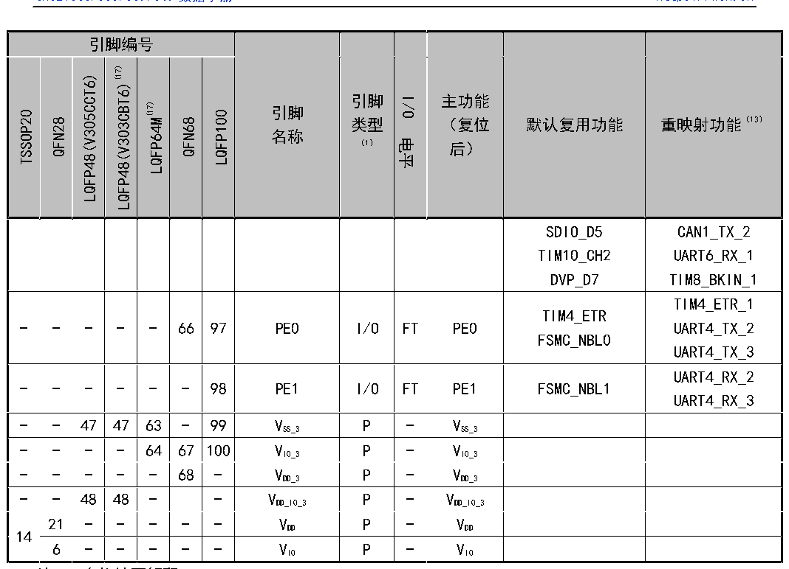

<!-- source-page: 34 -->

[← p.33](0033.md) · [index](../README.md) · [PDF p.34](https://ch32-riscv-ug.github.io/CH32V307/datasheet_zh/CH32V20x_30xDS0.PDF#page=34) · [p.35 →](0035.md)

<!-- header: CH32V303/305/307/317数据手册 https://wch.cn -->

 <!-- p34-cluster-01 uncaptioned graphics, rendered from the PDF; verify at https://ch32-riscv-ug.github.io/CH32V307/datasheet_zh/CH32V20x_30xDS0.PDF#page=34 -->

🖼 Text parsed from the figure above

<!-- p34-table-001 (table-3-1@1) -->
<table><tr><th colspan="7">引脚编号</th><th rowspan="2" style="text-align:left">引脚名称</th><th rowspan="2" style="text-align:left">引脚类型 （1）</th><th rowspan="2">I/O电平</th><th rowspan="2" style="text-align:left">主功能 （复位后）</th><th rowspan="2">默认复用功能</th><th rowspan="2">重映射功能（13）</th></tr><tr><td>TSSOP20</td><td>QFN28</td><td>LQFP48(V305CCT6)</td><td>LQFP48(V303CBT6)(17)</td><td>LQFP64M(17)</td><td>QFN68</td><td>LQFP100</td></tr><tr><td></td><td></td><td></td><td></td><td></td><td></td><td></td><td></td><td></td><td></td><td></td><td style="text-align:left">SDIO_D5TIM10_CH2DVP_D7</td><td style="text-align:left">CAN1_TX_2UART6_RX_1TIM8_BKIN_1</td></tr><tr><td>-</td><td>-</td><td>-</td><td>-</td><td>-</td><td>66</td><td>97</td><td>PE0</td><td>I/O</td><td>FT</td><td>PE0</td><td style="text-align:left">TIM4_ETRFSMC_NBL0</td><td style="text-align:left">TIM4_ETR_1UART4_TX_2UART4_TX_3</td></tr><tr><td>-</td><td>-</td><td>-</td><td>-</td><td>-</td><td>-</td><td>98</td><td>PE1</td><td>I/O</td><td>FT</td><td>PE1</td><td>FSMC_NBL1</td><td style="text-align:left">UART4_RX_2UART4_RX_3</td></tr><tr><td>-</td><td>-</td><td>47</td><td>47</td><td>63</td><td>-</td><td>99</td><td style="text-align:left">VSS_3</td><td>P</td><td>-</td><td style="text-align:left">VSS_3</td><td></td><td></td></tr><tr><td>-</td><td>-</td><td>-</td><td>-</td><td>64</td><td>67</td><td>100</td><td style="text-align:left">VIO_3</td><td>P</td><td>-</td><td style="text-align:left">VIO_3</td><td></td><td></td></tr><tr><td>-</td><td>-</td><td>-</td><td>-</td><td>-</td><td>68</td><td>-</td><td style="text-align:left">VDD_3</td><td>P</td><td>-</td><td style="text-align:left">VDD_3</td><td></td><td></td></tr><tr><td>-</td><td>-</td><td>48</td><td>48</td><td>-</td><td></td><td>-</td><td style="text-align:left">VDD_IO_3</td><td>P</td><td>-</td><td style="text-align:left">VDD_IO_3</td><td></td><td></td></tr><tr><td rowspan="2">14</td><td>21</td><td>-</td><td>-</td><td>-</td><td>-</td><td>-</td><td style="text-align:left">VDD</td><td>P</td><td>-</td><td style="text-align:left">VDD</td><td></td><td></td></tr><tr><td>6</td><td>-</td><td>-</td><td>-</td><td>-</td><td>-</td><td style="text-align:left">VIO</td><td>P</td><td>-</td><td style="text-align:left">VIO</td><td></td><td></td></tr></table>

6 - - - - - VIO P - VIO  

注1：表格缩写解释：  
I = TTL/CMOS电平斯密特输入；O = CMOS电平三态输出；A = 模拟信号输入或输出；  
P = 电源；FT = 耐受5V；ANT = 射频信号输入输出（天线）。  
注2：VDD 和VBAT 均可连接内部模拟开关为备份区域以及PC13、PC14和PC15引脚供电，这个模拟开关只能够  
通过有限的电流(3mA)。当由VDD 供电时：PC14和PC15可用于GPIO或LSE引脚、PC13可作为通用I/O口、  
TAMPER引脚、RTC校准时钟、RTC闹钟或秒输出；PC13、PC14和PC15作为GPIO输出脚时只能工作在2MHz  
模式下，最大驱动负载为30pF，并且不能作为电流源(如驱动LED)。而当由VBAT 供电时：PC14和PC15  
只能用于LSE引脚、PC13可作为TAMPER引脚、RTC闹钟或秒输出。  
注3：这些引脚在备份区域第一次上电时处于主功能状态下，之后即使复位，这些引脚的状态由备份区  
域寄存器控制（这些寄存器不会被主复位系统所复位）。关于如何控制这些IO口的具体信息，请参  
考CH32FV2x_V3xRM手册的电池备份区域和BKP寄存器的相关章节。  
注4：LQFP64M封装的引脚5和引脚6在芯片复位后默认配置为OSC_IN和OSC_OUT功能脚。软件可以重新设  
置这两个引脚为PD0和PD1功能。但对于LQFP100封装，由于PD0和PD1为固有的功能引脚，因此没有  
必要再由软件进行重映射设置。更多详细信息请参考CH32FV2x_V3xRM手册的复用功能I/O章节和调  
试设置章节。  
注5：BOOT0和BOOT1/PB2引脚都未引出的芯片，在内部BOOT0引脚已短接到GND，BOOT1/PB2引脚浮空，低  
功耗情况下，建议配置PB2为下拉输入模式，以防止产生额外电流。  
BOOT1/PB2引脚引出但BOOT0引脚未引出的芯片，在内部BOOT0引脚已短接到GND。  
BOOT0引脚引出但BOOT1/PB2引脚未引出的芯片，在内部BOOT1/PB2引脚已短接到GND，低功耗情况下，建  
议配置PB2下拉输入模式，以防止产生额外电流。  
注6：对于CH32V305FBP6和CH32V305GBU6芯片，PA8和PC9引脚在芯片内部短接合封，禁止将两个IO均配  
置为输出功能，有功耗要求的注意引脚状态。  
注7：SDIO_D0和SDIO_D1默认映射到PC8和PC9。仅对于批号倒数第五位大于1，或批号倒数第六位不为0  
<!-- image: p34-draw-image-00001 bbox=[500.88, 779.28, 520.32, 789.6] -->
<!-- footer: V3.9 33 -->
