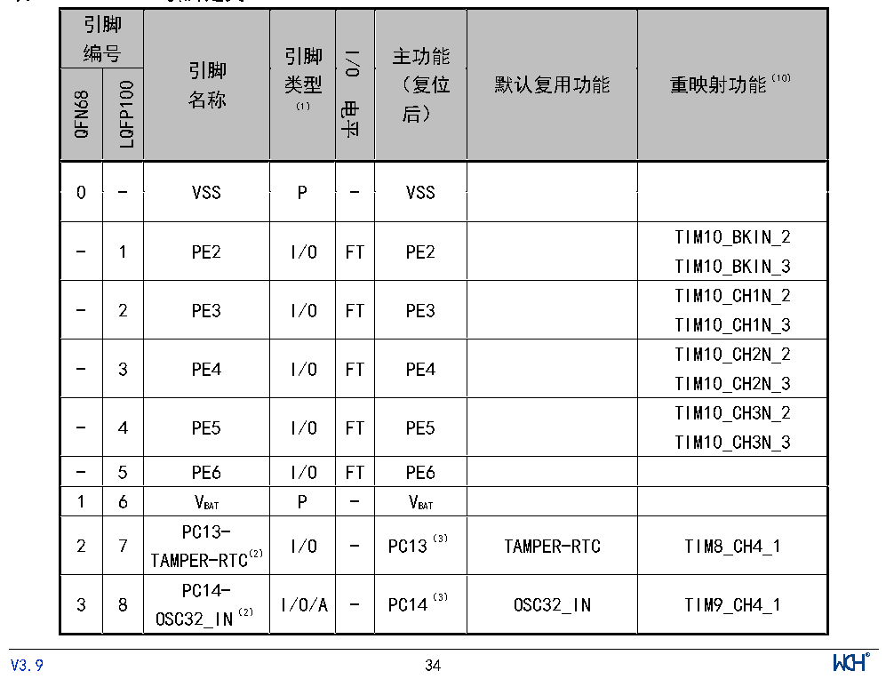

<!-- source-page: 35 -->

[← p.34](0034.md) · [index](../README.md) · [PDF p.35](https://ch32-riscv-ug.github.io/CH32V307/datasheet_zh/CH32V20x_30xDS0.PDF#page=35) · [p.36 →](0036.md)

<!-- header: CH32V303/305/307/317数据手册 https://wch.cn -->

<!-- p35-table-001 (table-3-1@1) -->
<table><tr><th colspan="2" style="text-align:left">的产品（除CH32V305GBU6芯片以外），当寄存器RCC_HBPCENR的bit[14]ETHMACEN=1与</th></tr><tr><td style="text-align:left">bit[10]SDIOEN=1时，SDIO_D0和SDIO_D1默认映射自动改到PB14和PB15。</td><td></td></tr></table>

<!-- p35-table-002 (table-3-1@1) -->
<table><tr><th colspan="3" style="text-align:left">注8：DVP_D5默认映射到PB6。仅对于批号倒数第五位大于1，或批号倒数第六位不为0的产品，当寄存器</th></tr><tr><td></td><td colspan="2" style="text-align:left">RCC_HBPCENR的bit[13]DVPEN=1与bit[11]USBHSEN=1且R8_USB_CTRL的bit[2]RB_UC_RST_SIE=0时，</td></tr><tr><td></td><td>DVP_D5默认映射自动改到PB3。</td><td></td></tr></table>

<!-- p35-table-003 (table-3-1@1) -->
<table><tr><th colspan="3" style="text-align:left">注9：FSMC_NADV默认映射到PB7。仅对于批号倒数第五位大于1，或批号倒数第六位不为0的产品，当寄</th></tr><tr><td></td><td colspan="2" style="text-align:left">存器RCC_HBPCENR的bit[8]FSMCEN=1与bit[11]USBHSEN=1且R8_USB_CTRL的bit[2]RB_UC_RST_SIE=0</td></tr><tr><td></td><td>时，FSMC_NADV默认映射自动改到PD2。</td><td></td></tr></table>

注10：I2S3_SD默认映射到PB5。仅对于批号倒数第五位大于2，或批号倒数第六位不为0的产品，如果同  
时使用10M以太网和I2S3功能，则I2S3_SD默认映射自动改到PA9。  
注11：I2S3_MCK默认映射到PC7。仅对于批号倒数第五位大于2，或批号倒数第六位不为0的产品，如果  
同时使用10M以太网和I2S3功能，则I2S3_MCK默认映射自动改到PA8。  

<!-- p35-table-004 (table-3-1@1) -->
<table><tr><th colspan="3" style="text-align:left">注12：SPI3_MOSI默认映射到PB5。仅对于批号倒数第五位为2，且批号倒数第六位为0的产品，当使用以</th></tr><tr><td></td><td colspan="2" style="text-align:left">太网时，I2S3默认引脚功能不可用，SPI3默认引脚的片选信号不可用，此时SPI3_MOSI默认映射自</td></tr><tr><td></td><td>动改到PA15。</td><td></td></tr></table>

注13：重映射功能下划线后的数值表示AFIO寄存器中相对应位的配置值。例如：UART4_RX_3表示AFIO  
寄存器相应位配置为11b。  
注14：TIM2_CH1和TIM2_ETR共用一个引脚，但不能同时使用。  
注15、注16：对于CH32V305FBP6芯片，PA5和PA1引脚在芯片内部短接合封，禁止将两个IO均配置为输出  
功能；PA9和PA13引脚在芯片内部短接合封，禁止将两个IO均配置为输出功能；有功耗要求的注意  
引脚状态。  
注17：CH32V303CBT6和CH32V303RBT6芯片均不支持TIM8。  

 <!-- p35-cluster-01 uncaptioned graphics, rendered from the PDF; verify at https://ch32-riscv-ug.github.io/CH32V307/datasheet_zh/CH32V20x_30xDS0.PDF#page=35 -->

🖼 Text parsed from the figure above

<!-- p35-table-005 (table-3-2@1) -->
<table><caption>表3-2 CH32V317引脚定义</caption><tr><th colspan="2" style="text-align:left">引脚编号</th><th rowspan="2" style="text-align:left">引脚名称</th><th rowspan="2" style="text-align:left">引脚类型 （1）</th><th rowspan="2">I/O电平</th><th rowspan="2" style="text-align:left">主功能 （复位后）</th><th rowspan="2">默认复用功能</th><th rowspan="2">重映射功能（10）</th></tr><tr><td>QFN68</td><td>LQFP100</td></tr><tr><td>0</td><td>-</td><td>VSS</td><td>P</td><td>-</td><td>VSS</td><td></td><td></td></tr><tr><td>-</td><td>1</td><td>PE2</td><td>I/O</td><td>FT</td><td>PE2</td><td></td><td style="text-align:left">TIM10_BKIN_2TIM10_BKIN_3</td></tr><tr><td>-</td><td>2</td><td>PE3</td><td>I/O</td><td>FT</td><td>PE3</td><td></td><td style="text-align:left">TIM10_CH1N_2TIM10_CH1N_3</td></tr><tr><td>-</td><td>3</td><td>PE4</td><td>I/O</td><td>FT</td><td>PE4</td><td></td><td style="text-align:left">TIM10_CH2N_2TIM10_CH2N_3</td></tr><tr><td>-</td><td>4</td><td>PE5</td><td>I/O</td><td>FT</td><td>PE5</td><td></td><td style="text-align:left">TIM10_CH3N_2TIM10_CH3N_3</td></tr><tr><td>-</td><td>5</td><td>PE6</td><td>I/O</td><td>FT</td><td>PE6</td><td></td><td></td></tr><tr><td>1</td><td>6</td><td style="text-align:left">VBAT</td><td>P</td><td>-</td><td style="text-align:left">VBAT</td><td></td><td></td></tr><tr><td>2</td><td>7</td><td style="text-align:left">PC13- TAMPER-RTC（2）</td><td>I/O</td><td>-</td><td>PC13（3）</td><td>TAMPER-RTC</td><td>TIM8_CH4_1</td></tr><tr><td>3</td><td>8</td><td style="text-align:left">PC14- OSC32_IN（2）</td><td>I/O/A</td><td>-</td><td>PC14（3）</td><td>OSC32_IN</td><td>TIM9_CH4_1</td></tr></table>

1 6 VBAT P - VBAT  
<!-- image: p35-draw-image-00001 inside the figure -->
<!-- footer: V3.9 34 -->

