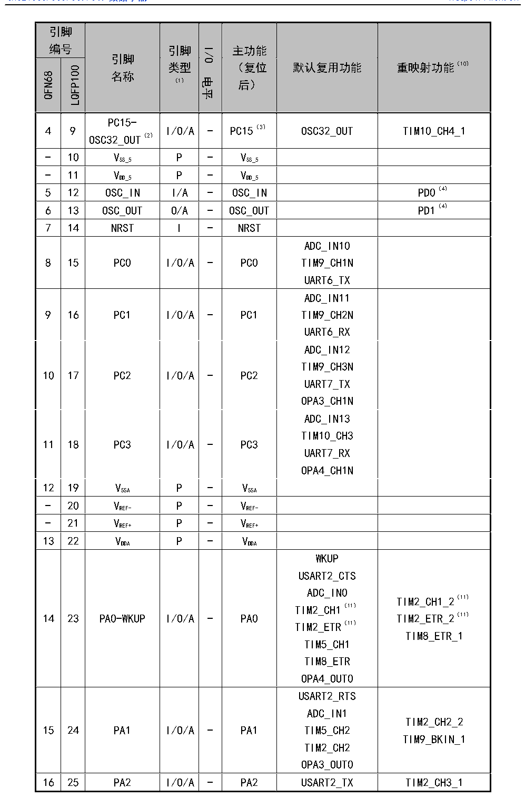

<!-- source-page: 36 -->

[← p.35](0035.md) · [index](../README.md) · [PDF p.36](https://ch32-riscv-ug.github.io/CH32V307/datasheet_zh/CH32V20x_30xDS0.PDF#page=36) · [p.37 →](0037.md)

<!-- header: CH32V303/305/307/317数据手册 https://wch.cn -->

 <!-- p36-cluster-01 uncaptioned graphics, rendered from the PDF; verify at https://ch32-riscv-ug.github.io/CH32V307/datasheet_zh/CH32V20x_30xDS0.PDF#page=36 -->

🖼 Text parsed from the figure above

<!-- p36-table-001 (table-3-2@1) -->
<table><tr><th colspan="2" style="text-align:left">引脚编号</th><th rowspan="2" style="text-align:left">引脚名称</th><th rowspan="2" style="text-align:left">引脚类型 （1）</th><th rowspan="2">I/O电平</th><th rowspan="2" style="text-align:left">主功能 （复位后）</th><th rowspan="2">默认复用功能</th><th rowspan="2">重映射功能（10）</th></tr><tr><td>QFN68</td><td>LQFP100</td></tr><tr><td>4</td><td>9</td><td style="text-align:left">PC15- OSC32_OUT（2）</td><td>I/O/A</td><td>-</td><td>PC15（3）</td><td>OSC32_OUT</td><td>TIM10_CH4_1</td></tr><tr><td>-</td><td>10</td><td style="text-align:left">VSS_5</td><td>P</td><td>-</td><td style="text-align:left">VSS_5</td><td></td><td></td></tr><tr><td>-</td><td>11</td><td style="text-align:left">VDD_5</td><td>P</td><td>-</td><td style="text-align:left">VDD_5</td><td></td><td></td></tr><tr><td>5</td><td>12</td><td>OSC_IN</td><td>I/A</td><td>-</td><td>OSC_IN</td><td></td><td>PD0（4）</td></tr><tr><td>6</td><td>13</td><td>OSC_OUT</td><td>O/A</td><td>-</td><td>OSC_OUT</td><td></td><td>PD1（4）</td></tr><tr><td>7</td><td>14</td><td>NRST</td><td>I</td><td>-</td><td>NRST</td><td></td><td></td></tr><tr><td>8</td><td>15</td><td>PC0</td><td>I/O/A</td><td>-</td><td>PC0</td><td style="text-align:left">ADC_IN10TIM9_CH1NUART6_TX</td><td></td></tr><tr><td>9</td><td>16</td><td>PC1</td><td>I/O/A</td><td>-</td><td>PC1</td><td style="text-align:left">ADC_IN11TIM9_CH2NUART6_RX</td><td></td></tr><tr><td>10</td><td>17</td><td>PC2</td><td>I/O/A</td><td>-</td><td>PC2</td><td style="text-align:left">ADC_IN12TIM9_CH3NUART7_TXOPA3_CH1N</td><td></td></tr><tr><td>11</td><td>18</td><td>PC3</td><td>I/O/A</td><td>-</td><td>PC3</td><td style="text-align:left">ADC_IN13TIM10_CH3UART7_RXOPA4_CH1N</td><td></td></tr><tr><td>12</td><td>19</td><td style="text-align:left">VSSA</td><td>P</td><td>-</td><td style="text-align:left">VSSA</td><td></td><td></td></tr><tr><td>-</td><td>20</td><td style="text-align:left">VREF-</td><td>P</td><td>-</td><td style="text-align:left">VREF-</td><td></td><td></td></tr><tr><td>-</td><td>21</td><td style="text-align:left">VREF+</td><td>P</td><td>-</td><td style="text-align:left">VREF+</td><td></td><td></td></tr><tr><td>13</td><td>22</td><td style="text-align:left">VDDA</td><td>P</td><td>-</td><td style="text-align:left">VDDA</td><td></td><td></td></tr><tr><td>14</td><td>23</td><td>PA0-WKUP</td><td>I/O/A</td><td>-</td><td>PA0</td><td style="text-align:left">WKUPUSART2_CTSADC_IN0TIM2_CH1（11） TIM2_ETR（11） TIM5_CH1TIM8_ETROPA4_OUT0</td><td style="text-align:left">TIM2_CH1_2（11） TIM2_ETR_2（11） TIM8_ETR_1</td></tr><tr><td>15</td><td>24</td><td>PA1</td><td>I/O/A</td><td>-</td><td>PA1</td><td style="text-align:left">USART2_RTSADC_IN1TIM5_CH2TIM2_CH2OPA3_OUT0</td><td style="text-align:left">TIM2_CH2_2TIM9_BKIN_1</td></tr><tr><td>16</td><td>25</td><td>PA2</td><td>I/O/A</td><td>-</td><td>PA2</td><td>USART2_TX</td><td>TIM2_CH3_1</td></tr></table>

<!-- image: p36-draw-image-00001 bbox=[500.88, 779.28, 520.32, 789.6] -->
<!-- footer: V3.9 35 -->
