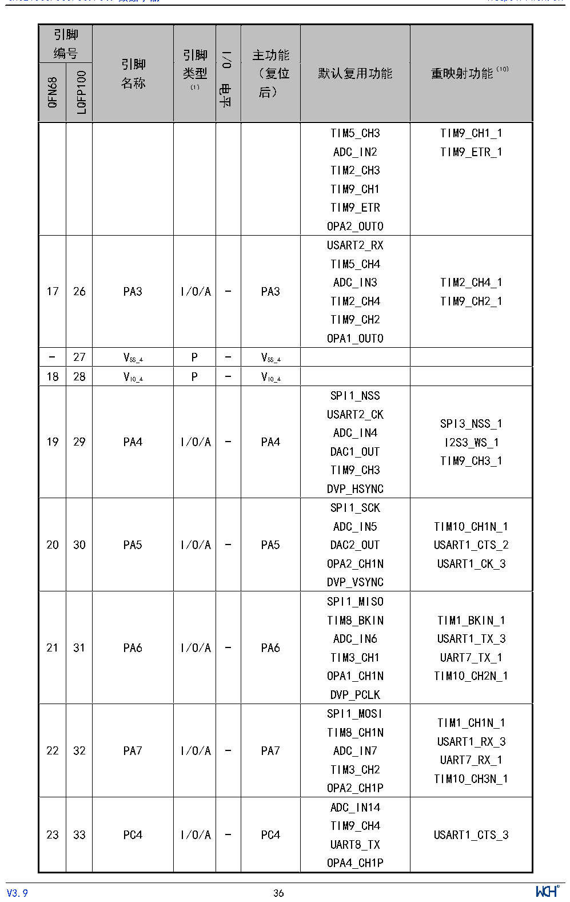

<!-- source-page: 37 -->

[← p.36](0036.md) · [index](../README.md) · [PDF p.37](https://ch32-riscv-ug.github.io/CH32V307/datasheet_zh/CH32V20x_30xDS0.PDF#page=37) · [p.38 →](0038.md)

<!-- header: CH32V303/305/307/317数据手册 https://wch.cn -->

 <!-- p37-cluster-01 uncaptioned graphics, rendered from the PDF; verify at https://ch32-riscv-ug.github.io/CH32V307/datasheet_zh/CH32V20x_30xDS0.PDF#page=37 -->

🖼 Text parsed from the figure above

<!-- p37-table-001 (table-3-2@1) -->
<table><tr><th colspan="2" style="text-align:left">引脚编号</th><th rowspan="2" style="text-align:left">引脚名称</th><th rowspan="2" style="text-align:left">引脚类型 （1）</th><th rowspan="2">I/O电平</th><th rowspan="2" style="text-align:left">主功能 （复位后）</th><th rowspan="2">默认复用功能</th><th rowspan="2">重映射功能（10）</th></tr><tr><td>QFN68</td><td>LQFP100</td></tr><tr><td></td><td></td><td></td><td></td><td></td><td></td><td style="text-align:left">TIM5_CH3ADC_IN2TIM2_CH3TIM9_CH1TIM9_ETROPA2_OUT0</td><td style="text-align:left">TIM9_CH1_1TIM9_ETR_1</td></tr><tr><td>17</td><td>26</td><td>PA3</td><td>I/O/A</td><td>-</td><td>PA3</td><td style="text-align:left">USART2_RXTIM5_CH4ADC_IN3TIM2_CH4TIM9_CH2OPA1_OUT0</td><td style="text-align:left">TIM2_CH4_1TIM9_CH2_1</td></tr><tr><td>-</td><td>27</td><td style="text-align:left">VSS_4</td><td>P</td><td>-</td><td style="text-align:left">VSS_4</td><td></td><td></td></tr><tr><td>18</td><td>28</td><td style="text-align:left">VIO_4</td><td>P</td><td>-</td><td style="text-align:left">VIO_4</td><td></td><td></td></tr><tr><td>19</td><td>29</td><td>PA4</td><td>I/O/A</td><td>-</td><td>PA4</td><td style="text-align:left">SPI1_NSSUSART2_CKADC_IN4DAC1_OUTTIM9_CH3DVP_HSYNC</td><td style="text-align:left">SPI3_NSS_1I2S3_WS_1TIM9_CH3_1</td></tr><tr><td>20</td><td>30</td><td>PA5</td><td>I/O/A</td><td>-</td><td>PA5</td><td style="text-align:left">SPI1_SCKADC_IN5DAC2_OUTOPA2_CH1NDVP_VSYNC</td><td style="text-align:left">TIM10_CH1N_1USART1_CTS_2USART1_CK_3</td></tr><tr><td>21</td><td>31</td><td>PA6</td><td>I/O/A</td><td>-</td><td>PA6</td><td style="text-align:left">SPI1_MISOTIM8_BKINADC_IN6TIM3_CH1OPA1_CH1NDVP_PCLK</td><td style="text-align:left">TIM1_BKIN_1USART1_TX_3UART7_TX_1TIM10_CH2N_1</td></tr><tr><td>22</td><td>32</td><td>PA7</td><td>I/O/A</td><td>-</td><td>PA7</td><td style="text-align:left">SPI1_MOSITIM8_CH1NADC_IN7TIM3_CH2OPA2_CH1P</td><td style="text-align:left">TIM1_CH1N_1USART1_RX_3UART7_RX_1TIM10_CH3N_1</td></tr><tr><td>23</td><td>33</td><td>PC4</td><td>I/O/A</td><td>-</td><td>PC4</td><td style="text-align:left">ADC_IN14TIM9_CH4UART8_TXOPA4_CH1P</td><td>USART1_CTS_3</td></tr></table>

<!-- image: p37-draw-image-00001 inside the figure -->
<!-- footer: V3.9 36 -->

