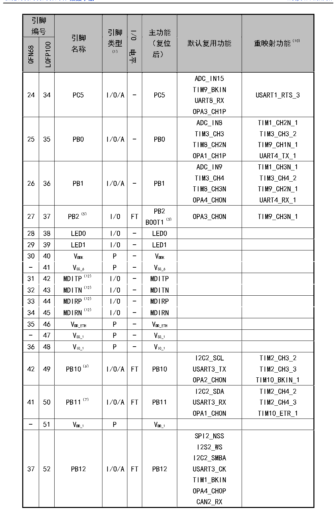

<!-- source-page: 38 -->

[← p.37](0037.md) · [index](../README.md) · [PDF p.38](https://ch32-riscv-ug.github.io/CH32V307/datasheet_zh/CH32V20x_30xDS0.PDF#page=38) · [p.39 →](0039.md)

<!-- header: CH32V303/305/307/317数据手册 https://wch.cn -->

 <!-- p38-cluster-01 uncaptioned graphics, rendered from the PDF; verify at https://ch32-riscv-ug.github.io/CH32V307/datasheet_zh/CH32V20x_30xDS0.PDF#page=38 -->

🖼 Text parsed from the figure above

<!-- p38-table-001 (table-3-2@1) -->
<table><tr><th colspan="2" style="text-align:left">引脚编号</th><th rowspan="2" style="text-align:left">引脚名称</th><th rowspan="2" style="text-align:left">引脚类型 （1）</th><th rowspan="2">I/O电平</th><th rowspan="2" style="text-align:left">主功能 （复位后）</th><th rowspan="2">默认复用功能</th><th rowspan="2">重映射功能（10）</th></tr><tr><td>QFN68</td><td>LQFP100</td></tr><tr><td>24</td><td>34</td><td>PC5</td><td>I/O/A</td><td>-</td><td>PC5</td><td style="text-align:left">ADC_IN15TIM9_BKINUART8_RXOPA3_CH1P</td><td>USART1_RTS_3</td></tr><tr><td>25</td><td>35</td><td>PB0</td><td>I/O/A</td><td>-</td><td>PB0</td><td style="text-align:left">ADC_IN8TIM3_CH3TIM8_CH2NOPA1_CH1P</td><td style="text-align:left">TIM1_CH2N_1TIM3_CH3_2TIM9_CH1N_1UART4_TX_1</td></tr><tr><td>26</td><td>36</td><td>PB1</td><td>I/O/A</td><td>-</td><td>PB1</td><td style="text-align:left">ADC_IN9TIM3_CH4TIM8_CH3NOPA4_CH0N</td><td style="text-align:left">TIM1_CH3N_1TIM3_CH4_2TIM9_CH2N_1UART4_RX_1</td></tr><tr><td>27</td><td>37</td><td>PB2（5）</td><td>I/O</td><td>FT</td><td style="text-align:left">PB2BOOT1（5）</td><td>OPA3_CH0N</td><td>TIM9_CH3N_1</td></tr><tr><td>28</td><td>38</td><td>LED0</td><td>I/O</td><td>-</td><td>LED0</td><td></td><td></td></tr><tr><td>29</td><td>39</td><td>LED1</td><td>I/O</td><td>-</td><td>LED1</td><td></td><td></td></tr><tr><td>30</td><td>40</td><td style="text-align:left">VDDK</td><td>P</td><td>-</td><td style="text-align:left">VDDK</td><td></td><td></td></tr><tr><td>-</td><td>41</td><td style="text-align:left">VSS_6</td><td>P</td><td>-</td><td style="text-align:left">VSS_6</td><td></td><td></td></tr><tr><td>31</td><td>42</td><td>MDITP（12）</td><td>I/O</td><td>-</td><td>MDITP</td><td></td><td></td></tr><tr><td>32</td><td>43</td><td>MDITN（12）</td><td>I/O</td><td>-</td><td>MDITN</td><td></td><td></td></tr><tr><td>33</td><td>44</td><td>MDIRP（12）</td><td>I/O</td><td>-</td><td>MDIRP</td><td></td><td></td></tr><tr><td>34</td><td>45</td><td>MDIRN（12）</td><td>I/O</td><td>-</td><td>MDIRN</td><td></td><td></td></tr><tr><td>35</td><td>46</td><td style="text-align:left">VDD_ETH</td><td>P</td><td>-</td><td style="text-align:left">VDD_ETH</td><td></td><td></td></tr><tr><td>-</td><td>47</td><td style="text-align:left">VSS_1</td><td>P</td><td>-</td><td style="text-align:left">VSS_1</td><td></td><td></td></tr><tr><td>36</td><td>48</td><td style="text-align:left">VIO_1</td><td>P</td><td>-</td><td style="text-align:left">VIO_1</td><td></td><td></td></tr><tr><td>42</td><td>49</td><td>PB10（6）</td><td>I/O/A</td><td>FT</td><td>PB10</td><td style="text-align:left">I2C2_SCLUSART3_TXOPA2_CH0N</td><td style="text-align:left">TIM2_CH3_2TIM2_CH3_3TIM10_BKIN_1</td></tr><tr><td>41</td><td>50</td><td>PB11（7）</td><td>I/O/A</td><td>FT</td><td>PB11</td><td style="text-align:left">I2C2_SDAUSART3_RXOPA1_CH0N</td><td style="text-align:left">TIM2_CH4_2TIM2_CH4_3TIM10_ETR_1</td></tr><tr><td>-</td><td>51</td><td style="text-align:left">VDD_1</td><td>P</td><td></td><td style="text-align:left">VDD_1</td><td></td><td></td></tr><tr><td>37</td><td>52</td><td>PB12</td><td>I/O/A</td><td>FT</td><td>PB12</td><td style="text-align:left">SPI2_NSSI2S2_WSI2C2_SMBAUSART3_CKTIM1_BKINOPA4_CH0PCAN2_RX</td><td></td></tr></table>

<!-- image: p38-draw-image-00001 bbox=[500.88, 779.28, 520.32, 789.6] -->
<!-- footer: V3.9 37 -->
