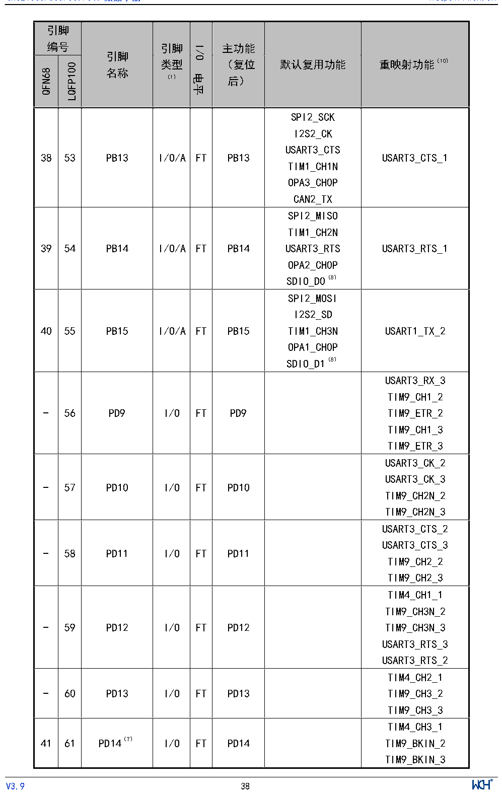

<!-- source-page: 39 -->

[← p.38](0038.md) · [index](../README.md) · [PDF p.39](https://ch32-riscv-ug.github.io/CH32V307/datasheet_zh/CH32V20x_30xDS0.PDF#page=39) · [p.40 →](0040.md)

<!-- header: CH32V303/305/307/317数据手册 https://wch.cn -->

 <!-- p39-cluster-01 uncaptioned graphics, rendered from the PDF; verify at https://ch32-riscv-ug.github.io/CH32V307/datasheet_zh/CH32V20x_30xDS0.PDF#page=39 -->

🖼 Text parsed from the figure above

<!-- p39-table-001 (table-3-2@1) -->
<table><tr><th colspan="2" style="text-align:left">引脚编号</th><th rowspan="2" style="text-align:left">引脚名称</th><th rowspan="2" style="text-align:left">引脚类型 （1）</th><th rowspan="2">I/O电平</th><th rowspan="2" style="text-align:left">主功能 （复位后）</th><th rowspan="2">默认复用功能</th><th rowspan="2">重映射功能（10）</th></tr><tr><td>QFN68</td><td>LQFP100</td></tr><tr><td>38</td><td>53</td><td>PB13</td><td>I/O/A</td><td>FT</td><td>PB13</td><td style="text-align:left">SPI2_SCKI2S2_CKUSART3_CTSTIM1_CH1NOPA3_CH0PCAN2_TX</td><td>USART3_CTS_1</td></tr><tr><td>39</td><td>54</td><td>PB14</td><td>I/O/A</td><td>FT</td><td>PB14</td><td style="text-align:left">SPI2_MISOTIM1_CH2NUSART3_RTSOPA2_CH0PSDIO_D0（8）</td><td>USART3_RTS_1</td></tr><tr><td>40</td><td>55</td><td>PB15</td><td>I/O/A</td><td>FT</td><td>PB15</td><td style="text-align:left">SPI2_MOSII2S2_SDTIM1_CH3NOPA1_CH0PSDIO_D1（8）</td><td>USART1_TX_2</td></tr><tr><td>-</td><td>56</td><td>PD9</td><td>I/O</td><td>FT</td><td>PD9</td><td></td><td style="text-align:left">USART3_RX_3TIM9_CH1_2TIM9_ETR_2TIM9_CH1_3TIM9_ETR_3</td></tr><tr><td>-</td><td>57</td><td>PD10</td><td>I/O</td><td>FT</td><td>PD10</td><td></td><td style="text-align:left">USART3_CK_2USART3_CK_3TIM9_CH2N_2TIM9_CH2N_3</td></tr><tr><td>-</td><td>58</td><td>PD11</td><td>I/O</td><td>FT</td><td>PD11</td><td></td><td style="text-align:left">USART3_CTS_2USART3_CTS_3TIM9_CH2_2TIM9_CH2_3</td></tr><tr><td>-</td><td>59</td><td>PD12</td><td>I/O</td><td>FT</td><td>PD12</td><td></td><td style="text-align:left">TIM4_CH1_1TIM9_CH3N_2TIM9_CH3N_3USART3_RTS_3USART3_RTS_2</td></tr><tr><td>-</td><td>60</td><td>PD13</td><td>I/O</td><td>FT</td><td>PD13</td><td></td><td style="text-align:left">TIM4_CH2_1TIM9_CH3_2TIM9_CH3_3</td></tr><tr><td>41</td><td>61</td><td>PD14（7）</td><td>I/O</td><td>FT</td><td>PD14</td><td></td><td style="text-align:left">TIM4_CH3_1TIM9_BKIN_2TIM9_BKIN_3</td></tr></table>

<!-- image: p39-draw-image-00001 inside the figure -->
<!-- footer: V3.9 38 -->

