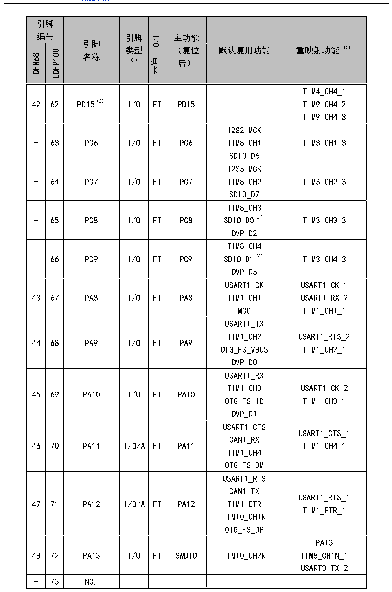

<!-- source-page: 40 -->

[← p.39](0039.md) · [index](../README.md) · [PDF p.40](https://ch32-riscv-ug.github.io/CH32V307/datasheet_zh/CH32V20x_30xDS0.PDF#page=40) · [p.41 →](0041.md)

<!-- header: CH32V303/305/307/317数据手册 https://wch.cn -->

 <!-- p40-cluster-01 uncaptioned graphics, rendered from the PDF; verify at https://ch32-riscv-ug.github.io/CH32V307/datasheet_zh/CH32V20x_30xDS0.PDF#page=40 -->

🖼 Text parsed from the figure above

<!-- p40-table-001 (table-3-2@1) -->
<table><tr><th colspan="2" style="text-align:left">引脚编号</th><th rowspan="2" style="text-align:left">引脚名称</th><th rowspan="2" style="text-align:left">引脚类型 （1）</th><th rowspan="2">I/O电平</th><th rowspan="2" style="text-align:left">主功能 （复位后）</th><th rowspan="2">默认复用功能</th><th rowspan="2">重映射功能（10）</th></tr><tr><td>QFN68</td><td>LQFP100</td></tr><tr><td>42</td><td>62</td><td>PD15（6）</td><td>I/O</td><td>FT</td><td>PD15</td><td></td><td style="text-align:left">TIM4_CH4_1TIM9_CH4_2TIM9_CH4_3</td></tr><tr><td>-</td><td>63</td><td>PC6</td><td>I/O</td><td>FT</td><td>PC6</td><td style="text-align:left">I2S2_MCKTIM8_CH1SDIO_D6</td><td>TIM3_CH1_3</td></tr><tr><td>-</td><td>64</td><td>PC7</td><td>I/O</td><td>FT</td><td>PC7</td><td style="text-align:left">I2S3_MCKTIM8_CH2SDIO_D7</td><td>TIM3_CH2_3</td></tr><tr><td>-</td><td>65</td><td>PC8</td><td>I/O</td><td>FT</td><td>PC8</td><td style="text-align:left">TIM8_CH3SDIO_D0（8） DVP_D2</td><td>TIM3_CH3_3</td></tr><tr><td>-</td><td>66</td><td>PC9</td><td>I/O</td><td>FT</td><td>PC9</td><td style="text-align:left">TIM8_CH4SDIO_D1（8） DVP_D3</td><td>TIM3_CH4_3</td></tr><tr><td>43</td><td>67</td><td>PA8</td><td>I/O</td><td>FT</td><td>PA8</td><td style="text-align:left">USART1_CKTIM1_CH1MCO</td><td style="text-align:left">USART1_CK_1USART1_RX_2TIM1_CH1_1</td></tr><tr><td>44</td><td>68</td><td>PA9</td><td>I/O</td><td>FT</td><td>PA9</td><td style="text-align:left">USART1_TXTIM1_CH2OTG_FS_VBUSDVP_D0</td><td style="text-align:left">USART1_RTS_2TIM1_CH2_1</td></tr><tr><td>45</td><td>69</td><td>PA10</td><td>I/O</td><td>FT</td><td>PA10</td><td style="text-align:left">USART1_RXTIM1_CH3OTG_FS_IDDVP_D1</td><td style="text-align:left">USART1_CK_2TIM1_CH3_1</td></tr><tr><td>46</td><td>70</td><td>PA11</td><td>I/O/A</td><td>FT</td><td>PA11</td><td style="text-align:left">USART1_CTSCAN1_RXTIM1_CH4OTG_FS_DM</td><td style="text-align:left">USART1_CTS_1TIM1_CH4_1</td></tr><tr><td>47</td><td>71</td><td>PA12</td><td>I/O/A</td><td>FT</td><td>PA12</td><td style="text-align:left">USART1_RTSCAN1_TXTIM1_ETRTIM10_CH1NOTG_FS_DP</td><td style="text-align:left">USART1_RTS_1TIM1_ETR_1</td></tr><tr><td>48</td><td>72</td><td>PA13</td><td>I/O</td><td>FT</td><td>SWDIO</td><td>TIM10_CH2N</td><td style="text-align:left">PA13TIM8_CH1N_1USART3_TX_2</td></tr><tr><td>-</td><td>73</td><td>NC.</td><td></td><td></td><td></td><td></td><td></td></tr></table>

<!-- image: p40-draw-image-00001 bbox=[500.88, 779.28, 520.32, 789.6] -->
<!-- footer: V3.9 39 -->
