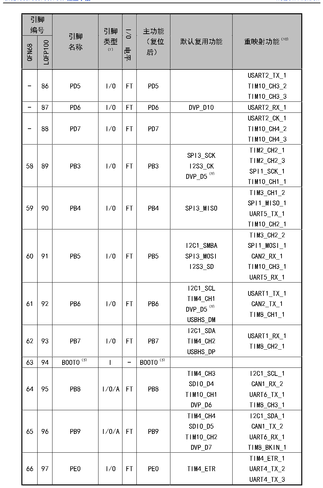

<!-- source-page: 42 -->

[← p.41](0041.md) · [index](../README.md) · [PDF p.42](https://ch32-riscv-ug.github.io/CH32V307/datasheet_zh/CH32V20x_30xDS0.PDF#page=42) · [p.43 →](0043.md)

<!-- header: CH32V303/305/307/317数据手册 https://wch.cn -->

 <!-- p42-cluster-01 uncaptioned graphics, rendered from the PDF; verify at https://ch32-riscv-ug.github.io/CH32V307/datasheet_zh/CH32V20x_30xDS0.PDF#page=42 -->

🖼 Text parsed from the figure above

<!-- p42-table-001 (table-3-2@1) -->
<table><tr><th colspan="2" style="text-align:left">引脚编号</th><th rowspan="2" style="text-align:left">引脚名称</th><th rowspan="2" style="text-align:left">引脚类型 （1）</th><th rowspan="2">I/O电平</th><th rowspan="2" style="text-align:left">主功能 （复位后）</th><th rowspan="2">默认复用功能</th><th rowspan="2">重映射功能（10）</th></tr><tr><td>QFN68</td><td>LQFP100</td></tr><tr><td>-</td><td>86</td><td>PD5</td><td>I/O</td><td>FT</td><td>PD5</td><td></td><td style="text-align:left">USART2_TX_1TIM10_CH3_2TIM10_CH3_3</td></tr><tr><td>-</td><td>87</td><td>PD6</td><td>I/O</td><td>FT</td><td>PD6</td><td>DVP_D10</td><td>USART2_RX_1</td></tr><tr><td>-</td><td>88</td><td>PD7</td><td>I/O</td><td>FT</td><td>PD7</td><td></td><td style="text-align:left">USART2_CK_1TIM10_CH4_2TIM10_CH4_3</td></tr><tr><td>58</td><td>89</td><td>PB3</td><td>I/O</td><td>FT</td><td>PB3</td><td style="text-align:left">SPI3_SCKI2S3_CKDVP_D5（9）</td><td style="text-align:left">TIM2_CH2_1TIM2_CH2_3SPI1_SCK_1TIM10_CH1_1</td></tr><tr><td>59</td><td>90</td><td>PB4</td><td>I/O</td><td>FT</td><td>PB4</td><td>SPI3_MISO</td><td style="text-align:left">TIM3_CH1_2SPI1_MISO_1UART5_TX_1TIM10_CH2_1</td></tr><tr><td>60</td><td>91</td><td>PB5</td><td>I/O</td><td>FT</td><td>PB5</td><td style="text-align:left">I2C1_SMBASPI3_MOSII2S3_SD</td><td style="text-align:left">TIM3_CH2_2SPI1_MOSI_1CAN2_RX_1TIM10_CH3_1UART5_RX_1</td></tr><tr><td>61</td><td>92</td><td>PB6</td><td>I/O</td><td>FT</td><td>PB6</td><td style="text-align:left">I2C1_SCLTIM4_CH1DVP_D5（9） USBHS_DM</td><td style="text-align:left">USART1_TX_1CAN2_TX_1TIM8_CH1_1</td></tr><tr><td>62</td><td>93</td><td>PB7</td><td>I/O</td><td>FT</td><td>PB7</td><td style="text-align:left">I2C1_SDATIM4_CH2USBHS_DP</td><td style="text-align:left">USART1_RX_1TIM8_CH2_1</td></tr><tr><td>63</td><td>94</td><td>BOOT0（5）</td><td>I</td><td>-</td><td>BOOT0（5）</td><td></td><td></td></tr><tr><td>64</td><td>95</td><td>PB8</td><td>I/O/A</td><td>FT</td><td>PB8</td><td style="text-align:left">TIM4_CH3SDIO_D4TIM10_CH1DVP_D6</td><td style="text-align:left">I2C1_SCL_1CAN1_RX_2UART6_TX_1TIM8_CH3_1</td></tr><tr><td>65</td><td>96</td><td>PB9</td><td>I/O/A</td><td>FT</td><td>PB9</td><td style="text-align:left">TIM4_CH4SDIO_D5TIM10_CH2DVP_D7</td><td style="text-align:left">I2C1_SDA_1CAN1_TX_2UART6_RX_1TIM8_BKIN_1</td></tr><tr><td>66</td><td>97</td><td>PE0</td><td>I/O</td><td>FT</td><td>PE0</td><td>TIM4_ETR</td><td style="text-align:left">TIM4_ETR_1UART4_TX_2UART4_TX_3</td></tr></table>

<!-- image: p42-draw-image-00001 bbox=[500.88, 779.28, 520.32, 789.6] -->
<!-- footer: V3.9 41 -->
