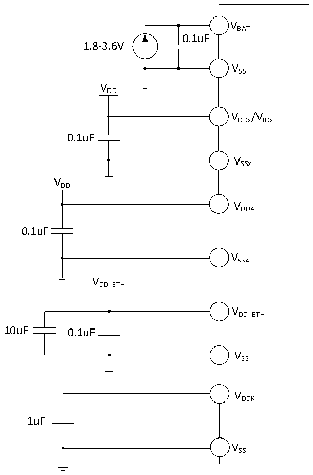

<!-- source-page: 51 -->

[← p.50](0050.md) · [index](../README.md) · [PDF p.51](https://ch32-riscv-ug.github.io/CH32V307/datasheet_zh/CH32V20x_30xDS0.PDF#page=51) · [p.52 →](0052.md)

<!-- header: CH32V303/305/307/317数据手册 https://wch.cn -->

图4-1-2 CH32V317常规供电典型电路  
 <!-- rendered from the PDF; verify at https://ch32-riscv-ug.github.io/CH32V307/datasheet_zh/CH32V20x_30xDS0.PDF#page=51 -->

🖼 Text parsed from the figure above

VBAT  
0.1uF  
1.8-3.6V  
VSS  
VDD  
VDDx/VIOx  
0.1uF  
VSSx  
VDD  
VDDA  
0.1uF  
VSSA  
VDD_ETH  
VDD_ETH  
10uF 0.1uF  
VSS  
VDDK  
1uF  
VSS  

## 4.2 绝对最大值

临界或者超过绝对最大值将可能导致芯片工作不正常甚至损坏。  

<!-- p51-table-001 (table-4-1@1) pages 51-52 -->
<table><caption>表4-1 绝对最大值参数表</caption><tr><th>符号</th><th colspan="2">描述</th><th>最小值</th><th>最大值</th><th>单位</th></tr><tr><td rowspan="2" style="text-align:left">TA</td><td rowspan="2">工作时的环境温度</td><td>型号末位为6的芯片</td><td>-40</td><td>85</td><td>℃</td></tr><tr><td>型号末位为7的芯片</td><td>-40</td><td>105</td><td>℃</td></tr><tr><td style="text-align:left">TS</td><td colspan="2">存储时的环境温度</td><td>-40</td><td>125</td><td>℃</td></tr><tr><td style="text-align:left">V -V DD SS</td><td colspan="2" style="text-align:left">外部主供电电压（包含V 和V ） DDA DD</td><td>-0.3</td><td>4.0</td><td>V</td></tr><tr><td style="text-align:left">V -V IO SS</td><td colspan="2">I/O供电电压</td><td>-0.3</td><td>4.0</td><td>V</td></tr><tr><td style="text-align:left">V -V DD_ETH SS</td><td>内部10/100M以太网PHY供电电压</td><td>CH32V317</td><td>-0.3</td><td>4.0</td><td>V</td></tr><tr><td style="text-align:left">VDDK</td><td>内部电源LDO退耦端的电压</td><td>CH32V317</td><td>-0.2</td><td>1.5</td><td>V</td></tr><tr><td rowspan="3" style="text-align:left">VIN</td><td colspan="2">FT（耐受5V）引脚上的输入电压</td><td style="text-align:left">V -0.3SS</td><td>5.5</td><td>V</td></tr><tr><td>10/100M以太网PHY差分引脚</td><td>CH32V317</td><td style="text-align:left">V -0.3SS</td><td style="text-align:left">V +0.3DD_ETH</td><td>V</td></tr><tr><td colspan="2">USB和10M以太网PHY引脚上的输入电压</td><td style="text-align:left">V -0.3SS</td><td style="text-align:left">V +0.3DD</td><td>V</td></tr><tr><td></td><td colspan="2">其他引脚上的输入电压</td><td style="text-align:left">V -0.3SS</td><td style="text-align:left">V +0.3IO</td><td>V</td></tr><tr><td style="text-align:left">|△V | DD_x</td><td colspan="2">不同主供电引脚之间的电压差</td><td></td><td>50</td><td>mV</td></tr><tr><td style="text-align:left">|△V | IO_x</td><td colspan="2">不同I/O端供电引脚之间的电压差</td><td></td><td>50</td><td>mV</td></tr><tr><td style="text-align:left">|△V | SS_x</td><td colspan="2">不同接地引脚之间的电压差</td><td></td><td>50</td><td>mV</td></tr><tr><td rowspan="2" style="text-align:left">VESD（HBM）</td><td colspan="2">ESD静电放电电压（HBM人体模型，非接触式）</td><td colspan="2">4K</td><td>V</td></tr><tr><td colspan="2">USB引脚（PA11、PA12）</td><td colspan="2">3K</td><td>V</td></tr><tr><td style="text-align:left">IVDD</td><td colspan="2" style="text-align:left">经过V /V /V 电源线的总电流（供应电流） DD DDA IO</td><td></td><td>150</td><td rowspan="8">mA</td></tr><tr><td style="text-align:left">IVss</td><td colspan="2" style="text-align:left">经过V 地线的总电流（流出电流） SS</td><td></td><td>150</td></tr><tr><td rowspan="2" style="text-align:left">IIO</td><td colspan="2">任意I/O和控制引脚上的灌电流</td><td></td><td>25</td></tr><tr><td colspan="2">任意I/O和控制引脚上的源电流</td><td></td><td>-25</td></tr><tr><td rowspan="3" style="text-align:left">IINJ（PIN）</td><td colspan="2">NRST引脚注入电流</td><td></td><td>+/-5</td></tr><tr><td colspan="2">HSE的OSC_IN引脚和LSE的OSC_IN引脚注入电流</td><td></td><td>+/-5</td></tr><tr><td colspan="2">其他引脚的注入电流</td><td></td><td>+/-5</td></tr><tr><td style="text-align:left">∑IINJ（PIN）</td><td colspan="2">所有IO和控制引脚的总注入电流</td><td></td><td>+/-25</td></tr></table>

<!-- image: p51-draw-image-00001 bbox=[502.8, 779.28, 522.24, 789.6] -->
<!-- footer: V3.9 50 -->
