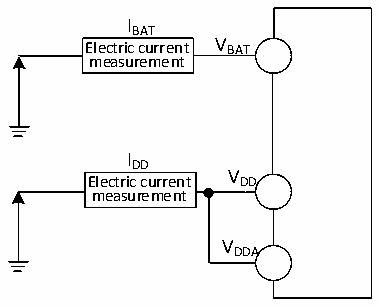

<!-- source-page: 54 -->

[← p.53](0053.md) · [index](../README.md) · [PDF p.54](https://ch32-riscv-ug.github.io/CH32V307/datasheet_zh/CH32V20x_30xDS0.PDF#page=54) · [p.55 →](0055.md)

<!-- header: CH32V303/305/307/317数据手册 https://wch.cn -->

> ⬆ **Table continued** — rendered in full at [page 53](0053.md). <!-- p54-table-001 -->

注：1.常温测试值。  

### 4.3.3 内置的参考电压

<!-- p54-table-002 (table-4-5@1) -->
<table><caption>表4-5 内置参考电压</caption><tr><th>符号</th><th>参数</th><th>条件</th><th>最小值</th><th>典型值</th><th>最大值</th><th>单位</th></tr><tr><td style="text-align:left">VREFINT</td><td>内置参考电压</td><td style="text-align:left">T = 表4-2所示的工作环境A温度范围</td><td>1.17</td><td>1.2</td><td>1.23</td><td>V</td></tr><tr><td style="text-align:left">TS_vrefint</td><td style="text-align:left">当读出内部参考电压时，ADC的采样时间</td><td></td><td>17.1</td><td></td><td></td><td>us</td></tr></table>

### 4.3.4 供电电流特性

电流消耗是多种参数和因素的综合指标，这些参数和因素包括工作电压、环境温度、I/O 引脚的  
负载、产品的软件配置、工作频率、I/O 脚的翻转速率、程序在存储器中的位置以及执行的代码等。  
电流消耗测量方法如下图：  

图4-2-1 CH32V303/305/307电流消耗测量  
 <!-- rendered from the PDF; verify at https://ch32-riscv-ug.github.io/CH32V307/datasheet_zh/CH32V20x_30xDS0.PDF#page=54 -->

🖼 Text parsed from the figure above

IBAT  
Electric current V BAT  
measurement  
IDD  
V  
Electric current DD  
measurement  
VDDA  

<!-- image: p54-draw-image-00001 bbox=[502.8, 779.28, 522.24, 789.6] -->
<!-- footer: V3.9 53 -->
