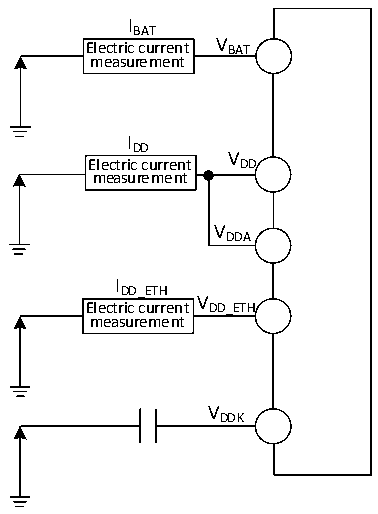

<!-- source-page: 55 -->

[← p.54](0054.md) · [index](../README.md) · [PDF p.55](https://ch32-riscv-ug.github.io/CH32V307/datasheet_zh/CH32V20x_30xDS0.PDF#page=55) · [p.56 →](0056.md)

<!-- header: CH32V303/305/307/317数据手册 https://wch.cn -->

图4-2-2 CH32V317电流消耗测量  
 <!-- rendered from the PDF; verify at https://ch32-riscv-ug.github.io/CH32V307/datasheet_zh/CH32V20x_30xDS0.PDF#page=55 -->

🖼 Text parsed from the figure above

IBAT  
Electric current V BAT  
measurement  
IDD  
V  
Electric current DD  
measurement  
VDDA  
IDD_ETH  
V  
Electric current DD_ETH  
measurement  
VDDK  

CH32V303/305/307处于下列条件：  
常温VDD= 3.3V情况下，测试时：所有I/O端口配置下拉输入，HSE或HSI只开1个，HSE = 8M，  
HSI = 8M（已校准），FPLCK1= FHCLK/2，FPLCK2= FHCLK，当FHCLK＞8MHz时，PLL打开。使能或关闭所有外设  
时钟的功耗。  
CH32V317处于下列条件：  
常温 VDD= 3.3V、VDD_ETH= 3.3V 情况下，测试时：所有 IO 端口配置下拉输入，HSE 或 HSI 只开 1  
个，HSE = 8M，HSI = 8M（已校准），FPLCK1= FHCLK/2，FPLCK2= FHCLK，当FHCLK＞8MHz时，PLL打开。使能  
或关闭所有外设时钟的功耗。  

<!-- p55-table-001 (table-4-6@1) pages 55-56 -->
<table><caption>表4-6 运行模式下典型的电流消耗，数据处理代码从内部闪存中运行</caption><tr><th rowspan="2">符号</th><th rowspan="2">参数</th><th rowspan="2" colspan="2">条件</th><th colspan="2">典型值</th><th rowspan="2">单位</th></tr><tr><td>使能所有外设</td><td>关闭所有外设</td></tr><tr><td rowspan="14" style="text-align:left">I （1） DD</td><td rowspan="14" style="text-align:left">运行模式下的供应电流</td><td rowspan="9">外部时钟</td><td style="text-align:left">F = 144MHz HCLK</td><td>22.4</td><td>12.4</td><td rowspan="14">mA</td></tr><tr><td style="text-align:left">F = 72MHz HCLK</td><td>11.5</td><td>6.5</td></tr><tr><td style="text-align:left">F = 48MHz HCLK</td><td>8.0</td><td>4.6</td></tr><tr><td style="text-align:left">F = 36MHz HCLK</td><td>6.4</td><td>3.8</td></tr><tr><td style="text-align:left">F = 24MHz HCLK</td><td>4.4</td><td>2.7</td></tr><tr><td style="text-align:left">F = 16MHz HCLK</td><td>3.5</td><td>2.3</td></tr><tr><td style="text-align:left">F = 8MHz HCLK</td><td>1.8</td><td>1.3</td></tr><tr><td style="text-align:left">F = 4MHz HCLK</td><td>1.3</td><td>1.0</td></tr><tr><td style="text-align:left">F = 500kHz HCLK</td><td>0.8</td><td>0.7</td></tr><tr><td rowspan="5" style="text-align:left">运行于高速内部RC振荡器（HSI）， 使用 HB 预分频以减低频率</td><td style="text-align:left">F = 144MHz HCLK</td><td>22.1</td><td>12.2</td></tr><tr><td style="text-align:left">F = 72MHz HCLK</td><td>11.3</td><td>6.3</td></tr><tr><td style="text-align:left">F = 48MHz HCLK</td><td>7.7</td><td>4.3</td></tr><tr><td style="text-align:left">F = 36MHz HCLK</td><td>5.8</td><td>3.3</td></tr><tr><td style="text-align:left">F = 24MHz HCLK</td><td>4.1</td><td>2.4</td></tr><tr><td rowspan="4"></td><td rowspan="4"></td><td rowspan="4"></td><td style="text-align:left">F = 16MHz HCLK</td><td>3.0</td><td>1.8</td><td rowspan="4"></td></tr><tr><td style="text-align:left">F = 8MHz HCLK</td><td>1.5</td><td>1.0</td></tr><tr><td style="text-align:left">F = 4MHz HCLK</td><td>1.0</td><td>0.7</td></tr><tr><td style="text-align:left">F = 500kHz HCLK</td><td>0.4</td><td>0.4</td></tr></table>

<!-- image: p55-draw-image-00001 bbox=[502.8, 779.28, 522.24, 789.6] -->
<!-- footer: V3.9 54 -->
