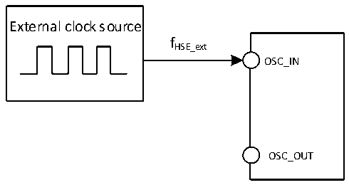

<!-- source-page: 57 -->

[← p.56](0056.md) · [index](../README.md) · [PDF p.57](https://ch32-riscv-ug.github.io/CH32V307/datasheet_zh/CH32V20x_30xDS0.PDF#page=57) · [p.58 →](0058.md)

<!-- header: CH32V303/305/307/317数据手册 https://wch.cn -->

> ⬆ **Table continued** — rendered in full at [page 56](0056.md). <!-- p57-table-001 -->

注：以上为实测参数。  
CH32V317芯片内置10/100Mbps以太网PHY物理层收发器，该模块的电流消耗如下表4-9所示。  

<!-- p57-table-002 (table-4-9@1) -->
<table><caption>表4-9 10/100Mbps以太网PHY模块的电流消耗（仅针对CH32V317芯片）</caption><tr><th>符号</th><th>参数</th><th>条件</th><th>典型值</th><th>单位</th></tr><tr><td rowspan="6" style="text-align:left">IDD_10/100M_PHY</td><td rowspan="2">传输状态下的供应电流</td><td style="text-align:left">100BASE-TX 通路链接成功并且在收发通道上有数据包</td><td>60.4</td><td rowspan="6">mA</td></tr><tr><td style="text-align:left">10BASE-TX 通路链接成功并且在收发通道上有数据包</td><td>34.2</td></tr><tr><td rowspan="2">空闲状态下的供应电流</td><td style="text-align:left">100BASE-TX 通路链接成功并且在收发通道上无任何数据包</td><td>61.4</td></tr><tr><td style="text-align:left">10BASE-TX 通路链接成功并且在收发通道上无任何数据包</td><td>28.1</td></tr><tr><td>断开状态下的供应电流</td><td style="text-align:left">100BASE-TX 和 10BASE-TX 通路均未链接成功且PHY处于自动协商状态。</td><td>38.4</td></tr><tr><td>停机状态下的供应电流</td><td>仅SMI接口处于工作状态</td><td>0.2</td></tr></table>

### 4.3.5 外部时钟源特性

<!-- p57-table-003 (table-4-10@1) -->
<table><caption>表4-10 来自外部高速时钟</caption><tr><th>符号</th><th>参数</th><th>条件</th><th>最小值</th><th>典型值</th><th>最大值</th><th>单位</th></tr><tr><td style="text-align:left">FHSE_ext</td><td>外部时钟频率</td><td></td><td>3</td><td>8</td><td>25</td><td>MHz</td></tr><tr><td style="text-align:left">V （1） HSEH</td><td>OSC_IN输入引脚高电平电压</td><td></td><td style="text-align:left">0.8*VIO</td><td></td><td style="text-align:left">VIO</td><td>V</td></tr><tr><td style="text-align:left">V （1） HSEL</td><td>OSC_IN输入引脚低电平电压</td><td></td><td>0</td><td></td><td style="text-align:left">0.2*VIO</td><td>V</td></tr><tr><td style="text-align:left">C in（HSE）</td><td>OSC_IN输入电容</td><td></td><td></td><td>5</td><td></td><td>pF</td></tr><tr><td style="text-align:left">DuCy HSE</td><td>占空比（Duty cycle）</td><td></td><td></td><td>50</td><td></td><td>%</td></tr><tr><td style="text-align:left">IL</td><td>OSC_IN输入漏电流</td><td></td><td></td><td></td><td>±1</td><td>uA</td></tr></table>

注：不满足此条件可能会引起电平识别错误。  

图4-3 外部提供高频时钟源电路  
 <!-- rendered from the PDF; verify at https://ch32-riscv-ug.github.io/CH32V307/datasheet_zh/CH32V20x_30xDS0.PDF#page=57 -->

🖼 Text parsed from the figure above

External clock source  
fHSE_ext  
OSC_IN  
OSC_OUT  

<!-- image: p57-draw-image-00001 bbox=[502.8, 779.28, 522.24, 789.6] -->
<!-- footer: V3.9 56 -->
