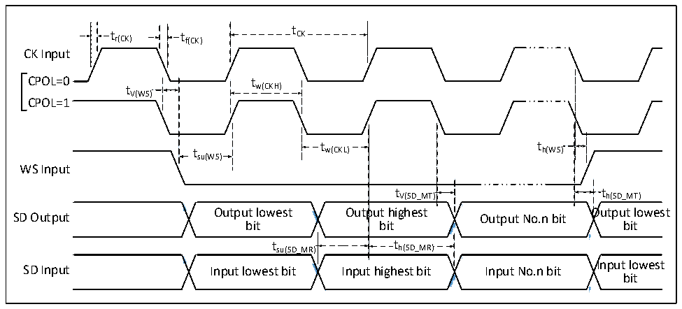
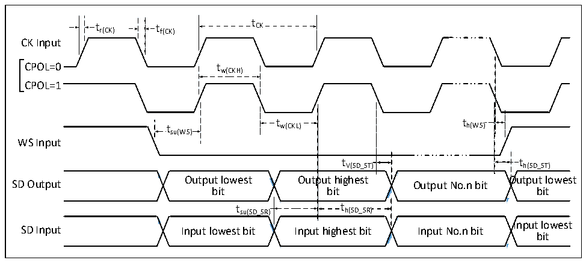

<!-- source-page: 67 -->

[← p.66](0066.md) · [index](../README.md) · [PDF p.67](https://ch32-riscv-ug.github.io/CH32V307/datasheet_zh/CH32V20x_30xDS0.PDF#page=67) · [p.68 →](0068.md)

<!-- header: CH32V303/305/307/317数据手册 https://wch.cn -->

### 4.3.15 I2S接口特性

图4-12 I2S总线主模式时序图  
 <!-- rendered from the PDF; verify at https://ch32-riscv-ug.github.io/CH32V307/datasheet_zh/CH32V20x_30xDS0.PDF#page=67 -->

🖼 Text parsed from the figure above

t  
t r(CK) t f(CK) CK  
CK Input  
CPOL=0t tw(CKH)  
V(WS)  
CPOL=1  
t t  
t w(CKL) h(WS)  
su(WS)  
WS Input  
t  t V(SD_MT)  
tV(SD_MT) th(SD_MT)  
<!-- image: p67-draw-image-00002 inside the figure -->
<!-- image: p67-draw-image-00003 inside the figure -->
<!-- image: p67-draw-image-00004 inside the figure -->
<!-- image: p67-draw-image-00005 inside the figure -->
Output lowest Output highest Output lowest  
SD Output Output No.n bit  
bit bit bit  
t  t h(SD_MR)  t  th(SD_MR)  
t su(SD_MR) t h(SD_MR)  
<!-- image: p67-draw-image-00006 inside the figure -->
<!-- image: p67-draw-image-00007 inside the figure -->
<!-- image: p67-draw-image-00008 inside the figure -->
<!-- image: p67-draw-image-00009 inside the figure -->
Input lowest  
SD Input Input lowest bit Input highest bit Input No.n bit  
bit  

图4-13 I2S总线从模式时序图  
 <!-- rendered from the PDF; verify at https://ch32-riscv-ug.github.io/CH32V307/datasheet_zh/CH32V20x_30xDS0.PDF#page=67 -->

🖼 Text parsed from the figure above

t  
t r(CK) t f(CK) CK  
CK Input  
CPOL=0 tw(CKH)  
CPOL=1  
t t  
t w(CKL) h(WS)  
su(WS)  
WS Input  
t V(SD_ST)  
tV(SD_ST) th(SD_ST)  
<!-- image: p67-draw-image-00010 inside the figure -->
<!-- image: p67-draw-image-00011 inside the figure -->
<!-- image: p67-draw-image-00012 inside the figure -->
<!-- image: p67-draw-image-00013 inside the figure -->
Output lowest Output highest Output lowest  
SD Output Output No.n bit  
bit bit bit  
t h(SD_SR)  th(SD_SR)  
t su(SD_SR) t h(SD_SR)  
<!-- image: p67-draw-image-00014 inside the figure -->
<!-- image: p67-draw-image-00015 inside the figure -->
<!-- image: p67-draw-image-00016 inside the figure -->
<!-- image: p67-draw-image-00017 inside the figure -->
Input lowest  
SD Input Input lowest bit Input highest bit Input No.n bit  
bit  

<!-- p67-table-005 (table-4-29@1) pages 67-68 -->
<table><caption>表4-29 I2S接口特性</caption><tr><th>符号</th><th>参数</th><th>条件</th><th>最小值</th><th>最大值</th><th>单位</th></tr><tr><td rowspan="2" style="text-align:left">f /t CK CK</td><td rowspan="2">I2S时钟频率</td><td>主模式</td><td></td><td>8</td><td>MHz</td></tr><tr><td>从模式</td><td></td><td>8</td><td>MHz</td></tr><tr><td style="text-align:left">t /t r（CK） f（CK）</td><td>I2S时钟上升和下降时间</td><td>负载电容：C = 30pF</td><td></td><td>20</td><td>ns</td></tr><tr><td style="text-align:left">t V（WS）</td><td>WS有效时间</td><td>主模式</td><td></td><td>5</td><td>ns</td></tr><tr><td style="text-align:left">t SU（WS）</td><td>WS建立时间</td><td>从模式</td><td>10</td><td></td><td>ns</td></tr><tr><td rowspan="2" style="text-align:left">t h（WS）</td><td rowspan="2">WS保持时间</td><td>主模式</td><td>0</td><td></td><td>ns</td></tr><tr><td>从模式</td><td>0</td><td></td><td>ns</td></tr><tr><td style="text-align:left">t /t w（CKH） w（CKL）</td><td>SCK高电平和低电平时间</td><td style="text-align:left">主模式，f = 36MHz PCLK 预分频系数 = 4</td><td>40</td><td>60</td><td>%</td></tr><tr><td style="text-align:left">t SU（SD_MR）</td><td>数据输入建立时间</td><td>主模式</td><td>8</td><td></td><td>ns</td></tr><tr><td style="text-align:left">t SU（SD_SR）</td><td></td><td>从模式</td><td>8</td><td></td><td>ns</td></tr><tr><td rowspan="2" style="text-align:left">t h（SD_MR） t h（SD_SR）</td><td rowspan="2">数据输入保持时间</td><td>主模式</td><td>5</td><td></td><td>ns</td></tr><tr><td>从模式</td><td>4</td><td></td><td>ns</td></tr><tr><td style="text-align:left">t h（SD_MT）</td><td rowspan="2">数据输出保持时间</td><td>主模式（使能边沿之后）</td><td></td><td>5</td><td>ns</td></tr><tr><td style="text-align:left">t h（SD_ST）</td><td>从模式（使能边沿之后）</td><td></td><td>5</td><td>ns</td></tr><tr><td style="text-align:left">t V（SD_MT）</td><td rowspan="2">数据输出有效时间</td><td>主模式（使能边沿之后）</td><td></td><td>5</td><td>ns</td></tr><tr><td style="text-align:left">t v（SD_ST）</td><td>从模式（使能边沿之后）</td><td></td><td>4</td><td>ns</td></tr></table>

<!-- image: p67-draw-image-00001 bbox=[502.8, 779.28, 522.24, 789.6] -->
<!-- footer: V3.9 66 -->
