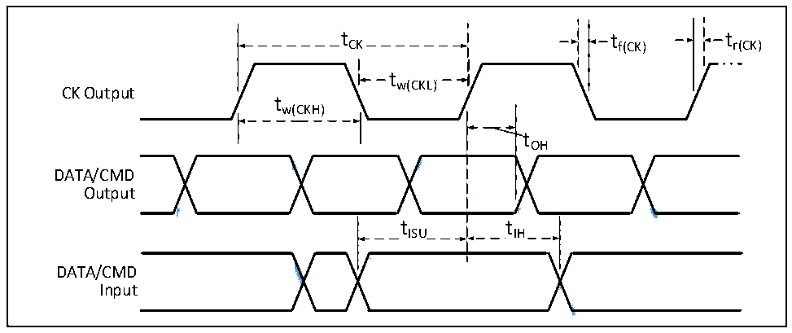

<!-- source-page: 68 -->

[← p.67](0067.md) · [index](../README.md) · [PDF p.68](https://ch32-riscv-ug.github.io/CH32V307/datasheet_zh/CH32V20x_30xDS0.PDF#page=68) · [p.69 →](0069.md)

<!-- header: CH32V303/305/307/317数据手册 https://wch.cn -->

> ⬆ **Table continued** — rendered in full at [page 67](0067.md). <!-- p68-table-001 -->

### 4.3.16 USB接口特性

<!-- p68-table-002 (table-4-30@1) -->
<table><caption>表4-30 USB模块特性</caption><tr><th>符号</th><th>参数</th><th>条件</th><th>最小值</th><th>最大值</th><th>单位</th></tr><tr><td style="text-align:left">VDD</td><td>USB操作电压</td><td></td><td>3.0</td><td>3.6</td><td>V</td></tr><tr><td style="text-align:left">VSE</td><td>单端接收器阈值</td><td style="text-align:left">V = 3.3VDD</td><td>1.2</td><td>1.9</td><td>V</td></tr><tr><td style="text-align:left">VOL</td><td>静态输出低电平</td><td></td><td></td><td>0.3</td><td>V</td></tr><tr><td style="text-align:left">VOH</td><td>静态输出高电平</td><td></td><td>2.8</td><td>3.6</td><td>V</td></tr><tr><td style="text-align:left">VHSSQ</td><td>高速压制信息检测阈值</td><td></td><td>100</td><td>150</td><td>mV</td></tr><tr><td style="text-align:left">VHSDSC</td><td>高速断开连接检测阈值</td><td></td><td>500</td><td>625</td><td>mV</td></tr><tr><td style="text-align:left">VHSOI</td><td>高速空闲电平</td><td></td><td>-10</td><td>10</td><td>mV</td></tr><tr><td style="text-align:left">VHSOH</td><td>高速数据高电平</td><td></td><td>360</td><td>440</td><td>mV</td></tr><tr><td style="text-align:left">VHSOL</td><td>高速数据低电平</td><td></td><td>-10</td><td>10</td><td>mV</td></tr></table>

### 4.3.17 SD/MMC接口特性

图4-14 SD高速模式时序图  
 <!-- rendered from the PDF; verify at https://ch32-riscv-ug.github.io/CH32V307/datasheet_zh/CH32V20x_30xDS0.PDF#page=68 -->

🖼 Text parsed from the figure above

t CK  tCK  
tCK tf(CK) tr(CK)  
tw(CKL)  
CK Output  
tw(CKH)  
tOH  
<!-- image: p68-draw-image-00002 inside the figure -->
<!-- image: p68-draw-image-00003 inside the figure -->
<!-- image: p68-draw-image-00005 inside the figure -->
<!-- image: p68-draw-image-00004 inside the figure -->
<!-- image: p68-draw-image-00006 inside the figure -->
DATA/CMD  
Output  
tISU tIH  
<!-- image: p68-draw-image-00007 inside the figure -->
<!-- image: p68-draw-image-00009 inside the figure -->
<!-- image: p68-draw-image-00008 inside the figure -->
DATA/CMD  
Input  

<!-- image: p68-draw-image-00001 bbox=[502.8, 779.28, 522.24, 789.6] -->
<!-- footer: V3.9 67 -->
