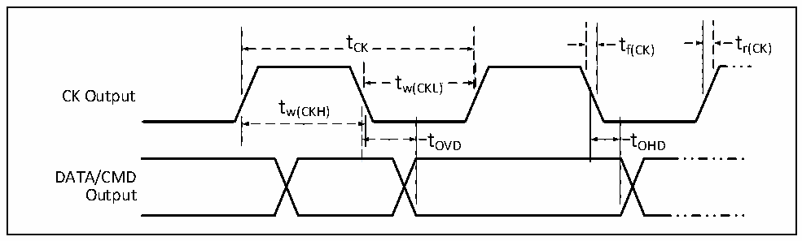

<!-- source-page: 69 -->

[← p.68](0068.md) · [index](../README.md) · [PDF p.69](https://ch32-riscv-ug.github.io/CH32V307/datasheet_zh/CH32V20x_30xDS0.PDF#page=69) · [p.70 →](0070.md)

<!-- header: CH32V303/305/307/317数据手册 https://wch.cn -->

图4-15 SD默认模式时序图  
 <!-- rendered from the PDF; verify at https://ch32-riscv-ug.github.io/CH32V307/datasheet_zh/CH32V20x_30xDS0.PDF#page=69 -->

🖼 Text parsed from the figure above

t CK  tCK  
tCK tf(CK) tr(CK)  
tw(CKL)  
CK Output  
tw(CKH)  
t OHD  
tOVD tOHD  
DATA/CMD  
Output  

<!-- p69-table-004 (table-4-31@1) -->
<table><caption>表4-31 SD/MMC接口特性</caption><tr><th>符号</th><th>参数</th><th colspan="2">条件</th><th>最小值</th><th>最大值</th><th>单位</th></tr><tr><td style="text-align:left">f /t CK CK</td><td>数据传输模式下的时钟频率</td><td colspan="2">CL≤30pF</td><td></td><td>48</td><td>MHz</td></tr><tr><td style="text-align:left">t W（CKL）</td><td>时钟低电平时间</td><td colspan="2">CL≤30pF</td><td>6</td><td></td><td rowspan="4">ns</td></tr><tr><td style="text-align:left">t W（CKH）</td><td>时钟高电平时间</td><td colspan="2">CL≤30pF</td><td>6</td><td></td></tr><tr><td style="text-align:left">t r（CK）</td><td>上升时间</td><td colspan="2">CL≤30pF</td><td></td><td>4</td></tr><tr><td style="text-align:left">t f（CK）</td><td>下降时间</td><td colspan="2">CL≤30pF</td><td></td><td>4</td></tr><tr><td colspan="7">CMD/DAT输入（参考CK）</td></tr><tr><td style="text-align:left">t ISU</td><td>输入建立时间</td><td colspan="2">CL≤30pF</td><td>7</td><td></td><td rowspan="2">ns</td></tr><tr><td style="text-align:left">t IH</td><td>输入保持时间</td><td colspan="2">CL≤30pF</td><td>2</td><td></td></tr><tr><td colspan="7">在高速模式下，CMD/DAT输出（参考CK）</td></tr><tr><td rowspan="2" style="text-align:left">t OV</td><td rowspan="2">输出有效时间</td><td rowspan="2">CL≤30pF</td><td>主模式</td><td></td><td>5</td><td rowspan="3">ns</td></tr><tr><td>从模式</td><td></td><td>9</td></tr><tr><td style="text-align:left">t OH</td><td>输出保持时间</td><td colspan="2">CL≤30pF</td><td>20</td><td></td></tr><tr><td colspan="7">在默认模式下，CMD/DAT输出（参考CK）</td></tr><tr><td rowspan="2" style="text-align:left">t OVD</td><td rowspan="2">输出有效默认时间</td><td rowspan="2">CL≤30pF</td><td>主模式</td><td></td><td>8</td><td rowspan="3">ns</td></tr><tr><td>从模式</td><td></td><td>14</td></tr><tr><td style="text-align:left">t OHD</td><td>输出保持默认时间</td><td colspan="2">CL≤30pF</td><td>20</td><td></td></tr></table>

<!-- image: p69-draw-image-00001 bbox=[502.8, 779.28, 522.24, 789.6] -->
<!-- footer: V3.9 68 -->
