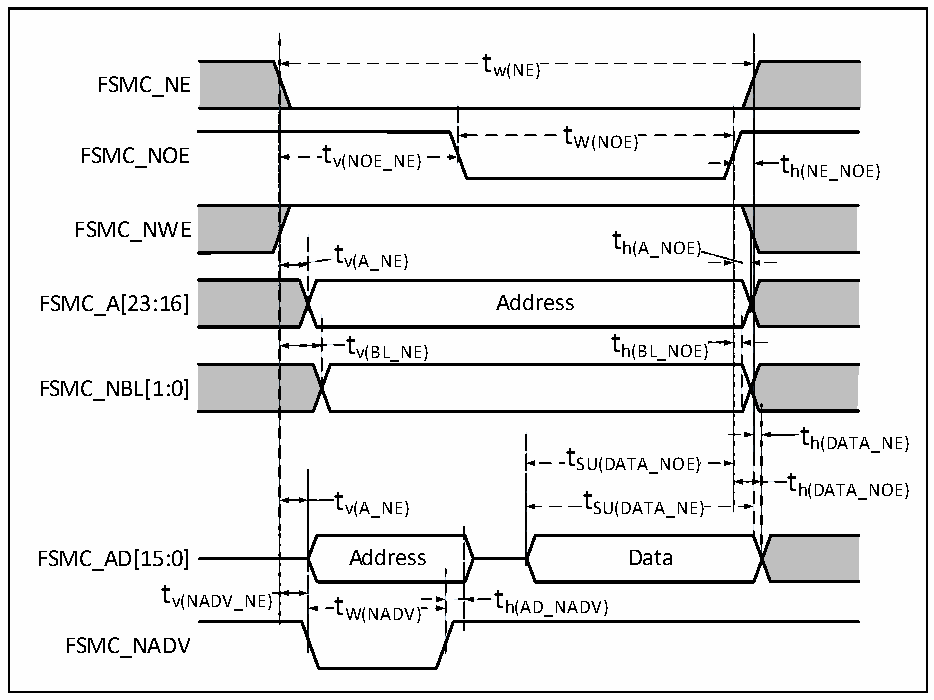

<!-- source-page: 70 -->

[← p.69](0069.md) · [index](../README.md) · [PDF p.70](https://ch32-riscv-ug.github.io/CH32V307/datasheet_zh/CH32V20x_30xDS0.PDF#page=70) · [p.71 →](0071.md)

<!-- header: CH32V303/305/307/317数据手册 https://wch.cn -->

### 4.3.18 FSMC特性

图4-16 异步总线复用PSRAM/NOR读操作波形  
 <!-- rendered from the PDF; verify at https://ch32-riscv-ug.github.io/CH32V307/datasheet_zh/CH32V20x_30xDS0.PDF#page=70 -->

🖼 Text parsed from the figure above

t t W(NOE) v(NOE_NE)  
FSMC_NE  
FSMC_NWE  
t h(A_NOE)  
v(A_NE)  
FSMC_A[23:16] Address  
t v(BL_NE)  )  t h(BL_NOE)  )  )  
FSMC_NBL[1:0]  
th(DATA_NE)  
t SU(DATA_NOE)  t SU(DATA_NE)  
t  
v(A_NE) SU(DATA_NE)  
FSMC_AD[15:0] Address Data  
tv(NADV_NE)t th(AD_NADV)  
W(NADV)  
FSMC_NADV  

<!-- p70-table-005 (table-4-32@1) -->
<table><caption>表4-32 异步总线复用的PSRAM/NOR读操作时序</caption><tr><th>符号</th><th>参数</th><th>最小值</th><th>最大值</th><th>单位</th></tr><tr><td style="text-align:left">t W（NE）</td><td>FSMC_NE低电平时间</td><td style="text-align:left">7*t HCLK</td><td></td><td rowspan="15">ns</td></tr><tr><td style="text-align:left">t V（NOE_NE）</td><td>FSMC_NE低至FSMC_NOE低</td><td>0</td><td></td></tr><tr><td style="text-align:left">t W（NOE）</td><td>FSMC_NOE低时间</td><td style="text-align:left">7*t HCLK</td><td></td></tr><tr><td style="text-align:left">t h（NE_NOE）</td><td>FSMC_NOE高至FSMC_NE高保持时间</td><td>0</td><td></td></tr><tr><td style="text-align:left">t V（A_NE）</td><td>FSMC_NE低至FSMC_A有效</td><td>0</td><td>5</td></tr><tr><td style="text-align:left">t V（NADV_NE）</td><td>FSMC_NE低至FSMC_NADV低</td><td>0</td><td>5</td></tr><tr><td style="text-align:left">t W（NADV）</td><td>FSMC_NADV低时间</td><td style="text-align:left">t HCLK</td><td></td></tr><tr><td style="text-align:left">t h（AD_NADV）</td><td>FSMC_NADV高之后FSMC_AD（地址）有效保持时间</td><td style="text-align:left">2*t HCLK</td><td></td></tr><tr><td style="text-align:left">t h（A_NOE）</td><td>FSMC_NOE高之后的地址保持时间</td><td>0</td><td></td></tr><tr><td style="text-align:left">t h（BL_NOE）</td><td>FSMC_NOE高之后的FSMC_BL保持时间</td><td>0</td><td></td></tr><tr><td style="text-align:left">t V（BL_NE）</td><td>FSMC_NE低至FSMC_BL有效</td><td>0</td><td>5</td></tr><tr><td style="text-align:left">t SU（DATA_NE）</td><td>数据至FSMC_NE高的建立时间</td><td style="text-align:left">3*t HCLK</td><td></td></tr><tr><td style="text-align:left">t SU（DATA_NOE）</td><td>数据至FSMC_NOE高的建立时间</td><td style="text-align:left">3*t HCLK</td><td></td></tr><tr><td style="text-align:left">t h（DATA_NE）</td><td>FSMC_NE高之后的数据保持时间</td><td>0</td><td></td></tr><tr><td style="text-align:left">t h（DATA_NOE）</td><td>FSMC_NOE高之后的数据保持时间</td><td>0</td><td></td></tr></table>

<!-- image: p70-draw-image-00001 bbox=[502.8, 779.28, 522.24, 789.6] -->
<!-- footer: V3.9 69 -->
