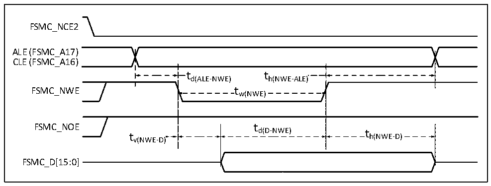
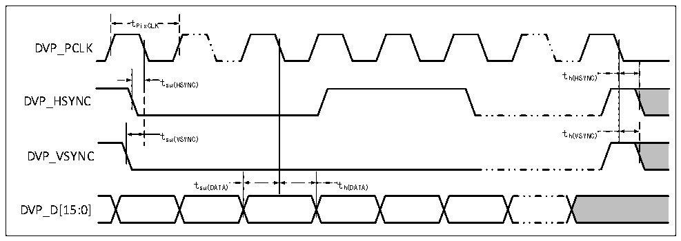

<!-- source-page: 75 -->

[← p.74](0074.md) · [index](../README.md) · [PDF p.75](https://ch32-riscv-ug.github.io/CH32V307/datasheet_zh/CH32V20x_30xDS0.PDF#page=75) · [p.76 →](0076.md)

<!-- header: CH32V303/305/307/317数据手册 https://wch.cn -->

图4-23 NAND控制器在通用存储空间的写操作波形  
 <!-- rendered from the PDF; verify at https://ch32-riscv-ug.github.io/CH32V307/datasheet_zh/CH32V20x_30xDS0.PDF#page=75 -->

🖼 Text parsed from the figure above

FSMC_NCE2  
ALE (FSMC_A17)  
CLE (FSMC_A16)  
t d(ALE-NW  
t h(NWE-ALE)  )  t w(NWE)  
td(ALE-NWE) th(NWE-ALE)  
FSMC_NWE tw(NWE)  
FSMC_NOE t  
d(D-NWE) t  
t h(NWE-D)  
v(NWE-D)  
FSMC_D[15:0]  

<!-- p75-table-003 (table-4-36@1) -->
<table><caption>表4-36 NAND闪存读写周期的时序特性</caption><tr><th>符号</th><th>参数</th><th>最小值</th><th>最大值</th><th>单位</th></tr><tr><td style="text-align:left">t d（D-NWE）</td><td>FSMC_NWE高之前至FSMC_D[15:0]数据有效</td><td style="text-align:left">4*t HCLK</td><td></td><td rowspan="11">ns</td></tr><tr><td style="text-align:left">t w（NOE）</td><td>FSMC_NOE低时间</td><td style="text-align:left">4*t HCLK</td><td></td></tr><tr><td style="text-align:left">t su（D-NOE）</td><td>FSMC_NOE高之前至FSMC_D[15:0]数据有效</td><td>20</td><td></td></tr><tr><td style="text-align:left">t h（NOE-D）</td><td>FSMC_NOE高之后至FSMC_D[15:0]数据有效</td><td>15</td><td></td></tr><tr><td style="text-align:left">t w（NWE）</td><td>FSMC_NWE低时间</td><td style="text-align:left">4*t HCLK</td><td></td></tr><tr><td style="text-align:left">t v（NWE-D）</td><td>FSMC_NWE低至FSMC_D[15:0]数据有效</td><td>0</td><td></td></tr><tr><td style="text-align:left">t h（NWE-D）</td><td>FSMC_NWE高至FSMC_D[15:0]数据无效</td><td style="text-align:left">2*t HCLK</td><td></td></tr><tr><td style="text-align:left">t d（ALE-NWE）</td><td>FSMC_NWE低之前至FSMC_ALE有效</td><td style="text-align:left">2*t HCLK</td><td></td></tr><tr><td style="text-align:left">t h（NWE-ALE）</td><td>FSMC_NWE高至FSMC_ALE无效</td><td style="text-align:left">2*t HCLK</td><td></td></tr><tr><td style="text-align:left">t d（ALE-NOE）</td><td>FSMC_NOE低之前至FSMC_ALE有效</td><td style="text-align:left">2*t HCLK</td><td></td></tr><tr><td style="text-align:left">t h（NOE-ALE）</td><td>FSMC_NOE高至FSMC_ALE无效</td><td style="text-align:left">4*t HCLK</td><td></td></tr></table>

### 4.3.19 DVP接口特性

图4-24 DVP时序波形  
 <!-- rendered from the PDF; verify at https://ch32-riscv-ug.github.io/CH32V307/datasheet_zh/CH32V20x_30xDS0.PDF#page=75 -->

🖼 Text parsed from the figure above

tPixCLK  
DVP_PCLK  
t  
t h(HSYNC)  
su(HSYNC)  
DVP_HSYNC  
t su(VSYNC) t h(VSYNC)  
DVP_VSYNC  
t su(DATA)  
DVP_D[15:0]  

<!-- p75-table-005 (table-4-37@1) pages 75-76 -->
<table><caption>表4-37 DVP接口特性</caption><tr><th>符号</th><th>参数及描述</th><th>最小值</th><th>最大值</th><th>单位</th></tr><tr><td style="text-align:left">f /t PixCLK PixCLK</td><td>像素时钟输入频率</td><td></td><td>144</td><td>MHz</td></tr><tr><td style="text-align:left">Duty （PixCLK）</td><td>像素时钟的占空比</td><td>15</td><td></td><td>%</td></tr><tr><td style="text-align:left">t su（DATA）</td><td>数据建立时间</td><td>2.5</td><td></td><td rowspan="4">ns</td></tr><tr><td style="text-align:left">t h（DATA）</td><td>数据保持时间</td><td>1</td><td></td></tr><tr><td style="text-align:left">t /t su（HSYNC） su（VSYNC）</td><td>HSYNC/VSYNC信号输入建立时间</td><td>2.5</td><td></td></tr><tr><td style="text-align:left">t /t h（HSYNC） h（VSYNC）</td><td>HSYNC/VSYNC信号输入保持时间</td><td>1</td><td></td></tr></table>

<!-- image: p75-draw-image-00001 bbox=[502.8, 779.28, 522.24, 789.6] -->
<!-- footer: V3.9 74 -->
