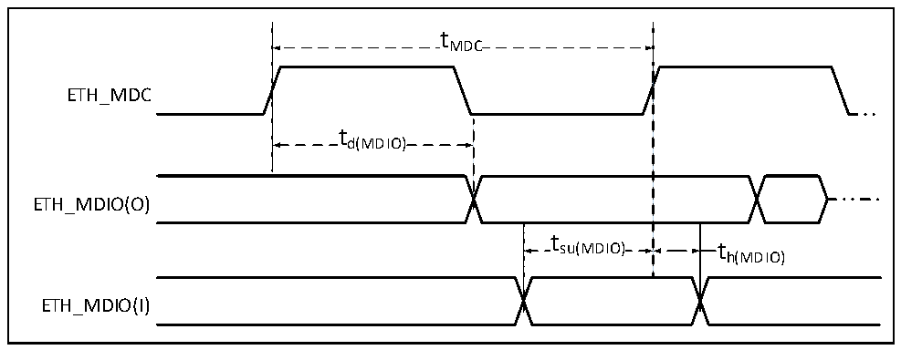
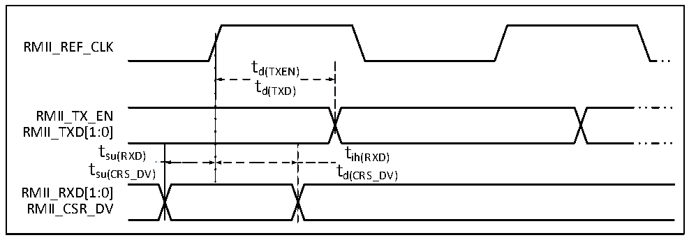

<!-- source-page: 76 -->

[← p.75](0075.md) · [index](../README.md) · [PDF p.76](https://ch32-riscv-ug.github.io/CH32V307/datasheet_zh/CH32V20x_30xDS0.PDF#page=76) · [p.77 →](0077.md)

<!-- header: CH32V303/305/307/317数据手册 https://wch.cn -->

> ⬆ **Table continued** — rendered in full at [page 75](0075.md). <!-- p76-table-001 -->

### 4.3.20 千兆以太网接口特性

图4-25 ETH-SMI 时序波形  
 <!-- rendered from the PDF; verify at https://ch32-riscv-ug.github.io/CH32V307/datasheet_zh/CH32V20x_30xDS0.PDF#page=76 -->

🖼 Text parsed from the figure above

tMDC  
ETH_MDC  
td(MDIO)  
ETH_MDIO(O)  
t  
su(MDIO) t  
h(MDIO)  
ETH_MDIO(I)  

<!-- p76-table-002 (table-4-38@1) -->
<table><caption>表4-38 以太网MAC的SMI信号特性</caption><tr><th>符号</th><th>参数及描述</th><th>最小值</th><th>典型值</th><th>最大值</th><th>单位</th></tr><tr><td style="text-align:left">f /t MDC MDC</td><td>MDC时钟频率</td><td></td><td></td><td>2.5</td><td>MHz</td></tr><tr><td style="text-align:left">t d（MDIO）</td><td>MDIO写数据的有效时间</td><td>0</td><td></td><td>300</td><td rowspan="3">ns</td></tr><tr><td style="text-align:left">t su（MDIO）</td><td>读数据建立时间</td><td>10</td><td></td><td></td></tr><tr><td style="text-align:left">t h（MDIO）</td><td>读数据保持时间</td><td>10</td><td></td><td></td></tr></table>

图4-26 ETH-RMII信号时序波形  
 <!-- rendered from the PDF; verify at https://ch32-riscv-ug.github.io/CH32V307/datasheet_zh/CH32V20x_30xDS0.PDF#page=76 -->

🖼 Text parsed from the figure above

RMII_REF_CLK  
td(TXEN)  
td(TXD)  
RMII_TX_EN  
RMII_TXD[1:0]  
tsu(RXD) tih(RXD)  
tsu(CRS_DV) td(CRS_DV)  
RMII_RXD[1:0]  
RMII_CSR_DV  

<!-- p76-table-003 (table-4-39@1) pages 76-77 -->
<table><caption>表4-39 以太网MAC信号RMII信号特性</caption><tr><th>符号</th><th>参数及描述</th><th>最小值</th><th>典型值</th><th>最大值</th><th>单位</th></tr><tr><td style="text-align:left">t su（RXD）</td><td>接收数据的建立时间</td><td>4</td><td></td><td></td><td>ns</td></tr><tr><td style="text-align:left">t ih（RXD）</td><td>接收数据的保持时间</td><td>2</td><td></td><td></td><td rowspan="5"></td></tr><tr><td style="text-align:left">t su（CRS_DV）</td><td>载波侦测信号建立时间</td><td>4</td><td></td><td></td></tr><tr><td style="text-align:left">t ih（CRS_DV）</td><td>载波侦测信号保持时间</td><td>2</td><td></td><td></td></tr><tr><td style="text-align:left">t d（TXEN）</td><td>传输使能有效延迟时间</td><td></td><td></td><td>16</td></tr><tr><td style="text-align:left">t d（TXD）</td><td>数据传输有效延迟时间</td><td></td><td></td><td>16</td></tr></table>

<!-- image: p76-draw-image-00001 bbox=[502.8, 779.28, 522.24, 789.6] -->
<!-- footer: V3.9 75 -->
