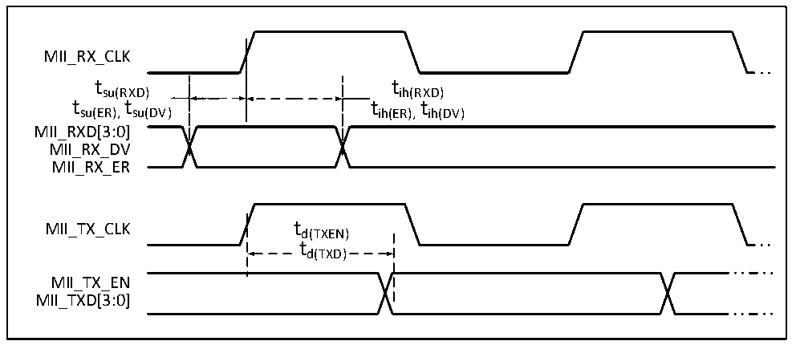

<!-- source-page: 77 -->

[← p.76](0076.md) · [index](../README.md) · [PDF p.77](https://ch32-riscv-ug.github.io/CH32V307/datasheet_zh/CH32V20x_30xDS0.PDF#page=77) · [p.78 →](0078.md)

<!-- header: CH32V303/305/307/317数据手册 https://wch.cn -->

> ⬆ **Table continued** — rendered in full at [page 76](0076.md). <!-- p77-table-001 -->

图4-27 ETH-MII信号时序波形  
 <!-- rendered from the PDF; verify at https://ch32-riscv-ug.github.io/CH32V307/datasheet_zh/CH32V20x_30xDS0.PDF#page=77 -->

🖼 Text parsed from the figure above

MII_RX_CLK  
t su(RXD) t t su(ER), su(DV)  
tsu(RXD) tih(RXD)  
tsu(ER),su(DV) t tih(ER),ih(DV) t  
MII_RXD[3:0]  
MII_RX_DV  
MII_RX_ER  
MII_TX_CLK td(TXEN)  
td(TXD)  
MII_TX_EN  
MII_TXD[3:0]  

<!-- p77-table-003 (table-4-40@1) -->
<table><caption>表4-40 以太网MAC信号MII信号特性</caption><tr><th>符号</th><th>参数及描述</th><th>最小值</th><th>典型值</th><th>最大值</th><th>单位</th></tr><tr><td style="text-align:left">t su（RXD）</td><td>接收数据的建立时间</td><td>10</td><td></td><td></td><td rowspan="8">ns</td></tr><tr><td style="text-align:left">t ih（RXD）</td><td>接收数据的保持时间</td><td>10</td><td></td><td></td></tr><tr><td style="text-align:left">t su（DV）</td><td>数据有效信号建立时间</td><td>10</td><td></td><td></td></tr><tr><td style="text-align:left">t ih（DV）</td><td>数据有效信号保持时间</td><td>10</td><td></td><td></td></tr><tr><td style="text-align:left">t su（ER）</td><td>错误信号建立时间</td><td>10</td><td></td><td></td></tr><tr><td style="text-align:left">t ih（ER）</td><td>错误信号保持时间</td><td>10</td><td></td><td></td></tr><tr><td style="text-align:left">t d（TXEN）</td><td>传输使能有效延迟时间</td><td></td><td></td><td>16</td></tr><tr><td style="text-align:left">t d（TXD）</td><td>数据传输有效延迟时间</td><td></td><td></td><td>16</td></tr></table>

<!-- image: p77-draw-image-00001 bbox=[502.8, 779.28, 522.24, 789.6] -->
<!-- footer: V3.9 76 -->
