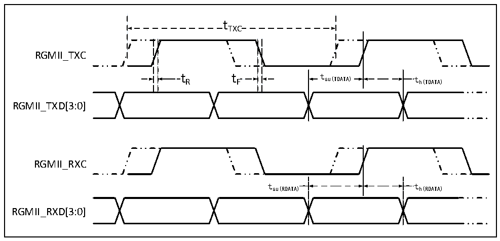

<!-- source-page: 78 -->

[← p.77](0077.md) · [index](../README.md) · [PDF p.78](https://ch32-riscv-ug.github.io/CH32V307/datasheet_zh/CH32V20x_30xDS0.PDF#page=78) · [p.79 →](0079.md)

<!-- header: CH32V303/305/307/317数据手册 https://wch.cn -->

图4-28 ETH-RGMII信号时序波形  
 <!-- rendered from the PDF; verify at https://ch32-riscv-ug.github.io/CH32V307/datasheet_zh/CH32V20x_30xDS0.PDF#page=78 -->

🖼 Text parsed from the figure above

tTXC  
RGMII_TXC  
t R t F t su(TDATA) t h(TDATA)  
RGMII_TXD[3:0]  
RGMII_RXC  
tsu(RDATA) th(RDATA)  
RGMII_RXD[3:0]  

<!-- p78-table-001 (table-4-41@1) -->
<table><caption>表4-41 以太网MAC信号RGMII信号特性</caption><tr><th>符号</th><th>参数及描述</th><th>最小值</th><th>典型值</th><th>最大值</th><th>单位</th></tr><tr><td style="text-align:left">f /t TXC TXC</td><td>TXC/RXC时钟频率</td><td>7.2</td><td>8</td><td>8.8</td><td rowspan="7">ns</td></tr><tr><td style="text-align:left">t R</td><td>TXC/RXC上升时间</td><td></td><td></td><td>2.0</td></tr><tr><td style="text-align:left">t F</td><td>TXC/RXC下降时间</td><td></td><td></td><td>2.0</td></tr><tr><td style="text-align:left">t su（TDATA）</td><td>发送数据建立时间</td><td>1.2</td><td>2.0</td><td></td></tr><tr><td style="text-align:left">t h（TDATA）</td><td>发送数据保持时间</td><td>1.2</td><td>2.0</td><td></td></tr><tr><td style="text-align:left">t su（RDATA）</td><td>输入数据建立时间</td><td>1.2</td><td>2.0</td><td></td></tr><tr><td style="text-align:left">t h（RDATA）</td><td>输入数据保持时间</td><td>1.2</td><td>2.0</td><td></td></tr></table>

### 4.3.21 12位ADC特性

<!-- p78-table-002 (table-4-42@1) pages 78-79 -->
<table><caption>表4-42 ADC特性</caption><tr><th>符号</th><th>参数</th><th>条件</th><th>最小值</th><th>典型值</th><th>最大值</th><th>单位</th></tr><tr><td style="text-align:left">VDDA</td><td>供电电压</td><td></td><td>2.4</td><td></td><td>3.6</td><td>V</td></tr><tr><td style="text-align:left">VREF+</td><td>正参考电压</td><td style="text-align:left">V 不能高于V REF+ DDA</td><td>2.4</td><td></td><td style="text-align:left">VDDA</td><td>V</td></tr><tr><td style="text-align:left">IVREF</td><td>参考电流</td><td></td><td></td><td>160</td><td>220</td><td>uA</td></tr><tr><td style="text-align:left">IDDA</td><td>供电电流</td><td></td><td></td><td>480</td><td>530</td><td>uA</td></tr><tr><td style="text-align:left">f ADC</td><td>ADC时钟频率</td><td></td><td></td><td></td><td>14</td><td>MHz</td></tr><tr><td style="text-align:left">f S</td><td>采样速率</td><td></td><td>0.05</td><td></td><td>1</td><td>MHz</td></tr><tr><td style="text-align:left">f TRIG</td><td>外部触发频率</td><td></td><td></td><td></td><td>16</td><td style="text-align:left">1/f ADC</td></tr><tr><td style="text-align:left">VAIN</td><td>转换电压范围</td><td></td><td>0</td><td></td><td style="text-align:left">VREF+</td><td>V</td></tr><tr><td style="text-align:left">RAIN</td><td>外部输入阻抗</td><td></td><td></td><td></td><td>50</td><td>kΩ</td></tr><tr><td style="text-align:left">RADC</td><td>采样开关电阻</td><td></td><td></td><td>0.6</td><td>1.5</td><td>kΩ</td></tr><tr><td style="text-align:left">CADC</td><td>内部采样和保持电容</td><td></td><td></td><td>8</td><td></td><td>pF</td></tr><tr><td style="text-align:left">t CAL</td><td>校准时间</td><td></td><td></td><td>40</td><td></td><td style="text-align:left">1/f ADC</td></tr><tr><td style="text-align:left">t Iat</td><td>注入触发转换时延</td><td></td><td></td><td></td><td>2</td><td style="text-align:left">1/f ADC</td></tr><tr><td style="text-align:left">t Iatr</td><td>常规触发转换时延</td><td></td><td></td><td></td><td>2</td><td style="text-align:left">1/f ADC</td></tr><tr><td style="text-align:left">t s</td><td>采样时间</td><td></td><td>1.5</td><td></td><td>239.5</td><td style="text-align:left">1/f ADC</td></tr><tr><td style="text-align:left">t STAB</td><td>上电时间</td><td></td><td></td><td></td><td>1</td><td>us</td></tr><tr><td style="text-align:left">t CONV</td><td>总的转换时间（包括采样时间）</td><td></td><td>14</td><td></td><td>252</td><td style="text-align:left">1/f ADC</td></tr></table>

<!-- image: p78-draw-image-00001 bbox=[502.8, 779.28, 522.24, 789.6] -->
<!-- footer: V3.9 77 -->
