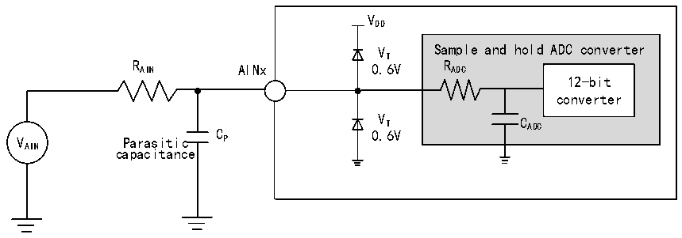

<!-- source-page: 79 -->

[← p.78](0078.md) · [index](../README.md) · [PDF p.79](https://ch32-riscv-ug.github.io/CH32V307/datasheet_zh/CH32V20x_30xDS0.PDF#page=79) · [p.80 →](0080.md)

<!-- header: CH32V303/305/307/317数据手册 https://wch.cn -->

> ⬆ **Table continued** — rendered in full at [page 78](0078.md). <!-- p79-table-001 -->

注：以上均为设计参数保证。  
公式：最大RAIN  
<!-- image: p79-draw-image-00002 bbox=[210.0, 157.8, 365.28, 181.92] -->
上述公式用于决定最大的外部阻抗，使得误差可以小于1/4 LSB。其中N = 12（表示12位分辨率）。  

<!-- p79-table-002 (table-4-43@1) -->
<table><caption>表4-43 fADC= 14MHz时的最大RAIN</caption><tr><th style="text-align:left">T（周期） S</th><th style="text-align:left">t（us） S</th><th style="text-align:left">最大R （kΩ） AIN</th></tr><tr><td>1.5</td><td>0.11</td><td>0.4</td></tr><tr><td>7.5</td><td>0.54</td><td>5.9</td></tr><tr><td>13.5</td><td>0.96</td><td>11.4</td></tr><tr><td>28.5</td><td>2.04</td><td>25.2</td></tr><tr><td>41.5</td><td>2.96</td><td>37.2</td></tr><tr><td>55.5</td><td>3.96</td><td>50</td></tr><tr><td>71.5</td><td>5.11</td><td>无效</td></tr><tr><td>239.5</td><td>17.1</td><td>无效</td></tr></table>

<!-- p79-table-003 (table-4-44@1) -->
<table><caption>表4-44 ADC误差</caption><tr><th>符号</th><th>参数</th><th>条件</th><th>最小值</th><th>典型值</th><th>最大值</th><th>单位</th></tr><tr><td>EO</td><td>偏移误差</td><td rowspan="3" style="text-align:left">f = 56MHz， PCLK2 f = 14MHz， ADC R &lt; 10kΩ，V = 3.3V AIN DDA</td><td></td><td>±4</td><td></td><td rowspan="3">LSB</td></tr><tr><td>ED</td><td>微分非线性误差</td><td></td><td>±2</td><td></td></tr><tr><td>EL</td><td>积分非线性误差</td><td></td><td>±2.5</td><td></td></tr></table>

Cp 表示PCB与焊盘上的寄生电容（大约5pF），可能与焊盘和PCB布局质量有关。较大的Cp 数值将  
降低转换精度，解决办法是降低fADC 值。  

图4-29 ADC典型连接图  
 <!-- rendered from the PDF; verify at https://ch32-riscv-ug.github.io/CH32V307/datasheet_zh/CH32V20x_30xDS0.PDF#page=79 -->

🖼 Text parsed from the figure above

VDD  
VT Sample and hold ADC converter  
R AIN AINx 0.6V R ADC  
12-bit  
converter  
V T C ADC  
VAIN Parasitic C P 0.6V  
capacitance  

<!-- image: p79-draw-image-00001 bbox=[502.8, 779.28, 522.24, 789.6] -->
<!-- footer: V3.9 78 -->
