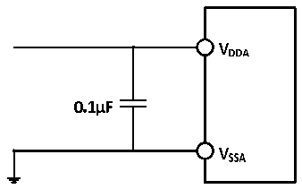

<!-- source-page: 80 -->

[← p.79](0079.md) · [index](../README.md) · [PDF p.80](https://ch32-riscv-ug.github.io/CH32V307/datasheet_zh/CH32V20x_30xDS0.PDF#page=80) · [p.81 →](0081.md)

<!-- header: CH32V303/305/307/317数据手册 https://wch.cn -->

图4-30 模拟电源及退耦电路参考  
 <!-- rendered from the PDF; verify at https://ch32-riscv-ug.github.io/CH32V307/datasheet_zh/CH32V20x_30xDS0.PDF#page=80 -->

🖼 Text parsed from the figure above

<!-- image: p80-draw-image-00002 inside the figure -->
<!-- image: p80-draw-image-00003 inside the figure -->
<!-- image: p80-draw-image-00006 inside the figure -->
<!-- image: p80-draw-image-00008 inside the figure -->
<!-- image: p80-draw-image-00010 inside the figure -->
<!-- image: p80-draw-image-00009 inside the figure -->
<!-- image: p80-draw-image-00007 inside the figure -->
<!-- image: p80-draw-image-00004 inside the figure -->
<!-- image: p80-draw-image-00005 inside the figure -->

### 4.3.22 温度传感器特性

<!-- p80-table-001 (table-4-45@1) -->
<table><caption>表4-45 温度传感器特性</caption><tr><th>符号</th><th>参数</th><th>条件</th><th>最小值</th><th>典型值</th><th>最大值</th><th>单位</th></tr><tr><td style="text-align:left">RTS</td><td>温度传感器测量范围</td><td></td><td>-40</td><td></td><td>85</td><td></td></tr><tr><td style="text-align:left">ATSC</td><td>温度传感器的测量误差</td><td></td><td></td><td>±12</td><td></td><td></td></tr><tr><td>Avg_Slope</td><td>平均斜率（负温度系数）</td><td></td><td>3.8</td><td>4.3</td><td>4.8</td><td>mV/℃</td></tr><tr><td style="text-align:left">V25</td><td>在25℃时的电压</td><td></td><td>1.34</td><td>1.40</td><td>1.46</td><td>V</td></tr><tr><td style="text-align:left">TS_temp</td><td>当读取温度时，ADC采样时间</td><td style="text-align:left">f = 14MHz ADC</td><td></td><td></td><td>17.1</td><td>us</td></tr></table>

### 4.3.23 DAC特性

<!-- p80-table-002 (table-4-46@1) pages 80-81 -->
<table><caption>表4-46 DAC特性</caption><tr><th>符号</th><th>参数</th><th>条件</th><th>最小值</th><th>典型值</th><th>最大值</th><th>单位</th></tr><tr><td style="text-align:left">VDDA</td><td>供电电压</td><td></td><td>2.4</td><td>3.3</td><td>3.6</td><td>V</td></tr><tr><td style="text-align:left">VREF+</td><td>正参考电压</td><td style="text-align:left">V 不能高于V REF+ DDA</td><td>2.4</td><td>3.3</td><td>3.6</td><td>V</td></tr><tr><td rowspan="2" style="text-align:left">R（1） L</td><td>缓冲器打开时的负载电阻</td><td></td><td>5</td><td></td><td></td><td>kΩ</td></tr><tr><td>缓冲器关闭时的负载电阻</td><td></td><td>15</td><td></td><td></td><td>kΩ</td></tr><tr><td style="text-align:left">C（1） L</td><td>缓冲器打开时负载电容</td><td></td><td></td><td></td><td>50</td><td>pF</td></tr><tr><td style="text-align:left">V （1） OUT_MIN</td><td rowspan="2">缓冲器打开，12位DAC转换</td><td></td><td>0</td><td></td><td>8</td><td>mV</td></tr><tr><td style="text-align:left">V （1） OUT_MAX</td><td style="text-align:left">V = 3.3VREF+</td><td>3.29</td><td></td><td>3.3</td><td>V</td></tr><tr><td style="text-align:left">V （1） OUT_MIN</td><td rowspan="2">缓冲器关闭，12位DAC转换</td><td></td><td>0</td><td></td><td>3</td><td>mV</td></tr><tr><td style="text-align:left">V （1） OUT_MAX</td><td style="text-align:left">V = 3.3VREF+</td><td>3.295</td><td></td><td>3.3</td><td>V</td></tr><tr><td rowspan="3" style="text-align:left">IVREF+</td><td colspan="2">无负载，输入值0x800</td><td></td><td>58</td><td></td><td rowspan="3">uA</td></tr><tr><td colspan="2" style="text-align:left">无负载，V =3.6V时，输入值0xF1CREF+</td><td></td><td>194</td><td></td></tr><tr><td colspan="2" style="text-align:left">无负载，V =3.6V时，输入值0x555（最差） REF+</td><td></td><td>331</td><td></td></tr><tr><td rowspan="3" style="text-align:left">IDDA</td><td colspan="2">缓冲器打开无负载，输入值0x800</td><td></td><td>170</td><td></td><td rowspan="3">uA</td></tr><tr><td colspan="2" style="text-align:left">缓冲器打开无负载，V =3.6V，输入值0xF1CREF+</td><td></td><td>150</td><td></td></tr><tr><td colspan="2" style="text-align:left">缓冲器打开无负载，V =3.6V，输入值0x555（最差） REF+</td><td></td><td>170</td><td></td></tr><tr><td>DNL</td><td>微分非线性误差</td><td></td><td></td><td>±2</td><td></td><td>LSB</td></tr><tr><td>INL</td><td>积分非线性误差</td><td style="text-align:left">经过失调误差和增益误差校正后</td><td></td><td>±4</td><td></td><td>LSB</td></tr><tr><td rowspan="2">失调</td><td rowspan="2">偏移误差</td><td></td><td></td><td>±3</td><td>±12</td><td>mV</td></tr><tr><td style="text-align:left">V = 3.6VREF+</td><td></td><td></td><td>±10</td><td>LSB</td></tr><tr><td>增益误差</td><td></td><td>DAC配置为12位</td><td></td><td>±0.4</td><td></td><td>%</td></tr><tr><td>放大器增益（1）</td><td>开环时放大器的增益</td><td>5kΩ的负载（最大）</td><td>80</td><td>85</td><td></td><td>dB</td></tr><tr><td style="text-align:left">t SETTLING</td><td>设置时间（全范围：输入代码</td><td style="text-align:left">C ≤50pFLOAD</td><td></td><td>3</td><td>4</td><td>us</td></tr><tr><td></td><td style="text-align:left">从最小值转变为最大值， DAC_OUT达到其终值的±1LSB）</td><td style="text-align:left">R ≥5kΩLOAD</td><td></td><td></td><td></td><td></td></tr><tr><td>更新速率</td><td style="text-align:left">当输入代码为较小变化时（从数值i变到i+1LSB），得到正确DAC_OUT的最大频率</td><td style="text-align:left">C ≤50pFLOAD R ≥5kΩLOAD</td><td></td><td></td><td>1</td><td>MS/s</td></tr><tr><td style="text-align:left">t WAKEUP</td><td style="text-align:left">从关闭状态唤醒的时间（DAC的使能位ENx从0变为1）</td><td style="text-align:left">C ≤50pF， LOAD R ≥5kΩ，输入代码LOAD介于最小和最大可能数值之间</td><td></td><td>6.5</td><td>10</td><td>us</td></tr><tr><td>PSRR+（1）</td><td style="text-align:left">供电抑制比（相对于V ）（静DDA态直流测量）</td><td style="text-align:left">没有R ，C ≤50pF LOAD LOAD</td><td></td><td>-100</td><td>-75</td><td>dB</td></tr></table>

<!-- image: p80-draw-image-00001 bbox=[502.8, 779.28, 522.24, 789.6] -->
<!-- footer: V3.9 79 -->
