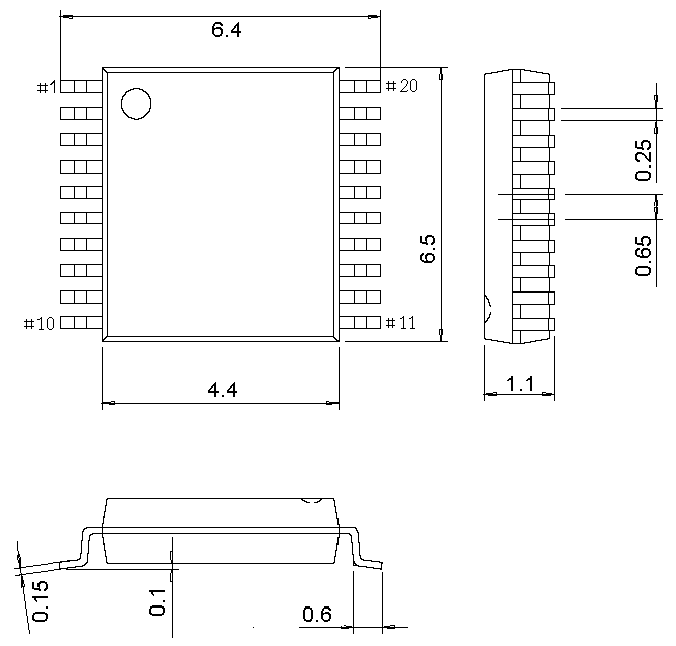
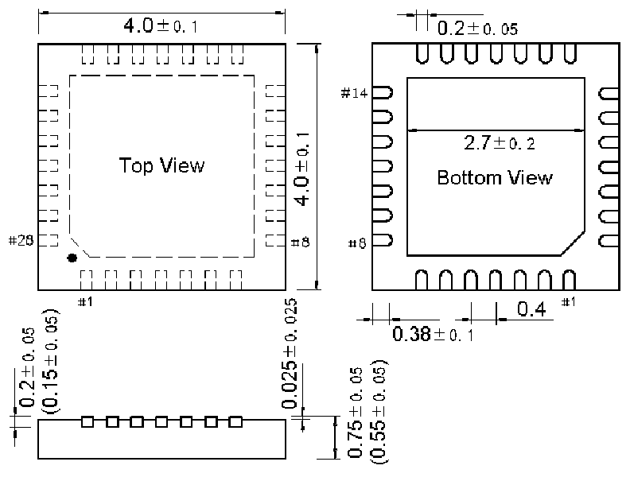

<!-- source-page: 84 -->

[← p.83](0083.md) · [index](../README.md) · [PDF p.84](https://ch32-riscv-ug.github.io/CH32V307/datasheet_zh/CH32V20x_30xDS0.PDF#page=84) · [p.85 →](0085.md)

<!-- header: CH32V303/305/307/317数据手册 https://wch.cn -->
说明：尺寸标注的单位是 mm（毫米），引脚中心间距总是标称值，没有误差，除此之外的尺寸误差不  
大于±0.2mm或者±10%两者中的较大值。  

## 5.1 TSSOP20封装

 <!-- p84-draw-image-00002 rendered from the PDF -->

## 5.2 QFN28封装

 <!-- p84-draw-image-00003 rendered from the PDF -->

<!-- image: p84-draw-image-00001 bbox=[502.8, 779.28, 522.24, 789.6] -->
<!-- footer: V3.9 83 -->
