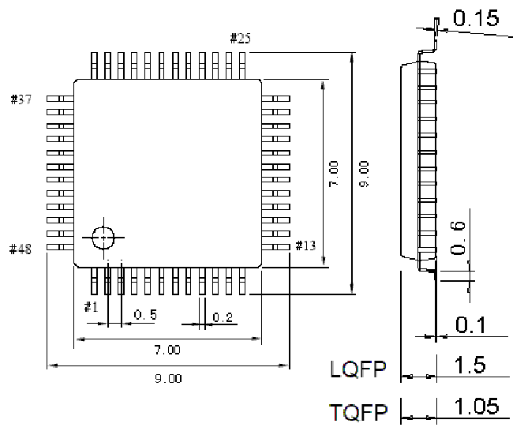
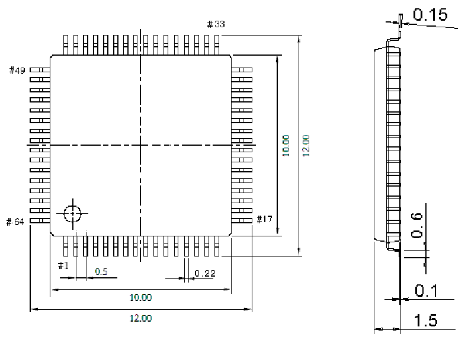

<!-- source-page: 85 -->

[← p.84](0084.md) · [index](../README.md) · [PDF p.85](https://ch32-riscv-ug.github.io/CH32V307/datasheet_zh/CH32V20x_30xDS0.PDF#page=85) · [p.86 →](0086.md)

<!-- header: CH32V303/305/307/317数据手册 https://wch.cn -->

## 5.3 LQFP48 封装

 <!-- p85-draw-image-00002 rendered from the PDF -->

## 5.4 LQFP64M封装

 <!-- p85-draw-image-00003 rendered from the PDF -->

<!-- image: p85-draw-image-00001 bbox=[502.8, 779.28, 522.24, 789.6] -->
<!-- footer: V3.9 84 -->
