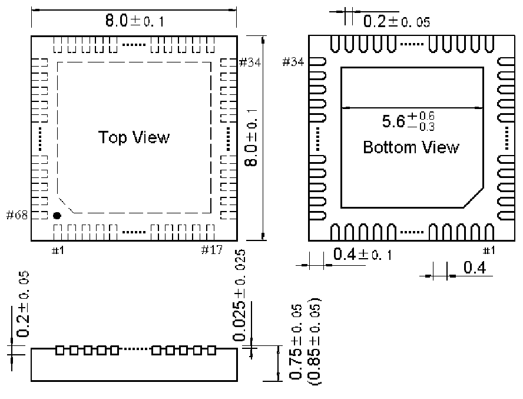
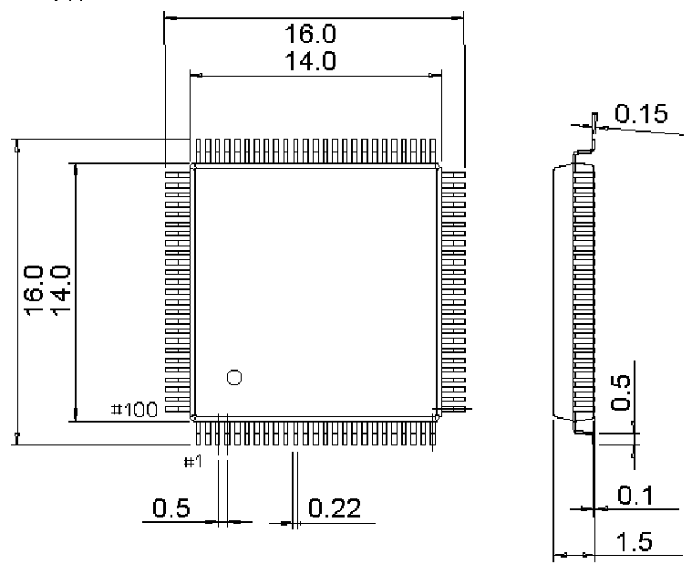

<!-- source-page: 86 -->

[← p.85](0085.md) · [index](../README.md) · [PDF p.86](https://ch32-riscv-ug.github.io/CH32V307/datasheet_zh/CH32V20x_30xDS0.PDF#page=86) · [p.87 →](0087.md)

<!-- header: CH32V303/305/307/317数据手册 https://wch.cn -->

## 5.5 QFN68封装

 <!-- p86-draw-image-00002 rendered from the PDF -->

## 5.6 LQFP100封装

 <!-- p86-draw-image-00003 rendered from the PDF -->

<!-- image: p86-draw-image-00001 bbox=[502.8, 779.28, 522.24, 789.6] -->
<!-- footer: V3.9 85 -->
