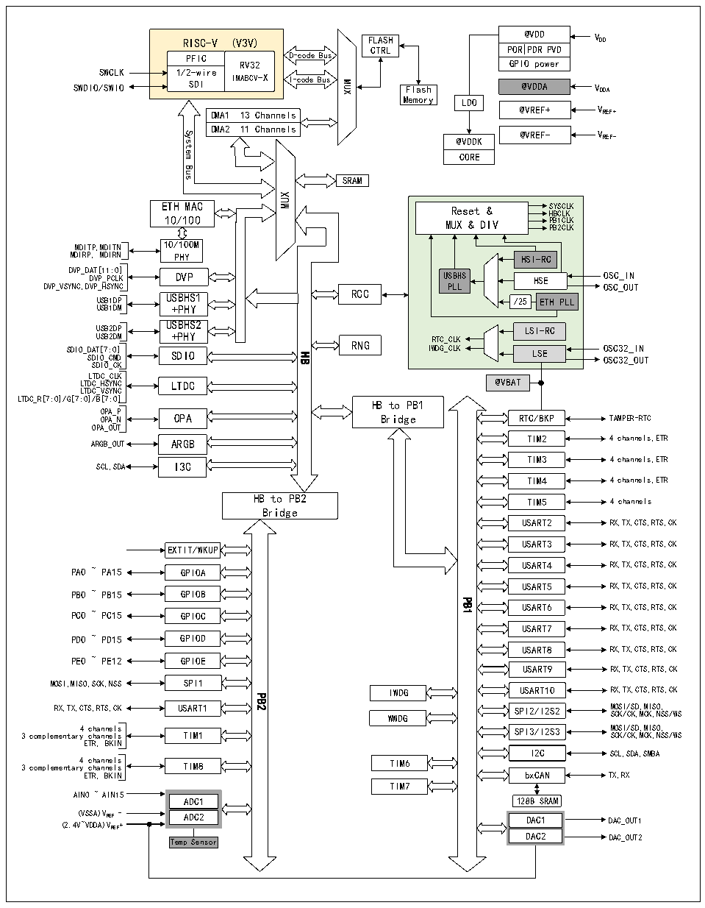

<!-- source-page: 5 -->

[← p.4](0004.md) · [index](../README.md) · [PDF p.5](https://ch32-riscv-ug.github.io/CH32V407/datasheet_en/CH32V407DS0.PDF#page=5) · [p.6 →](0006.md)

<!-- header: CH32V407/V467 Datasheet https://wch-ic.com -->

Figure 1-1-1 CH32V407 System block diagram  
 <!-- rendered from the PDF; verify at https://ch32-riscv-ug.github.io/CH32V407/datasheet_en/CH32V407DS0.PDF#page=5 -->

🖼 Text parsed from the figure above

@VDD  PORPD  DRPVD  GPIO power  @VDDA  
RISC-V (V3V) FLASH  
PORPDRPVD  
CTRL  
D-code Bus  
PFIC  
RV32  
SWCLK  
1/2-wire  
IMABCV-X SDII-codeBus Flash  
SWDIO/SWIOMUX@VDDA VDDA  
Memory  
LDO  
@VREF+ VREF+  
DMA1 13 Channels  
DMA2 11 Channels  
@VREF- VREF-  
System  
@VDDK  
CORE  
Bus  
SRAM  
MUX  
ETH MAC Reset &amp; S H Y B S C C L L K K  
10/100 MUX &amp; DIV PB1CLK  
PB2CLK  
MDITP,MDITN 10/100M  
MDIRP, MDIRN PHY HSI-RC  
DVP_D D AT VP [1 _P 1: CL 0] K DVP USBHS HSE OSC_IN  
DVP_VSYNC,DVP_HSYNC PLL OSC_OUT  
RCC  
USB1DP USBHS1 /25 ETH PLL  
USB1DM +PHY  
USBHS2  
USB2DP LSI-RC  
USB2DM +PHY RTC_CLK SDIO_ S D D A I T O [ _ 7 C :0 MD ] SDIO IWDG_CLK LSE O O S S C C 3 3 2 2 _ _ I O N UT  
RNG  
HB  
SDIO_CK  
LTDC_CLK  
LTDC_HSYNC LTDC @VBAT  
LTDC_VSYNC  
LTDC_R[7:0]/G[7:0]/B[7:0]  
HB to PB1  
O O P P A A _ _ P N OPA  
Bridge  
RTC/BKP TAMPER-RTC  
OPA_OUT  
TIM2 4 channels,ETR  
ARGB_OUT ARGB  
TIM3 4 channels,ETR  
SCL,SDA I3C  
TIM4 4 channels,ETR  
HB to PB2  
TIM5 4 channels  
Bridge  
USART2 RX,TX,CTS,RTS,CK  
USART3 RX,TX,CTS,RTS,CK  
EXTIT/WKUP  
USART4 RX,TX,CTS,RTS,CK  
PA0 ~ PA15 GPIOA  
USART5 RX,TX,CTS,RTS,CK  
GPIOB  
PB0 ~ PB15  
PB1  
USART6 RX,TX,CTS,RTS,CK  
PC0 ~ PC15  
GPIOC  
USART7 RX,TX,CTS,RTS,CK  
GPIOD  
PD0 ~ PD15  
USART8 RX,TX,CTS,RTS,CK  
PE0 ~ PE12 GPIOE  
USART9 RX,TX,CTS,RTS,CK  
MOSI,MISO,SCK,NSS SPI1  
USART10 RX,TX,CTS,RTS,CK  
IWDG  
PB2  
RX,TX,CTS,RTS,CK USART1 WWDG SPI2/I2S2 M S O C S K I / / C S K, D M ,M CK IS ,N O, SS /WS  
3 complementar 4 y c c h h a a n n n n e e l l s s TIM1 SPI3/I2S3 M S O C S K I / / C S K, D M ,M CK IS ,N O, SS /WS  
ETR, BKIN  
I2C SCL,SDA,SMBA  
3 complementary 4 c c h h a a n n n n e e l l s s TIM8 TIM6  
ETR, BKIN bxCAN TX,RX  
TIM7  
AIN0 ~ AIN15  
128B SRAM  
ADC1  
(VSSA)VREF - ADC2 DAC1 DAC_OUT1  
DAC1  DAC2  
(2.4V~VDDA)VREF+  
Temp Sensor DAC2 DAC_OUT2  

<!-- image: p5-draw-image-00001 bbox=[509.28, 782.04, 531.0, 793.8] -->
<!-- footer: V1.2 2 -->
