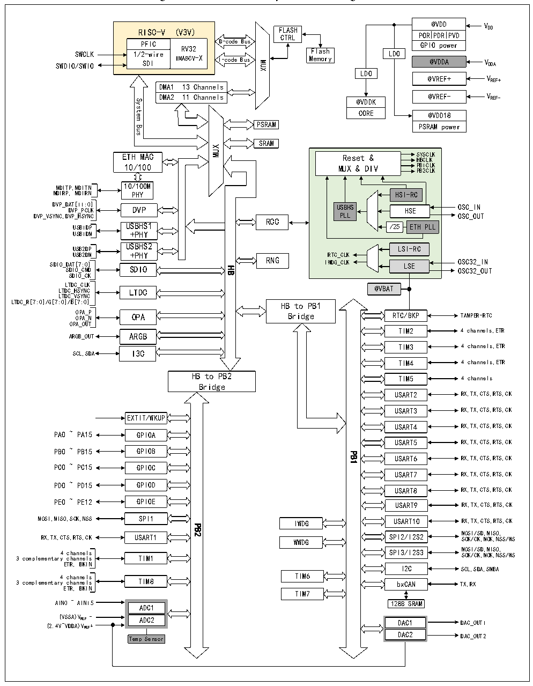

<!-- source-page: 6 -->

[← p.5](0005.md) · [index](../README.md) · [PDF p.6](https://ch32-riscv-ug.github.io/CH32V407/datasheet_en/CH32V407DS0.PDF#page=6) · [p.7 →](0007.md)

<!-- header: CH32V407/V467 Datasheet https://wch-ic.com -->

Figure 1-1-2 CH32V467 System block diagram  
 <!-- rendered from the PDF; verify at https://ch32-riscv-ug.github.io/CH32V407/datasheet_en/CH32V407DS0.PDF#page=6 -->

🖼 Text parsed from the figure above

@VDD  POR PDR PVD GPIO power  
RISC-V (V3V) PFIC  PFIC1/2-wire SDI  RV32IMABCV-X  
RISC-V (V3V) FLASH  
CTRL  
D-code Bus  
GPIO power  
RV32 Flash 1/2-wire  
LDO  
SWCLK  
IMABCV-X MemI-codeBusory SDI  
@VDDA VDDA  
MUX  
SWDIO/SWIO  
LDO  
@VREF+ VREF+  
DMA1 13 Channels  
@VREF- VREF-  
DMA2 11 Channels  
System  
@VDDK  
CORE @VDD18  
PSRAM PSRAM power  
Bus  
SRAM  
MUX  
ETH MAC Reset &amp; SHBCLKYSCLK  
10/100 MUX &amp; DIVPB2CLK PB1CLK  
MDITP,MDITN 10/100M  
MDIRP, MDIRN PHY HSI-RC  
DVP_D D AT VP [1 _P 1: CL 0] K DVP USBHS HSE OSC_IN  
DVP_VSYNC,DVP_HSYNC PLL OSC_OUT  
RCC  
USB1DP USBHS1 /25 ETH PLL  
USB1DM +PHY  
USB2DP USBHS2 LSI-RC  
USB2DM +PHY RTC_CLK  
RNG  
SDIO_D S A D T I [ O 7 _ : C 0 MD ] SDIO IWDG_CLK LSE O O S S C C 3 3 2 2 _ _ I O N UT  
HB  
SDIO_CK  
LTD L C TD _H C_ SY C N LK C LTDC @VBAT  
LTDC_VSYNC  
LTDC_R[7:0]/G[7:0]/B[7:0]  
HB to PB1  
OPA_P OPA_N OPA  
Bridge  
RTC/BKP TAMPER-RTC  
OPA_OUT  
TIM2 4 channels,ETR  
ARGB_OUT ARGB  
TIM3 4 channels,ETR  
SCL,SDA I3C  
TIM4 4 channels,ETR  
HB to PB2  
TIM5 4 channels  
Bridge  
USART2 RX,TX,CTS,RTS,CK  
USART2  USART3  USART4  
USART3 RX,TX,CTS,RTS,CK  
EXTIT/WKUP  
USART4 RX,TX,CTS,RTS,CK  
PA0 ~ PA15 GPIOA  
USART5 RX,TX,CTS,RTS,CK  
PB0 ~ PB15 GPIOB  
PB1  
USART6 RX,TX,CTS,RTS,CK  
PC0 ~ PC15 GPIOC  
USART7 RX,TX,CTS,RTS,CK  
PD0 ~ PD15 GPIOD  
USART8 RX,TX,CTS,RTS,CK  
PE0 ~ PE12 GPIOE  
USART9 RX,TX,CTS,RTS,CK  
MOSI,MISO,SCK,NSS SPI1  
USART10 RX,TX,CTS,RTS,CK  
IWDG  
PB2  
WWDG SPI2/I2S2 M S O C S K I / / C S K, D, M M CK IS , O N , SS /WS  
RX,TX,CTS,RTS,CK USART1  
SPI3/I2S3 M S O C S K I / / C S K, D, M M CK IS , O N , SS /WS  
4 channels 3 complementary channels TIM1  
ETR, BKIN  
I2C SCL,SDA,SMBA  
TIM6  
4 channels  
3 complementary channels TIM8  
bxCAN TX,RX  
ETR, BKIN  
TIM7  
AIN0 ~ AIN15  
128B SRAM  
ADC1  
(2.4 ( V V ~V SS DD A) A V ) R V E R F E F - + ADC2 DAC1 DAC_OUT1  
DAC1  DAC2  
Temp Sensor DAC2 DAC_OUT2  

<!-- image: p6-draw-image-00001 bbox=[509.28, 782.04, 531.0, 793.8] -->
<!-- footer: V1.2 3 -->
