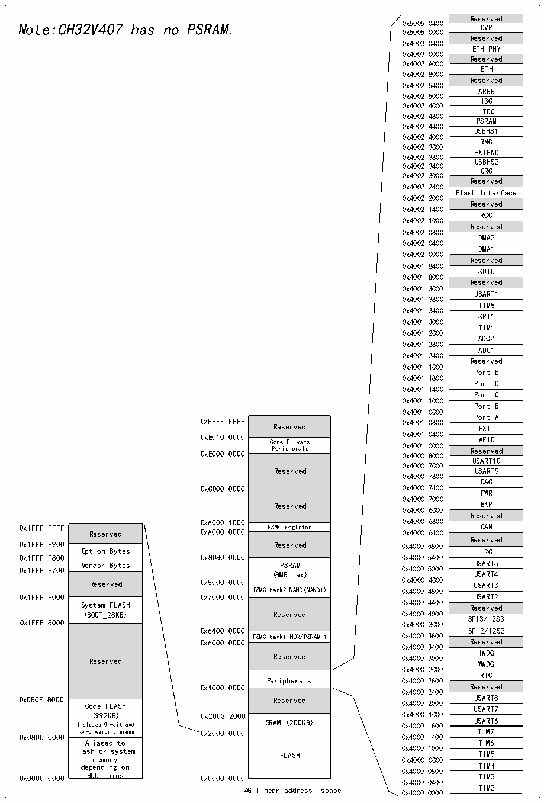

<!-- source-page: 7 -->

[← p.6](0006.md) · [index](../README.md) · [PDF p.7](https://ch32-riscv-ug.github.io/CH32V407/datasheet_en/CH32V407DS0.PDF#page=7) · [p.8 →](0008.md)

<!-- header: CH32V407/V467 Datasheet https://wch-ic.com -->

## 1.2 Memory Map

Figure 1-2 Memory address map  
 <!-- rendered from the PDF; verify at https://ch32-riscv-ug.github.io/CH32V407/datasheet_en/CH32V407DS0.PDF#page=7 -->

🖼 Text parsed from the figure above

Reserved  DVP  Reserved  ETH PHY  Reserved  ETH  Reserved  ARGB  I3C  LTDC  PSRAM  USBHS1  RNG  EXTEND  USBHS2  CRC  Reserved  Flash Interface  Reserved  RCC  Reserved  DMA2  DMA1  Reserved  SDIO  Reserved  USART1  TIM8  SPI1  TIM1  ADC2  ADC1  Reserved  Port E  Port D  Port C  Port B Port A  Port A  EXTIAFIO  AFIO  Reserved  RUeSsAeRrTv1e0d  USART9  DAC  PWR  BKP  Reserved  CAN  Reserved  I2C  USART5USART4  USART4  USART3  USART2  Reserved  SPI3/I2S3  SPI2/I2S2  Reserved  IWDG  WWDG  RTC  Reserved  USART8  USART7  USART6  TIM7  TIM6  TIM5  TIM4  TIM3  TIM2  
Note:CH32V407 has no PSRAM.0x50050000 0x5005 0400 DVP  
0x4003 0400  
0x4003 0000  
0x4002 A000  
0x4002 8000  
0x4002 5400  
0x4002 5000  
0x4002 4C00  
0x4002 4800  
0x4002 4400  
0x4002 4000  
0x4002 3C00  
0x4002 3800  
0x4002 3400  
0x4002 3000  
0x4002 2400  
0x4002 2000  
0x4002 1400  
0x4002 1000  
0x4002 0800  
0x4002 0400  
0x4002 0000  
0x4001 8400  
0x4001 8000  
0x4001 3C00  
0x4001 3800  
0x4001 3400  
0x4001 3000  
0x4001 2C00  
0x4001 2800  
0x4001 2400  
0x4001 1C00  
0x4001 1800  
0x4001 1400  
0x4001 1000  
0x4001 0C00  
0xFFFF FFFF Reserved 0x4001 0800 Po E r X t T I A  
Reserved  Core Private Peripherals  Reserved  Reserved  FSMC register  Reserved  PSRAM (8MB max)  FSMC bank2 NAND(NAND1)  Reserved  FSMC bank1 NOR/PSRAM 1  Reserved  Peripherals  Reserved  SRAM (200KB)  FLASH  
0 0 x x E E 0 0 0 1 0 0 0 0 0 0 0 0 0 0 C P o e r r e i p P h r e i r v a a l t s e 0 0 0 x x x 4 4 4 0 0 0 0 0 0 0 1 1 8 0 0 0 0 4 0 0 0 0 0 0 Re A s F e I r O ved  
USART10  
0x4000 7C00  
Reserved USART9  
0x4000 7800  
0x4000 7000  
Reserved BKP  
0x4000 6C00  
Reserved  Option Bytes  Vendor Bytes  Reserved  System FLASH (BOOT_28KB)  Reserved  Code FLASH (992KB) Includes 0 wait and non-0 waiting areas  Aliased to Flash or system memory depending on BOOT pins  
0x1FFF F900 Reserved 0x4000 5800  
0x1FFF F800 0x8080 0000 0x4000 5400  
FSMC bank2 NAND(NAND1) 0x4000 4800  
0x6400 0000 SPI2/I2S2  
FSMC bank1 NOR/PSRAM 1 0x4000 3800  
0x6000 0000 Reserved  
0x4000 3400  
0x4000 2C00  
Peripherals 0x4000 2800  
0x4000 0000 Reserved  
0x4000 2400  
0x0800 0000 0x4000 1400  
0x4000 0400  
4G linear address space 0x4000 0000 TIM2  

<!-- image: p7-draw-image-00001 bbox=[509.28, 782.04, 531.0, 793.8] -->
<!-- footer: V1.2 4 -->
