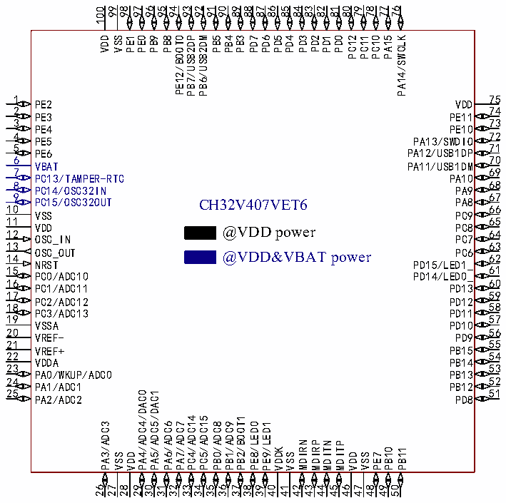
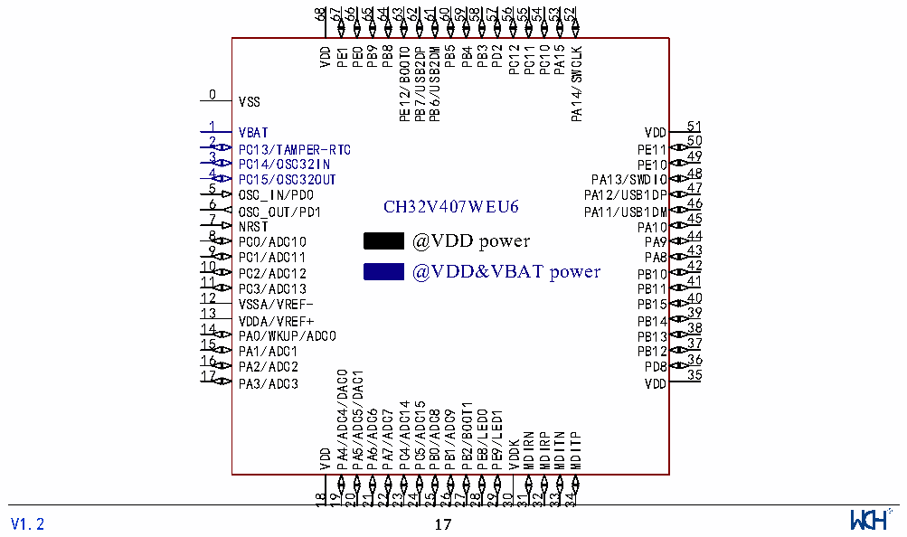

<!-- source-page: 20 -->

[← p.19](0019.md) · [index](../README.md) · [PDF p.20](https://ch32-riscv-ug.github.io/CH32V407/datasheet_en/CH32V407DS0.PDF#page=20) · [p.21 →](0021.md)

<!-- header: CH32V407/V467 Datasheet https://wch-ic.com -->

# Chapter 2 Pinouts and Pin Definition

## 2.1 Pinout

### 2.1.1 CH32V407 Pinouts

 <!-- p20-cluster-01 uncaptioned graphics, rendered from the PDF; verify at https://ch32-riscv-ug.github.io/CH32V407/datasheet_en/CH32V407DS0.PDF#page=20 -->

 <!-- p20-cluster-02 uncaptioned graphics, rendered from the PDF; verify at https://ch32-riscv-ug.github.io/CH32V407/datasheet_en/CH32V407DS0.PDF#page=20 -->

🖼 Text parsed from the figure above

100 99 96 95 94 93 92 91 90 89 83 80 79 78 77 76  
98 97 88 87 86 85 84 82 81  
VDD VSS PE1 PE0  
PB9  
PB8 PE12/BOOT0 PB7/USB2DP PB6/USB2DM PB5 PB4 PB3 PD7 PD6 PD5 PD4 PD3  
PD2  
PD1  
PD0  
PC12 PC11 PC10 PA15 PA14/SWCLK  
75  
1  
PE2  
VDD  
74  
2  
PE11  
PE3  
73  
3  
PE10  
PE4  
72  
4  
PA13/SWDIO  
PE5  
71  
5  
PA12/USB1DP  
PE6  
70  
6  
VBAT  
PA11/USB1DM  
69  
7  
PC13/TAMPER-RTC  
PA10  
68  
8  
PC14/OSC32IN  
PA9  
67  
9  
PA8  
PC15/OSC32OUT  
CH32V407VET6  
66  
10  
VSS  
PC9  
65  
11  
VDD  
PC8 64  
@VDD power  
12  
OSC_IN  
PC7  
63  
13  
14 OSC_OUT  
PC6 62  
@VDD&amp;VBAT power  
NRST  
PD15/LED1_  
61  
15  
PC0/ADC10  
PD14/LED0_  
60  
16  
PC1/ADC11  
PD13  
59  
17  
PC2/ADC12  
PD12  
58  
18  
PC3/ADC13  
PD11  
57  
19  
VSSA  
PD10  
56  
20  
VREF-  
PD9  
55  
21  
PB15  
VREF+  
54  
22  
PB14  
VDDA  
53  
23  
PA0/WKUP/ADC0  
PB13  
52  
24  
PA1/ADC1  
PB12  
51  
25  
/DAC0  
/DAC1  
PA2/ADC2  
PD8  
PC4/ADC14  
PC5/ADC15  
PB2/BOOT1  
PA3/ADC3  
PA4/ADC4  
PA5/ADC5  
PA6/ADC6  
PA7/ADC7  
PB0/ADC8  
PB1/ADC9  
PE8/LED0  
PE9/LED1  
MDIRN  
MDIRP  
MDITN  
MDITP  
VDDK  
PB10  
PB11  
VSS  
VDD  
VSS  
VDD  
VSS  
PE7  
26  
27  
28  
29  
30  
31  
32  
33  
34  
35  
36  
37  
38  
39  
40  
41  
42 43 44 45 46  
47  
48  
49  
50  
68 67 65 64 63 62 61 60 59 58 57 56 55 54 53 52  
66  
PB9 PB8 PE12/BOOT0 PB7/USB2DP PB6/USB2DM PB5 PB4 PB3 PD2 PC12 PC11  
PC10  
PA15  
VDD PE1  
PE0  
PA14/SWCLK  
0  
VSS  
51  
1  
VBAT  
VDD  
50  
2  
PC13/TAMPER-RTC  
PE11  
49  
3  
PC14/OSC32IN  
PE10  
48  
4  
PC15/OSC32OUT  
PA13/SWDIO  
47  
5  
OSC_IN/PD0  
PA12/USB1DP  
46  
6 CH32V407WEU6  
OSC_OUT/PD1  
PA11/USB1DM  
45  
7  
NRST  
PA10  
44  
8 PC0/ADC10 @VDD power  
PA9  
43  
9  
PC1/ADC11  
PA8  
42  
10 PC2/ADC12  
@VDD&amp;VBAT power  
PB10  
41  
11  
PC3/ADC13  
PB11  
40  
12  
VSSA/VREF-  
PB15  
39  
13  
VDDA/VREF+  
PB14  
38  
14  
PA0/WKUP/ADC0  
PB13  
37  
15  
PA1/ADC1  
PB12  
16 36  
PA2/ADC2  
PD8  
17 35  
/DAC0  
/DAC1  
PA3/ADC3  
VDD  
PC4/ADC14  
PC5/ADC15  
PB2/BOOT1  
PA4/ADC4  
PA5/ADC5 PA6/ADC6  
PA7/ADC7  
PB0/ADC8  
PB1/ADC9  
PE8/LED0 PE9/LED1  
MDIRN  
MDIRP  
MDITN  
MDITP  
VDDK  
VDD  
19  20  21  22  23  24  25  26  27  28  29  30  31  32  33  34  
<!-- image: p20-draw-image-00001 inside the figure -->
<!-- footer: V1.2 17 -->

