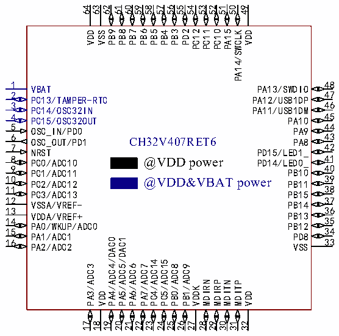
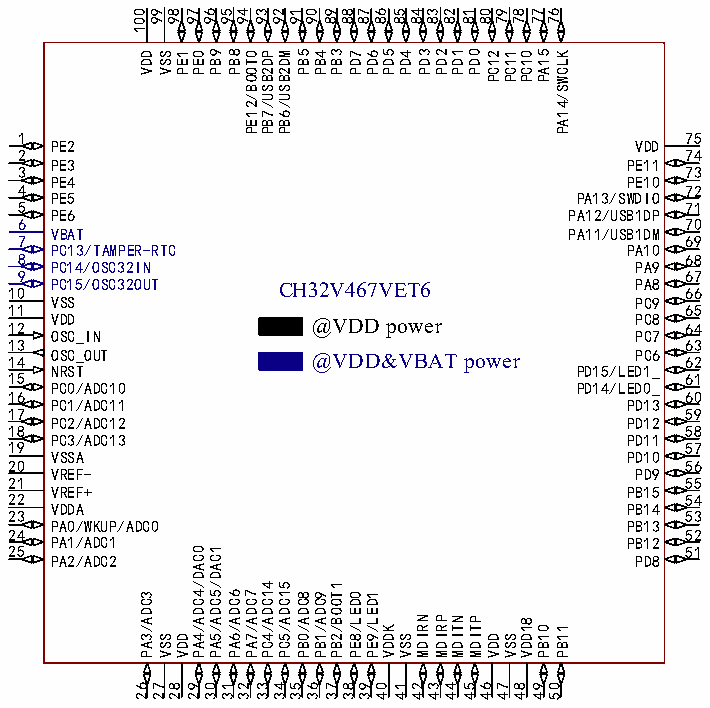

<!-- source-page: 21 -->

[← p.20](0020.md) · [index](../README.md) · [PDF p.21](https://ch32-riscv-ug.github.io/CH32V407/datasheet_en/CH32V407DS0.PDF#page=21) · [p.22 →](0022.md)

<!-- header: CH32V407/V467 Datasheet https://wch-ic.com -->

 <!-- p21-cluster-01 uncaptioned graphics, rendered from the PDF; verify at https://ch32-riscv-ug.github.io/CH32V407/datasheet_en/CH32V407DS0.PDF#page=21 -->

🖼 Text parsed from the figure above

64 62 61 60 59 58 57 56 55 54 53 52 51 50 49  
63  
PB9  
PB8  
PB7  
PB6  
PB5  
PB3  
PD2  
PC12  
PC11  
PC10  
PA15  
VDD  
VSS  
PB4  
PA14/SWCLK  
VDD  
1 PA13/SWDIO 48  
VBAT  
2 47  
PC13/TAMPER-RTC  
PA12/USB1DP  
46  
3  
PC14/OSC32IN  
PA11/USB1DM  
4 PA10 45  
PC15/OSC32OUT  
5 PA9 44  
OSC_IN/PD0  
6 43 PA8  
OSC_OUT/PD1 CH32V407RET6  
42  
7  
PD15/LED1_  
NRST  
@VDD power PD14/LED0_ 41  
8  
PC0/ADC10  
40 PC1/ADC11 PB10  
9  
10 39  
@VDD&amp;VBAT power  
PC2/ADC12  
PB11  
38  
11  
PC3/ADC13  
PB15  
12 37  
VSSA/VREF-  
PB14  
13 36  
PB13  
VDDA/VREF+  
14 35  
PB12  
PA0/WKUP/ADC0  
15 34  
PD8  
PA1/ADC1  
PA4/ADC4/DAC0  
PA5/ADC5/DAC1  
33 VSS  
16  
PA2/ADC2  
PC4/ADC14  
PC5/ADC15  
PA3/ADC3  
PA6/ADC6  
PA7/ADC7  
PB0/ADC8  
PB1/ADC9  
MDIRN  
MDIRP  
MDITN  
MDITP  
VDDK  
VDD  
VDD  
17  
18  
19  
20  
21  
22  
23  
24  
25 26  
27  
28 29  
30  
31  
32  

### 2.1.2 CH32V467 Pinouts

 <!-- p21-cluster-02 uncaptioned graphics, rendered from the PDF; verify at https://ch32-riscv-ug.github.io/CH32V407/datasheet_en/CH32V407DS0.PDF#page=21 -->

🖼 Text parsed from the figure above

100 99 96 95 94 93 92 91 90 89 83 80 79 78 77 76  
98 97 88 87 86 85 84 82 81  
PB9  
PB8  
PB5  
PB3  
PD5  
PD3  
PD2  
PD1  
PD0  
PA15  
VDD  
VSS  
PE1  
PE0  
PE12/BOOT0  
PB7/USB2DP  
PB6/USB2DM  
PB4  
PD7  
PD6  
PD4  
PC12  
PC11  
PC10  
PA14/SWCLK  
1  
75  
PE2  
VDD  
2  
74  
PE3  
PE11  
3  
73  
PE4  
PE10  
4  
72  
PE5  
PA13/SWDIO  
5  
71  
PE6  
PA12/USB1DP  
6  
70  
VBAT  
PA11/USB1DM  
7  
69  
PC13/TAMPER-RTC  
PA10  
8  
68  
PC14/OSC32IN  
PA9  
9  
67  
10 PC15/OSC32OUT CH32V467VET6  
PA8 66  
VSS  
PC9  
11  
65  
12 VDD @VDD power  
PC8 64  
OSC_IN  
PC7  
13  
63  
14 OSC_OUT @VDD&amp;VBAT power  
PC6  
62  
NRST  
PD15/LED1_  
15  
61  
PC0/ADC10  
PD14/LED0_  
16  
60  
PC1/ADC11  
PD13  
17  
59  
PC2/ADC12  
PD12  
18  
58  
PC3/ADC13  
PD11  
19  
57  
VSSA  
PD10  
20  
56  
VREF-  
PD9  
21  
55  
VREF+  
PB15  
22  
54  
VDDA  
PB14  
23  
53  
PA0/WKUP/ADC0  
PB13  
24  
52  
PA1/ADC1  
PB12  
25 51  
PA4/ADC4/DAC0  
PA5/ADC5/DAC1  
PA2/ADC2 PD8  
PC4/ADC14  
PC5/ADC15  
PB2/BOOT1  
PA6/ADC6  
PA7/ADC7  
PA3/ADC3  
PB0/ADC8  
PB1/ADC9  
PE8/LED0  
PE9/LED1  
MDIRN  
MDIRP  
MDITN  
MDITP  
VDD18  
VDDK  
PB10  
PB11  
VSS  
VDD  
VSS  
VDD  
VSS  
26 27  
28  
29  
30 31  
32  
33  
34 35  
36  
37 38  
39  
40  
41  
42 43  
44  
45 46  
47  
48  
49 50  

<!-- image: p21-draw-image-00001 bbox=[513.84, 782.04, 535.56, 793.8] -->
<!-- footer: V1.2 18 -->
