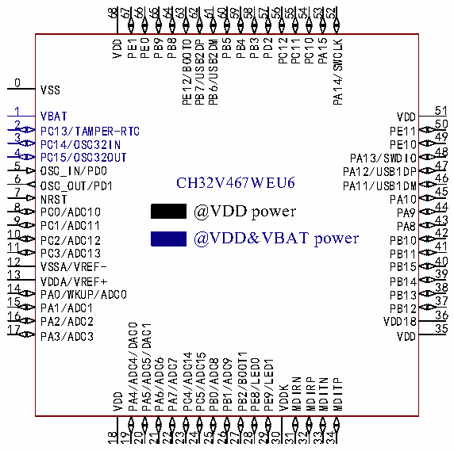
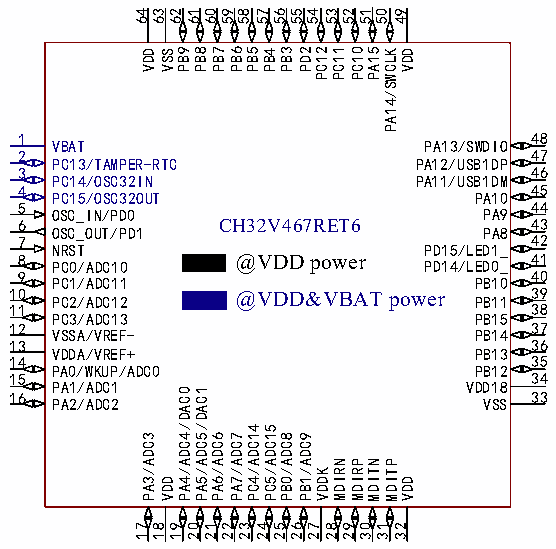

<!-- source-page: 22 -->

[← p.21](0021.md) · [index](../README.md) · [PDF p.22](https://ch32-riscv-ug.github.io/CH32V407/datasheet_en/CH32V407DS0.PDF#page=22) · [p.23 →](0023.md)

<!-- header: CH32V407/V467 Datasheet https://wch-ic.com -->

 <!-- p22-cluster-01 uncaptioned graphics, rendered from the PDF; verify at https://ch32-riscv-ug.github.io/CH32V407/datasheet_en/CH32V407DS0.PDF#page=22 -->

 <!-- p22-cluster-02 uncaptioned graphics, rendered from the PDF; verify at https://ch32-riscv-ug.github.io/CH32V407/datasheet_en/CH32V407DS0.PDF#page=22 -->

🖼 Text parsed from the figure above

68 67 65 64 63 62 61 60 59 58 57 56 55 54 53 52  
66  
VDD PE1  
PE0  
PB9 PB8 PE12/BOOT0 PB7/USB2DP PB6/USB2DM PB5 PB4 PB3 PD2 PC12 PC11  
PC10  
PA15  
PA14/SWCLK  
0  
VSS  
51  
1  
VBAT  
VDD  
50  
2  
PC13/TAMPER-RTC  
PE11  
49  
3  
PC14/OSC32IN  
PE10  
48  
4  
PC15/OSC32OUT  
PA13/SWDIO  
47  
5  
OSC_IN/PD0  
PA12/USB1DP  
46  
6 OSC_OUT/PD1 CH32V467WEU6  
PA11/USB1DM  
45  
7  
NRST  
PA10  
44  
8 PC0/ADC10 @VDD power  
PA9  
43  
9  
PC1/ADC11  
PA8  
42  
10 PC2/ADC12  
@VDD&amp;VBAT power  
PB10  
41  
11  
PC3/ADC13  
PB11  
40  
12  
VSSA/VREF-  
PB15  
39  
13  
VDDA/VREF+  
PB14  
38  
14  
PA0/WKUP/ADC0  
PB13  
37  
15  
PA1/ADC1  
PB12  
16 36  
PA2/ADC2  
VDD18  
17 35  
/DAC0  
/DAC1  
PA3/ADC3  
VDD  
PB2/BOOT1  
PC4/ADC14  
PC5/ADC15  
PA4/ADC4  
PA5/ADC5  
PA6/ADC6  
PA7/ADC7  
PB0/ADC8  
PB1/ADC9  
PE8/LED0  
PE9/LED1  
MDIRN  
MDIRP  
MDITN  
MDITP  
VDDK  
VDD  
18  
19  
20  
21  
22  
23  
24  
25  
26  
27  
28  
29  
30  
31 32 33 34  
64 62 61 60 59 58 57 56 55 54 53 52 51 50 49  
63  
VDD VSS PB9  
PB8  
PB7 PB6 PB5 PB4 PB3 PD2 PC12 PC11  
PC10  
PA15  
PA14/SWCLK  
VDD  
48  
1  
VBAT  
PA13/SWDIO  
47  
2  
PC13/TAMPER-RTC  
PA12/USB1DP  
46  
3  
PC14/OSC32IN  
PA11/USB1DM  
45  
4  
PC15/OSC32OUT  
PA10  
44  
5  
OSC_IN/PD0  
PA9  
43  
6 CH32V467RET6  
OSC_OUT/PD1  
PA8  
7 42  
NRST  
PD15/LED1_  
8 @VDD power 41  
PC0/ADC10  
PD14/LED0_  
9 40  
PC1/ADC11  
PB10  
10 PC2/ADC12 @VDD&amp;VBAT power 39  
PB11  
11 38  
PC3/ADC13  
PB15  
12 37  
VSSA/VREF-  
PB14  
13 36  
VDDA/VREF+  
PB13  
14 35  
PA0/WKUP/ADC0  
PB12  
34  
15  
PA1/ADC1  
VDD18  
/DAC0  
/DAC1  
33  
16  
PA2/ADC2  
VSS  
PC4/ADC14  
PC5/ADC15  
PA3/ADC3  
PA4/ADC4  
PA5/ADC5  
PA6/ADC6  
PA7/ADC7  
PB0/ADC8  
PB1/ADC9  
MDIRN  
MDIRP  
MDITN  
MDITP  
VDDK  
VDD  
VDD  
17  
18  
19  
20  
21  
22  
23  
24  
25  
26  
27  
28 29 30 31 32  

Note: Alternate functions are abbreviated in the pin diagram.  
Example:  
ADC_: (ADC0:ADC_IN0)  
USB1DP: USBHS1_DP  
USB1DM: USBHS1_DM  
USB2DP: USBHS2_DP  
USB2DM: USBHS2_DM  
<!-- image: p22-draw-image-00001 bbox=[513.84, 782.04, 535.56, 793.8] -->
<!-- footer: V1.2 19 -->
