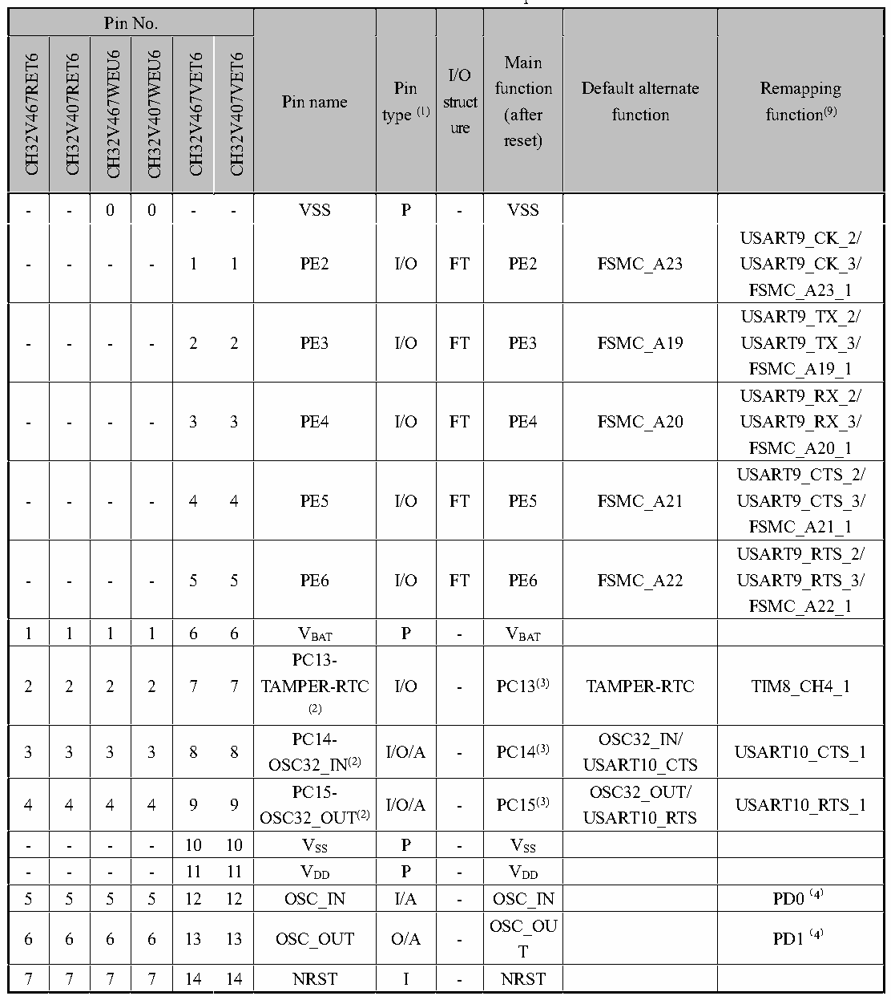

<!-- source-page: 23 -->

[← p.22](0022.md) · [index](../README.md) · [PDF p.23](https://ch32-riscv-ug.github.io/CH32V407/datasheet_en/CH32V407DS0.PDF#page=23) · [p.24 →](0024.md)

<!-- header: CH32V407/V467 Datasheet https://wch-ic.com -->

## 2.2 Pin Definitions

<em>Note: The pin function in the table below refer to all functions and do not involve specific model(s). There are</em>  
<em>differences in peripheral resources between different models. Please confirm whether this function is</em>  
<em>available according to the particular model&#x27;s resource table before viewing this table.</em>  

 <!-- p23-cluster-01 uncaptioned graphics, rendered from the PDF; verify at https://ch32-riscv-ug.github.io/CH32V407/datasheet_en/CH32V407DS0.PDF#page=23 -->

🖼 Text parsed from the figure above

<!-- p23-table-001 (table-2-1@1) -->
<table><caption>Table 2-1 CH32V407 and CH32V467 pin definitions</caption><tr><th colspan="6">Pin No.</th><th rowspan="2">Pin name</th><th rowspan="2" style="text-align:left">Pin type (1)</th><th rowspan="2" style="text-align:left">I/O struct ure</th><th rowspan="2" style="text-align:left">Main function (after reset)</th><th rowspan="2" style="text-align:left">Default alternate function</th><th rowspan="2" style="text-align:left">Remapping function(9)</th></tr><tr><td>CH32V467RET6</td><td>CH32V407RET6</td><td>CH32V467WEU6</td><td>CH32V407WEU6</td><td>CH32V467VET6</td><td>CH32V407VET6</td></tr><tr><td>-</td><td>-</td><td>0</td><td>0</td><td>-</td><td>-</td><td>VSS</td><td>P</td><td>-</td><td>VSS</td><td></td><td></td></tr><tr><td>-</td><td>-</td><td>-</td><td>-</td><td>1</td><td>1</td><td>PE2</td><td>I/O</td><td>FT</td><td>PE2</td><td>FSMC_A23</td><td style="text-align:left">USART9_CK_2/ USART9_CK_3/ FSMC_A23_1</td></tr><tr><td>-</td><td>-</td><td>-</td><td>-</td><td>2</td><td>2</td><td>PE3</td><td>I/O</td><td>FT</td><td>PE3</td><td>FSMC_A19</td><td style="text-align:left">USART9_TX_2/ USART9_TX_3/ FSMC_A19_1</td></tr><tr><td>-</td><td>-</td><td>-</td><td>-</td><td>3</td><td>3</td><td>PE4</td><td>I/O</td><td>FT</td><td>PE4</td><td>FSMC_A20</td><td style="text-align:left">USART9_RX_2/ USART9_RX_3/ FSMC_A20_1</td></tr><tr><td>-</td><td>-</td><td>-</td><td>-</td><td>4</td><td>4</td><td>PE5</td><td>I/O</td><td>FT</td><td>PE5</td><td>FSMC_A21</td><td style="text-align:left">USART9_CTS_2/ USART9_CTS_3/ FSMC_A21_1</td></tr><tr><td>-</td><td>-</td><td>-</td><td>-</td><td>5</td><td>5</td><td>PE6</td><td>I/O</td><td>FT</td><td>PE6</td><td>FSMC_A22</td><td style="text-align:left">USART9_RTS_2/ USART9_RTS_3/ FSMC_A22_1</td></tr><tr><td>1</td><td>1</td><td>1</td><td>1</td><td>6</td><td>6</td><td style="text-align:left">VBAT</td><td>P</td><td>-</td><td style="text-align:left">VBAT</td><td></td><td></td></tr><tr><td>2</td><td>2</td><td>2</td><td>2</td><td>7</td><td>7</td><td style="text-align:left">PC13- TAMPER-RTC (2)</td><td>I/O</td><td>-</td><td>PC13(3)</td><td>TAMPER-RTC</td><td>TIM8_CH4_1</td></tr><tr><td>3</td><td>3</td><td>3</td><td>3</td><td>8</td><td>8</td><td style="text-align:left">PC14- OSC32_IN(2)</td><td>I/O/A</td><td>-</td><td>PC14(3)</td><td style="text-align:left">OSC32_IN/ USART10_CTS</td><td>USART10_CTS_1</td></tr><tr><td>4</td><td>4</td><td>4</td><td>4</td><td>9</td><td>9</td><td style="text-align:left">PC15- OSC32_OUT(2)</td><td>I/O/A</td><td>-</td><td>PC15(3)</td><td style="text-align:left">OSC32_OUT/ USART10_RTS</td><td>USART10_RTS_1</td></tr><tr><td>-</td><td>-</td><td>-</td><td>-</td><td>10</td><td>10</td><td style="text-align:left">VSS</td><td>P</td><td>-</td><td style="text-align:left">VSS</td><td></td><td></td></tr><tr><td>-</td><td>-</td><td>-</td><td>-</td><td>11</td><td>11</td><td style="text-align:left">VDD</td><td>P</td><td>-</td><td style="text-align:left">VDD</td><td></td><td></td></tr><tr><td>5</td><td>5</td><td>5</td><td>5</td><td>12</td><td>12</td><td>OSC_IN</td><td>I/A</td><td>-</td><td>OSC_IN</td><td></td><td>PD0（4）</td></tr><tr><td>6</td><td>6</td><td>6</td><td>6</td><td>13</td><td>13</td><td>OSC_OUT</td><td>O/A</td><td>-</td><td style="text-align:left">OSC_OUT</td><td></td><td>PD1（4）</td></tr><tr><td>7</td><td>7</td><td>7</td><td>7</td><td>14</td><td>14</td><td>NRST</td><td>I</td><td>-</td><td>NRST</td><td></td><td></td></tr></table>

1 1 1 1 6 6 VBAT P - VBAT  

<!-- image: p23-draw-image-00001 bbox=[513.84, 782.04, 535.56, 793.8] -->
<!-- footer: V1.2 20 -->
