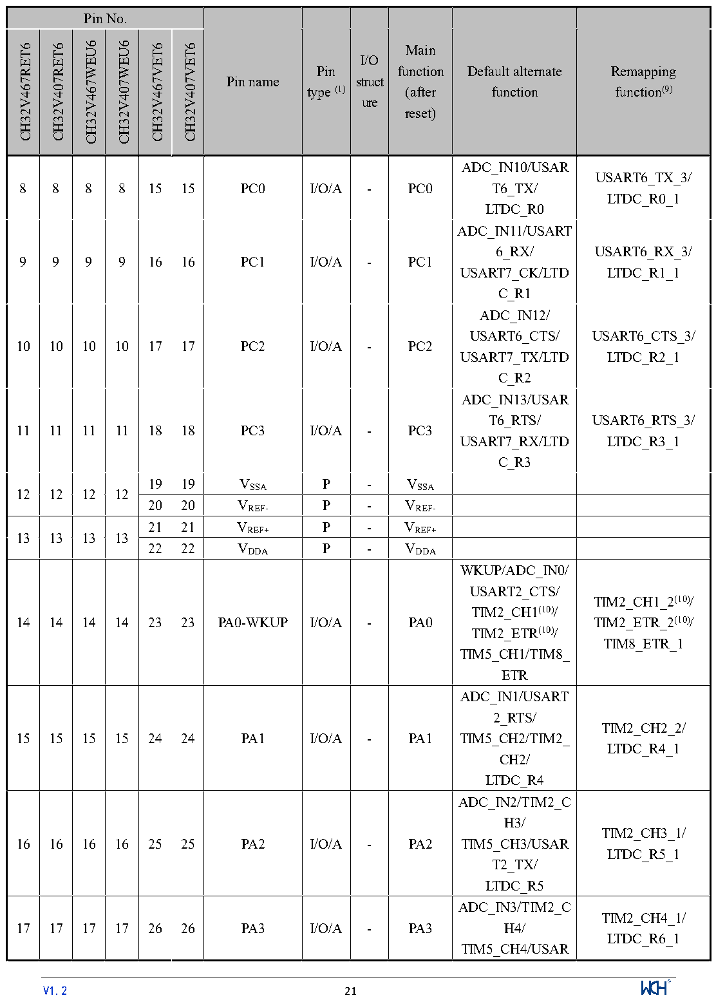

<!-- source-page: 24 -->

[← p.23](0023.md) · [index](../README.md) · [PDF p.24](https://ch32-riscv-ug.github.io/CH32V407/datasheet_en/CH32V407DS0.PDF#page=24) · [p.25 →](0025.md)

<!-- header: CH32V407/V467 Datasheet https://wch-ic.com -->

 <!-- p24-cluster-01 uncaptioned graphics, rendered from the PDF; verify at https://ch32-riscv-ug.github.io/CH32V407/datasheet_en/CH32V407DS0.PDF#page=24 -->

🖼 Text parsed from the figure above

<!-- p24-table-001 (table-2-1@1) -->
<table><tr><th colspan="6">Pin No.</th><th rowspan="2">Pin name</th><th rowspan="2" style="text-align:left">Pin type (1)</th><th rowspan="2" style="text-align:left">I/O struct ure</th><th rowspan="2" style="text-align:left">Main function (after reset)</th><th rowspan="2" style="text-align:left">Default alternate function</th><th rowspan="2" style="text-align:left">Remapping function(9)</th></tr><tr><td>CH32V467RET6</td><td>CH32V407RET6</td><td>CH32V467WEU6</td><td>CH32V407WEU6</td><td>CH32V467VET6</td><td>CH32V407VET6</td></tr><tr><td>8</td><td>8</td><td>8</td><td>8</td><td>15</td><td>15</td><td>PC0</td><td>I/O/A</td><td>-</td><td>PC0</td><td style="text-align:left">ADC_IN10/USART6_TX/ LTDC_R0</td><td style="text-align:left">USART6_TX_3/ LTDC_R0_1</td></tr><tr><td>9</td><td>9</td><td>9</td><td>9</td><td>16</td><td>16</td><td>PC1</td><td>I/O/A</td><td>-</td><td>PC1</td><td style="text-align:left">ADC_IN11/USART6_RX/ USART7_CK/LTDC_R1</td><td style="text-align:left">USART6_RX_3/ LTDC_R1_1</td></tr><tr><td>10</td><td>10</td><td>10</td><td>10</td><td>17</td><td>17</td><td>PC2</td><td>I/O/A</td><td>-</td><td>PC2</td><td style="text-align:left">ADC_IN12/ USART6_CTS/ USART7_TX/LTDC_R2</td><td style="text-align:left">USART6_CTS_3/ LTDC_R2_1</td></tr><tr><td>11</td><td>11</td><td>11</td><td>11</td><td>18</td><td>18</td><td>PC3</td><td>I/O/A</td><td>-</td><td>PC3</td><td style="text-align:left">ADC_IN13/USART6_RTS/ USART7_RX/LTDC_R3</td><td style="text-align:left">USART6_RTS_3/ LTDC_R3_1</td></tr><tr><td rowspan="2">12</td><td rowspan="2">12</td><td rowspan="2">12</td><td rowspan="2">12</td><td>19</td><td>19</td><td style="text-align:left">VSSA</td><td>P</td><td>-</td><td style="text-align:left">VSSA</td><td></td><td></td></tr><tr><td>20</td><td>20</td><td style="text-align:left">VREF-</td><td>P</td><td>-</td><td style="text-align:left">VREF-</td><td></td><td></td></tr><tr><td rowspan="2">13</td><td rowspan="2">13</td><td rowspan="2">13</td><td rowspan="2">13</td><td>21</td><td>21</td><td style="text-align:left">VREF+</td><td>P</td><td>-</td><td style="text-align:left">VREF+</td><td></td><td></td></tr><tr><td>22</td><td>22</td><td style="text-align:left">VDDA</td><td>P</td><td>-</td><td style="text-align:left">VDDA</td><td></td><td></td></tr><tr><td>14</td><td>14</td><td>14</td><td>14</td><td>23</td><td>23</td><td>PA0-WKUP</td><td>I/O/A</td><td>-</td><td>PA0</td><td style="text-align:left">WKUP/ADC_IN0/ USART2_CTS/ TIM2_CH1(10)/ TIM2_ETR(10)/ TIM5_CH1/TIM8_ ETR</td><td style="text-align:left">TIM2_CH1_2(10)/ TIM2_ETR_2(10)/ TIM8_ETR_1</td></tr><tr><td>15</td><td>15</td><td>15</td><td>15</td><td>24</td><td>24</td><td>PA1</td><td>I/O/A</td><td>-</td><td>PA1</td><td style="text-align:left">ADC_IN1/USART2_RTS/ TIM5_CH2/TIM2_ CH2/ LTDC_R4</td><td style="text-align:left">TIM2_CH2_2/ LTDC_R4_1</td></tr><tr><td>16</td><td>16</td><td>16</td><td>16</td><td>25</td><td>25</td><td>PA2</td><td>I/O/A</td><td>-</td><td>PA2</td><td style="text-align:left">ADC_IN2/TIM2_CH3/ TIM5_CH3/USART2_TX/ LTDC_R5</td><td style="text-align:left">TIM2_CH3_1/ LTDC_R5_1</td></tr><tr><td>17</td><td>17</td><td>17</td><td>17</td><td>26</td><td>26</td><td>PA3</td><td>I/O/A</td><td>-</td><td>PA3</td><td style="text-align:left">ADC_IN3/TIM2_CH4/ TIM5_CH4/USAR</td><td style="text-align:left">TIM2_CH4_1/ LTDC_R6_1</td></tr></table>

<!-- image: p24-draw-image-00001 inside the figure -->
<!-- footer: V1.2 21 -->

