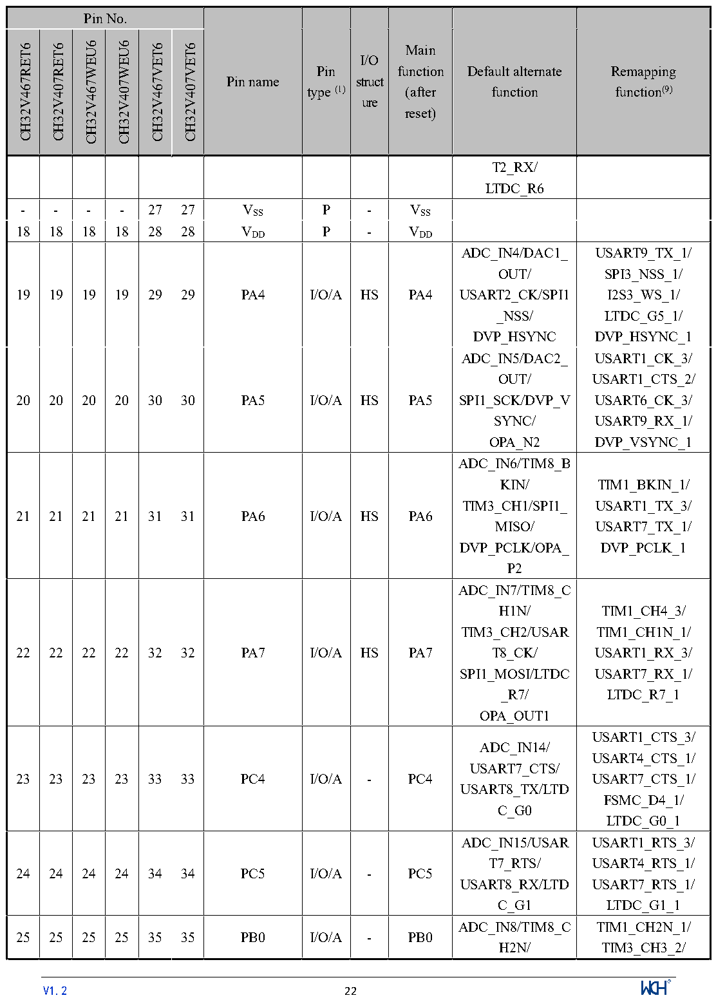

<!-- source-page: 25 -->

[← p.24](0024.md) · [index](../README.md) · [PDF p.25](https://ch32-riscv-ug.github.io/CH32V407/datasheet_en/CH32V407DS0.PDF#page=25) · [p.26 →](0026.md)

<!-- header: CH32V407/V467 Datasheet https://wch-ic.com -->

 <!-- p25-cluster-01 uncaptioned graphics, rendered from the PDF; verify at https://ch32-riscv-ug.github.io/CH32V407/datasheet_en/CH32V407DS0.PDF#page=25 -->

🖼 Text parsed from the figure above

<!-- p25-table-001 (table-2-1@1) -->
<table><tr><th colspan="6">Pin No.</th><th rowspan="2">Pin name</th><th rowspan="2" style="text-align:left">Pin type (1)</th><th rowspan="2" style="text-align:left">I/O struct ure</th><th rowspan="2" style="text-align:left">Main function (after reset)</th><th rowspan="2" style="text-align:left">Default alternate function</th><th rowspan="2" style="text-align:left">Remapping function(9)</th></tr><tr><td>CH32V467RET6</td><td>CH32V407RET6</td><td>CH32V467WEU6</td><td>CH32V407WEU6</td><td>CH32V467VET6</td><td>CH32V407VET6</td></tr><tr><td></td><td></td><td></td><td></td><td></td><td></td><td></td><td></td><td></td><td></td><td style="text-align:left">T2_RX/ LTDC_R6</td><td></td></tr><tr><td>-</td><td>-</td><td>-</td><td>-</td><td>27</td><td>27</td><td style="text-align:left">VSS</td><td>P</td><td>-</td><td style="text-align:left">VSS</td><td></td><td></td></tr><tr><td>18</td><td>18</td><td>18</td><td>18</td><td>28</td><td>28</td><td style="text-align:left">VDD</td><td>P</td><td>-</td><td style="text-align:left">VDD</td><td></td><td></td></tr><tr><td>19</td><td>19</td><td>19</td><td>19</td><td>29</td><td>29</td><td>PA4</td><td>I/O/A</td><td>HS</td><td>PA4</td><td style="text-align:left">ADC_IN4/DAC1_ OUT/ USART2_CK/SPI1 _NSS/ DVP_HSYNC</td><td style="text-align:left">USART9_TX_1/ SPI3_NSS_1/ I2S3_WS_1/ LTDC_G5_1/ DVP_HSYNC_1</td></tr><tr><td>20</td><td>20</td><td>20</td><td>20</td><td>30</td><td>30</td><td>PA5</td><td>I/O/A</td><td>HS</td><td>PA5</td><td style="text-align:left">ADC_IN5/DAC2_ OUT/ SPI1_SCK/DVP_VSYNC/ OPA_N2</td><td style="text-align:left">USART1_CK_3/ USART1_CTS_2/ USART6_CK_3/ USART9_RX_1/ DVP_VSYNC_1</td></tr><tr><td>21</td><td>21</td><td>21</td><td>21</td><td>31</td><td>31</td><td>PA6</td><td>I/O/A</td><td>HS</td><td>PA6</td><td style="text-align:left">ADC_IN6/TIM8_BKIN/ TIM3_CH1/SPI1_ MISO/ DVP_PCLK/OPA_ P2</td><td style="text-align:left">TIM1_BKIN_1/ USART1_TX_3/ USART7_TX_1/ DVP_PCLK_1</td></tr><tr><td>22</td><td>22</td><td>22</td><td>22</td><td>32</td><td>32</td><td>PA7</td><td>I/O/A</td><td>HS</td><td>PA7</td><td style="text-align:left">ADC_IN7/TIM8_CH1N/ TIM3_CH2/USART8_CK/ SPI1_MOSI/LTDC _R7/ OPA_OUT1</td><td style="text-align:left">TIM1_CH4_3/ TIM1_CH1N_1/ USART1_RX_3/ USART7_RX_1/ LTDC_R7_1</td></tr><tr><td>23</td><td>23</td><td>23</td><td>23</td><td>33</td><td>33</td><td>PC4</td><td>I/O/A</td><td>-</td><td>PC4</td><td style="text-align:left">ADC_IN14/ USART7_CTS/ USART8_TX/LTDC_G0</td><td style="text-align:left">USART1_CTS_3/ USART4_CTS_1/ USART7_CTS_1/ FSMC_D4_1/ LTDC_G0_1</td></tr><tr><td>24</td><td>24</td><td>24</td><td>24</td><td>34</td><td>34</td><td>PC5</td><td>I/O/A</td><td>-</td><td>PC5</td><td style="text-align:left">ADC_IN15/USART7_RTS/ USART8_RX/LTDC_G1</td><td style="text-align:left">USART1_RTS_3/ USART4_RTS_1/ USART7_RTS_1/ LTDC_G1_1</td></tr><tr><td>25</td><td>25</td><td>25</td><td>25</td><td>35</td><td>35</td><td>PB0</td><td>I/O/A</td><td>-</td><td>PB0</td><td style="text-align:left">ADC_IN8/TIM8_CH2N/</td><td style="text-align:left">TIM1_CH2N_1/ TIM3_CH3_2/</td></tr></table>

<!-- image: p25-draw-image-00001 inside the figure -->
<!-- footer: V1.2 22 -->

