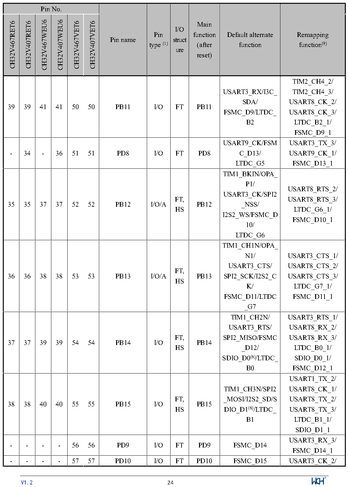

<!-- source-page: 27 -->

[← p.26](0026.md) · [index](../README.md) · [PDF p.27](https://ch32-riscv-ug.github.io/CH32V407/datasheet_en/CH32V407DS0.PDF#page=27) · [p.28 →](0028.md)

<!-- header: CH32V407/V467 Datasheet https://wch-ic.com -->

 <!-- p27-cluster-01 uncaptioned graphics, rendered from the PDF; verify at https://ch32-riscv-ug.github.io/CH32V407/datasheet_en/CH32V407DS0.PDF#page=27 -->

🖼 Text parsed from the figure above

<!-- p27-table-001 (table-2-1@1) -->
<table><tr><th colspan="6">Pin No.</th><th rowspan="2">Pin name</th><th rowspan="2" style="text-align:left">Pin type (1)</th><th rowspan="2" style="text-align:left">I/O struct ure</th><th rowspan="2" style="text-align:left">Main function (after reset)</th><th rowspan="2" style="text-align:left">Default alternate function</th><th rowspan="2" style="text-align:left">Remapping function(9)</th></tr><tr><td>CH32V467RET6</td><td>CH32V407RET6</td><td>CH32V467WEU6</td><td>CH32V407WEU6</td><td>CH32V467VET6</td><td>CH32V407VET6</td></tr><tr><td>39</td><td>39</td><td>41</td><td>41</td><td>50</td><td>50</td><td>PB11</td><td>I/O</td><td>FT</td><td>PB11</td><td style="text-align:left">USART3_RX/I3C_ SDA/ FSMC_D9/LTDC_ B2</td><td style="text-align:left">TIM2_CH4_2/ TIM2_CH4_3/ USART8_CK_2/ USART8_CK_3/ LTDC_B2_1/ FSMC_D9_1</td></tr><tr><td>-</td><td>34</td><td>-</td><td>36</td><td>51</td><td>51</td><td>PD8</td><td>I/O</td><td>FT</td><td>PD8</td><td style="text-align:left">USART9_CK/FSMC_D13/ LTDC_G5</td><td style="text-align:left">USART3_TX_3/ USART9_CK_1/ FSMC_D13_1</td></tr><tr><td>35</td><td>35</td><td>37</td><td>37</td><td>52</td><td>52</td><td>PB12</td><td>I/O/A</td><td style="text-align:left">FT, HS</td><td>PB12</td><td style="text-align:left">TIM1_BKIN/OPA_ P1/ USART3_CK/SPI2 _NSS/ I2S2_WS/FSMC_D10/ LTDC_G6</td><td style="text-align:left">USART8_RTS_2/ USART8_RTS_3/ LTDC_G6_1/ FSMC_D10_1</td></tr><tr><td>36</td><td>36</td><td>38</td><td>38</td><td>53</td><td>53</td><td>PB13</td><td>I/O/A</td><td style="text-align:left">FT, HS</td><td>PB13</td><td style="text-align:left">TIM1_CH1N/OPA_ N1/ USART3_CTS/ SPI2_SCK/I2S2_CK/ FSMC_D11/LTDC _G7</td><td style="text-align:left">USART3_CTS_1/ USART8_CTS_2/ USART8_CTS_3/ LTDC_G7_1/ FSMC_D11_1</td></tr><tr><td>37</td><td>37</td><td>39</td><td>39</td><td>54</td><td>54</td><td>PB14</td><td>I/O</td><td style="text-align:left">FT, HS</td><td>PB14</td><td style="text-align:left">TIM1_CH2N/ USART3_RTS/ SPI2_MISO/FSMC _D12/ SDIO_D0(6)/LTDC_ B0</td><td style="text-align:left">USART3_RTS_1/ USART8_RX_2/ USART8_RX_3/ LTDC_B0_1/ SDIO_D0_1/ FSMC_D12_1</td></tr><tr><td>38</td><td>38</td><td>40</td><td>40</td><td>55</td><td>55</td><td>PB15</td><td>I/O</td><td style="text-align:left">FT, HS</td><td>PB15</td><td style="text-align:left">TIM1_CH3N/SPI2 _MOSI/I2S2_SD/SDIO_D1(6)/LTDC_ B1</td><td style="text-align:left">USART1_TX_2/ USART8_CK_1/ USART8_TX_2/ USART8_TX_3/ LTDC_B1_1/ SDIO_D1_1</td></tr><tr><td>-</td><td>-</td><td>-</td><td>-</td><td>56</td><td>56</td><td>PD9</td><td>I/O</td><td>FT</td><td>PD9</td><td>FSMC_D14</td><td style="text-align:left">USART3_RX_3/ FSMC_D14_1</td></tr><tr><td>-</td><td>-</td><td>-</td><td>-</td><td>57</td><td>57</td><td>PD10</td><td>I/O</td><td>FT</td><td>PD10</td><td>FSMC_D15</td><td>USART3_CK_2/</td></tr></table>

<!-- image: p27-draw-image-00001 inside the figure -->
<!-- footer: V1.2 24 -->

