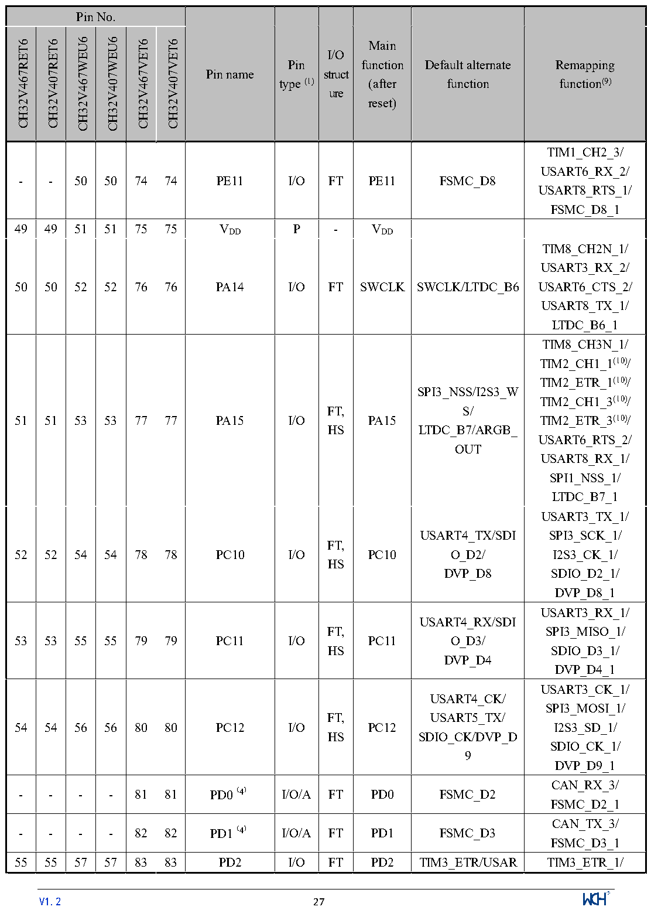

<!-- source-page: 30 -->

[← p.29](0029.md) · [index](../README.md) · [PDF p.30](https://ch32-riscv-ug.github.io/CH32V407/datasheet_en/CH32V407DS0.PDF#page=30) · [p.31 →](0031.md)

<!-- header: CH32V407/V467 Datasheet https://wch-ic.com -->

 <!-- p30-cluster-01 uncaptioned graphics, rendered from the PDF; verify at https://ch32-riscv-ug.github.io/CH32V407/datasheet_en/CH32V407DS0.PDF#page=30 -->

🖼 Text parsed from the figure above

<!-- p30-table-001 (table-2-1@1) -->
<table><tr><th colspan="6">Pin No.</th><th rowspan="2">Pin name</th><th rowspan="2" style="text-align:left">Pin type (1)</th><th rowspan="2" style="text-align:left">I/O struct ure</th><th rowspan="2" style="text-align:left">Main function (after reset)</th><th rowspan="2" style="text-align:left">Default alternate function</th><th rowspan="2" style="text-align:left">Remapping function(9)</th></tr><tr><td>CH32V467RET6</td><td>CH32V407RET6</td><td>CH32V467WEU6</td><td>CH32V407WEU6</td><td>CH32V467VET6</td><td>CH32V407VET6</td></tr><tr><td>-</td><td>-</td><td>50</td><td>50</td><td>74</td><td>74</td><td>PE11</td><td>I/O</td><td>FT</td><td>PE11</td><td>FSMC_D8</td><td style="text-align:left">TIM1_CH2_3/ USART6_RX_2/ USART8_RTS_1/ FSMC_D8_1</td></tr><tr><td>49</td><td>49</td><td>51</td><td>51</td><td>75</td><td>75</td><td style="text-align:left">VDD</td><td>P</td><td>-</td><td style="text-align:left">VDD</td><td></td><td></td></tr><tr><td>50</td><td>50</td><td>52</td><td>52</td><td>76</td><td>76</td><td>PA14</td><td>I/O</td><td>FT</td><td>SWCLK</td><td>SWCLK/LTDC_B6</td><td style="text-align:left">TIM8_CH2N_1/ USART3_RX_2/ USART6_CTS_2/ USART8_TX_1/ LTDC_B6_1</td></tr><tr><td>51</td><td>51</td><td>53</td><td>53</td><td>77</td><td>77</td><td>PA15</td><td>I/O</td><td style="text-align:left">FT, HS</td><td>PA15</td><td style="text-align:left">SPI3_NSS/I2S3_WS/ LTDC_B7/ARGB_ OUT</td><td style="text-align:left">TIM8_CH3N_1/ TIM2_CH1_1(10)/ TIM2_ETR_1(10)/ TIM2_CH1_3(10)/ TIM2_ETR_3(10)/ USART6_RTS_2/ USART8_RX_1/ SPI1_NSS_1/ LTDC_B7_1</td></tr><tr><td>52</td><td>52</td><td>54</td><td>54</td><td>78</td><td>78</td><td>PC10</td><td>I/O</td><td style="text-align:left">FT, HS</td><td>PC10</td><td style="text-align:left">USART4_TX/SDIO_D2/ DVP_D8</td><td style="text-align:left">USART3_TX_1/ SPI3_SCK_1/ I2S3_CK_1/ SDIO_D2_1/ DVP_D8_1</td></tr><tr><td>53</td><td>53</td><td>55</td><td>55</td><td>79</td><td>79</td><td>PC11</td><td>I/O</td><td style="text-align:left">FT, HS</td><td>PC11</td><td style="text-align:left">USART4_RX/SDIO_D3/ DVP_D4</td><td style="text-align:left">USART3_RX_1/ SPI3_MISO_1/ SDIO_D3_1/ DVP_D4_1</td></tr><tr><td>54</td><td>54</td><td>56</td><td>56</td><td>80</td><td>80</td><td>PC12</td><td>I/O</td><td style="text-align:left">FT, HS</td><td>PC12</td><td style="text-align:left">USART4_CK/ USART5_TX/ SDIO_CK/DVP_D9</td><td style="text-align:left">USART3_CK_1/ SPI3_MOSI_1/ I2S3_SD_1/ SDIO_CK_1/ DVP_D9_1</td></tr><tr><td>-</td><td>-</td><td>-</td><td>-</td><td>81</td><td>81</td><td>PD0（4）</td><td>I/O/A</td><td>FT</td><td>PD0</td><td>FSMC_D2</td><td style="text-align:left">CAN_RX_3/ FSMC_D2_1</td></tr><tr><td>-</td><td>-</td><td>-</td><td>-</td><td>82</td><td>82</td><td>PD1（4）</td><td>I/O/A</td><td>FT</td><td>PD1</td><td>FSMC_D3</td><td style="text-align:left">CAN_TX_3/ FSMC_D3_1</td></tr><tr><td>55</td><td>55</td><td>57</td><td>57</td><td>83</td><td>83</td><td>PD2</td><td>I/O</td><td>FT</td><td>PD2</td><td>TIM3_ETR/USAR</td><td>TIM3_ETR_1/</td></tr></table>

<!-- image: p30-draw-image-00001 inside the figure -->
<!-- footer: V1.2 27 -->

