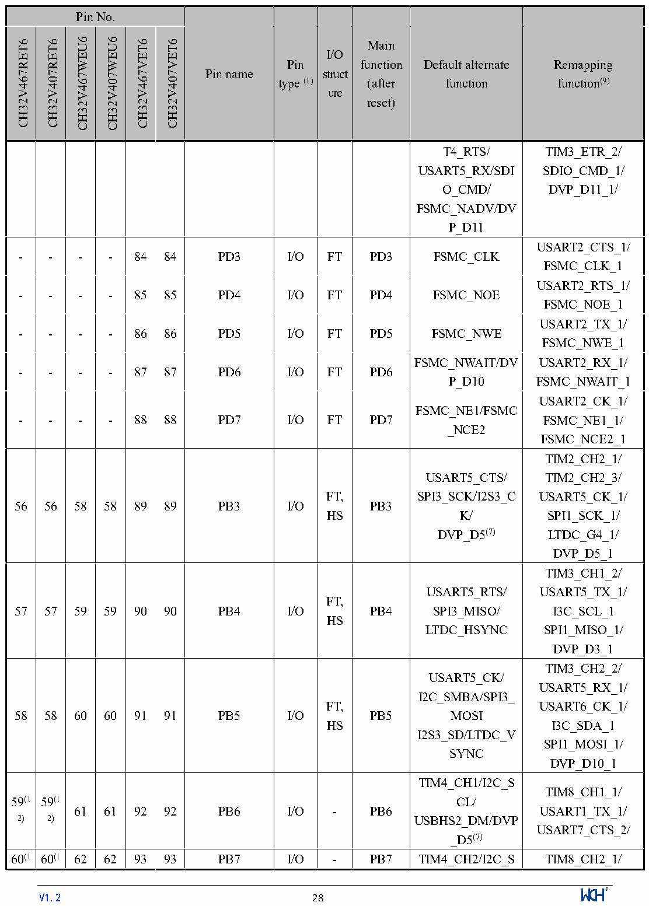

<!-- source-page: 31 -->

[← p.30](0030.md) · [index](../README.md) · [PDF p.31](https://ch32-riscv-ug.github.io/CH32V407/datasheet_en/CH32V407DS0.PDF#page=31) · [p.32 →](0032.md)

<!-- header: CH32V407/V467 Datasheet https://wch-ic.com -->

 <!-- p31-cluster-01 uncaptioned graphics, rendered from the PDF; verify at https://ch32-riscv-ug.github.io/CH32V407/datasheet_en/CH32V407DS0.PDF#page=31 -->

🖼 Text parsed from the figure above

<!-- p31-table-001 (table-2-1@1) -->
<table><tr><th colspan="6">Pin No.</th><th rowspan="2">Pin name</th><th rowspan="2" style="text-align:left">Pin type (1)</th><th rowspan="2" style="text-align:left">I/O struct ure</th><th rowspan="2" style="text-align:left">Main function (after reset)</th><th rowspan="2" style="text-align:left">Default alternate function</th><th rowspan="2" style="text-align:left">Remapping function(9)</th></tr><tr><td>CH32V467RET6</td><td>CH32V407RET6</td><td>CH32V467WEU6</td><td>CH32V407WEU6</td><td>CH32V467VET6</td><td>CH32V407VET6</td></tr><tr><td></td><td></td><td></td><td></td><td></td><td></td><td></td><td></td><td></td><td></td><td style="text-align:left">T4_RTS/ USART5_RX/SDIO_CMD/ FSMC_NADV/DVP_D11</td><td style="text-align:left">TIM3_ETR_2/ SDIO_CMD_1/ DVP_D11_1/</td></tr><tr><td>-</td><td>-</td><td>-</td><td>-</td><td>84</td><td>84</td><td>PD3</td><td>I/O</td><td>FT</td><td>PD3</td><td>FSMC_CLK</td><td style="text-align:left">USART2_CTS_1/ FSMC_CLK_1</td></tr><tr><td>-</td><td>-</td><td>-</td><td>-</td><td>85</td><td>85</td><td>PD4</td><td>I/O</td><td>FT</td><td>PD4</td><td>FSMC_NOE</td><td style="text-align:left">USART2_RTS_1/ FSMC_NOE_1</td></tr><tr><td>-</td><td>-</td><td>-</td><td>-</td><td>86</td><td>86</td><td>PD5</td><td>I/O</td><td>FT</td><td>PD5</td><td>FSMC_NWE</td><td style="text-align:left">USART2_TX_1/ FSMC_NWE_1</td></tr><tr><td>-</td><td>-</td><td>-</td><td>-</td><td>87</td><td>87</td><td>PD6</td><td>I/O</td><td>FT</td><td>PD6</td><td style="text-align:left">FSMC_NWAIT/DVP_D10</td><td style="text-align:left">USART2_RX_1/ FSMC_NWAIT_1</td></tr><tr><td>-</td><td>-</td><td>-</td><td>-</td><td>88</td><td>88</td><td>PD7</td><td>I/O</td><td>FT</td><td>PD7</td><td style="text-align:left">FSMC_NE1/FSMC _NCE2</td><td style="text-align:left">USART2_CK_1/ FSMC_NE1_1/ FSMC_NCE2_1</td></tr><tr><td>56</td><td>56</td><td>58</td><td>58</td><td>89</td><td>89</td><td>PB3</td><td>I/O</td><td style="text-align:left">FT, HS</td><td>PB3</td><td style="text-align:left">USART5_CTS/ SPI3_SCK/I2S3_CK/ DVP_D5(7)</td><td style="text-align:left">TIM2_CH2_1/ TIM2_CH2_3/ USART5_CK_1/ SPI1_SCK_1/ LTDC_G4_1/ DVP_D5_1</td></tr><tr><td>57</td><td>57</td><td>59</td><td>59</td><td>90</td><td>90</td><td>PB4</td><td>I/O</td><td style="text-align:left">FT, HS</td><td>PB4</td><td style="text-align:left">USART5_RTS/ SPI3_MISO/ LTDC_HSYNC</td><td style="text-align:left">TIM3_CH1_2/ USART5_TX_1/ I3C_SCL_1SPI1_MISO_1/ DVP_D3_1</td></tr><tr><td>58</td><td>58</td><td>60</td><td>60</td><td>91</td><td>91</td><td>PB5</td><td>I/O</td><td style="text-align:left">FT, HS</td><td>PB5</td><td style="text-align:left">USART5_CK/ I2C_SMBA/SPI3_ MOSII2S3_SD/LTDC_VSYNC</td><td style="text-align:left">TIM3_CH2_2/ USART5_RX_1/ USART6_CK_1/ I3C_SDA_1SPI1_MOSI_1/ DVP_D10_1</td></tr><tr><td style="text-align:left">59(12)</td><td style="text-align:left">59(12)</td><td>61</td><td>61</td><td>92</td><td>92</td><td>PB6</td><td>I/O</td><td>-</td><td>PB6</td><td style="text-align:left">TIM4_CH1/I2C_SCL/ USBHS2_DM/DVP _D5(7)</td><td style="text-align:left">TIM8_CH1_1/ USART1_TX_1/ USART7_CTS_2/</td></tr><tr><td>60(1</td><td>60(1</td><td>62</td><td>62</td><td>93</td><td>93</td><td>PB7</td><td>I/O</td><td>-</td><td>PB7</td><td>TIM4_CH2/I2C_S</td><td>TIM8_CH2_1/</td></tr></table>

<!-- image: p31-draw-image-00001 inside the figure -->
<!-- footer: V1.2 28 -->

