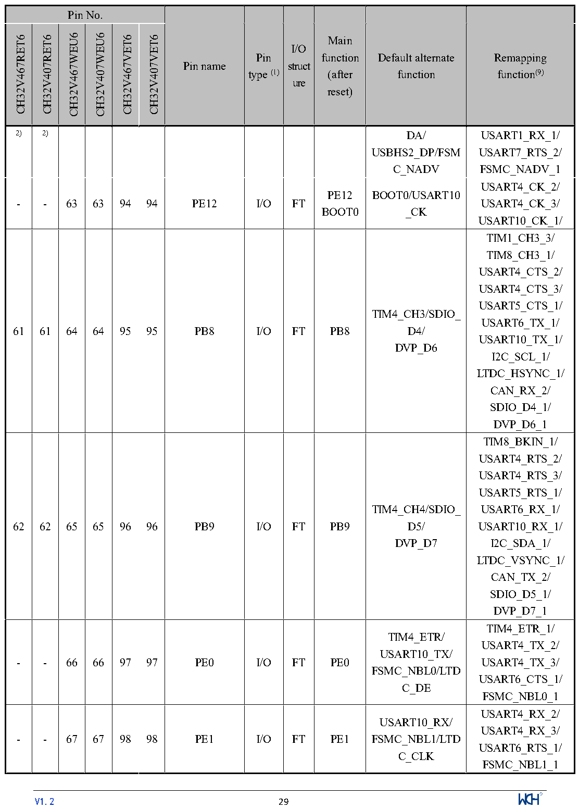

<!-- source-page: 32 -->

[← p.31](0031.md) · [index](../README.md) · [PDF p.32](https://ch32-riscv-ug.github.io/CH32V407/datasheet_en/CH32V407DS0.PDF#page=32) · [p.33 →](0033.md)

<!-- header: CH32V407/V467 Datasheet https://wch-ic.com -->

 <!-- p32-cluster-01 uncaptioned graphics, rendered from the PDF; verify at https://ch32-riscv-ug.github.io/CH32V407/datasheet_en/CH32V407DS0.PDF#page=32 -->

🖼 Text parsed from the figure above

<!-- p32-table-001 (table-2-1@1) -->
<table><tr><th colspan="6">Pin No.</th><th rowspan="2">Pin name</th><th rowspan="2" style="text-align:left">Pin type (1)</th><th rowspan="2" style="text-align:left">I/O struct ure</th><th rowspan="2" style="text-align:left">Main function (after reset)</th><th rowspan="2" style="text-align:left">Default alternate function</th><th rowspan="2" style="text-align:left">Remapping function(9)</th></tr><tr><td>CH32V467RET6</td><td>CH32V407RET6</td><td>CH32V467WEU6</td><td>CH32V407WEU6</td><td>CH32V467VET6</td><td>CH32V407VET6</td></tr><tr><td>2)</td><td>2)</td><td></td><td></td><td></td><td></td><td></td><td></td><td></td><td></td><td style="text-align:left">DA/ USBHS2_DP/FSMC_NADV</td><td style="text-align:left">USART1_RX_1/ USART7_RTS_2/ FSMC_NADV_1</td></tr><tr><td>-</td><td>-</td><td>63</td><td>63</td><td>94</td><td>94</td><td>PE12</td><td>I/O</td><td>FT</td><td style="text-align:left">PE12BOOT0</td><td style="text-align:left">BOOT0/USART10 _CK</td><td style="text-align:left">USART4_CK_2/ USART4_CK_3/ USART10_CK_1/</td></tr><tr><td>61</td><td>61</td><td>64</td><td>64</td><td>95</td><td>95</td><td>PB8</td><td>I/O</td><td>FT</td><td>PB8</td><td style="text-align:left">TIM4_CH3/SDIO_ D4/ DVP_D6</td><td style="text-align:left">TIM1_CH3_3/ TIM8_CH3_1/ USART4_CTS_2/ USART4_CTS_3/ USART5_CTS_1/ USART6_TX_1/ USART10_TX_1/ I2C_SCL_1/ LTDC_HSYNC_1/ CAN_RX_2/ SDIO_D4_1/ DVP_D6_1</td></tr><tr><td>62</td><td>62</td><td>65</td><td>65</td><td>96</td><td>96</td><td>PB9</td><td>I/O</td><td>FT</td><td>PB9</td><td style="text-align:left">TIM4_CH4/SDIO_ D5/ DVP_D7</td><td style="text-align:left">TIM8_BKIN_1/ USART4_RTS_2/ USART4_RTS_3/ USART5_RTS_1/ USART6_RX_1/ USART10_RX_1/ I2C_SDA_1/ LTDC_VSYNC_1/ CAN_TX_2/ SDIO_D5_1/ DVP_D7_1</td></tr><tr><td>-</td><td>-</td><td>66</td><td>66</td><td>97</td><td>97</td><td>PE0</td><td>I/O</td><td>FT</td><td>PE0</td><td style="text-align:left">TIM4_ETR/ USART10_TX/ FSMC_NBL0/LTDC_DE</td><td style="text-align:left">TIM4_ETR_1/ USART4_TX_2/ USART4_TX_3/ USART6_CTS_1/ FSMC_NBL0_1</td></tr><tr><td>-</td><td>-</td><td>67</td><td>67</td><td>98</td><td>98</td><td>PE1</td><td>I/O</td><td>FT</td><td>PE1</td><td style="text-align:left">USART10_RX/ FSMC_NBL1/LTDC_CLK</td><td style="text-align:left">USART4_RX_2/ USART4_RX_3/ USART6_RTS_1/ FSMC_NBL1_1</td></tr></table>

<!-- image: p32-draw-image-00001 inside the figure -->
<!-- footer: V1.2 29 -->

