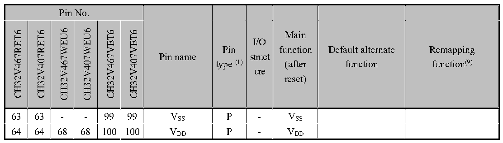

<!-- source-page: 33 -->

[← p.32](0032.md) · [index](../README.md) · [PDF p.33](https://ch32-riscv-ug.github.io/CH32V407/datasheet_en/CH32V407DS0.PDF#page=33) · [p.34 →](0034.md)

<!-- header: CH32V407/V467 Datasheet https://wch-ic.com -->

 <!-- p33-cluster-01 uncaptioned graphics, rendered from the PDF; verify at https://ch32-riscv-ug.github.io/CH32V407/datasheet_en/CH32V407DS0.PDF#page=33 -->

🖼 Text parsed from the figure above

<!-- p33-table-001 (table-2-1@1) -->
<table><tr><th colspan="6">Pin No.</th><th rowspan="2">Pin name</th><th rowspan="2" style="text-align:left">Pin type (1)</th><th rowspan="2" style="text-align:left">I/O struct ure</th><th rowspan="2" style="text-align:left">Main function (after reset)</th><th rowspan="2" style="text-align:left">Default alternate function</th><th rowspan="2" style="text-align:left">Remapping function(9)</th></tr><tr><td>CH32V467RET6</td><td>CH32V407RET6</td><td>CH32V467WEU6</td><td>CH32V407WEU6</td><td>CH32V467VET6</td><td>CH32V407VET6</td></tr><tr><td>63</td><td>63</td><td>-</td><td>-</td><td>99</td><td>99</td><td style="text-align:left">VSS</td><td>P</td><td>-</td><td style="text-align:left">VSS</td><td></td><td></td></tr><tr><td>64</td><td>64</td><td>68</td><td>68</td><td>100</td><td>100</td><td style="text-align:left">VDD</td><td>P</td><td>-</td><td style="text-align:left">VDD</td><td></td><td></td></tr></table>

<em>Note 1: Abbreviations in the table</em>  
<em>I = TTL/CMOS Schmitt input; O = CMOS tri-state output;</em>  
<em>A = Analog signal input or output; P = power; ETH = Ethernet signal;</em>  
<em>FT = 5V tolerance; HS = Support 100MHz high-speed.</em>  
<em>Note 2: Both VDD and VBAT can be connected with an internal analog switch to supply power to the backup</em>  
<em>area and the pins PC13, PC14 and PC15. This analog switch can only pass a limited current (3mA). When</em>  
<em>powered by VDD, PC14 and PC15 can be used for GPIO or LSE pins, and PC13 can be used as a</em>  
<em>general-purpose I/O port, TAMPER pin, RTC calibration clock, RTC alarm clock or second output; PC13,</em>  
<em>PC14, and PC15 can only operate at frequencies below 2MHz when used as GPIO output pins, with a</em>  
<em>maximum load capacitance of 30pF. They cannot be used as current sources (e.g., to drive LEDs). When the</em>  
<em>power is supplied by VBAT, PC14 and PC15 can only be used for LSE pin, and PC13 can be used as TAMPER</em>  
<em>pin, RTC alarm clock or second output;</em>  
<em>Note 3: These pins are in the main function state when the backup area is powered on for the first time. Even</em>  
<em>after reset, the state of these pins is controlled by the backup area registers (these registers will not be reset</em>  
<em>by the main reset system). For specific information on how to control these I/O ports, please refer to the</em>  
<em>relevant chapters on the battery backup area and BKP register in the CH32FV2x_V3xRM;</em>  
<em>Note 4: For the CH32V407WEU6, CH32V407RET6, CH32V467WEU6, and CH32V467RET6 chips, pins 5</em>  
<em>and 6 are configured by default as OSC_IN and OSC_OUT after chip reset. The software can reconfigure</em>  
<em>these two pins as PD0 and PD1; in this case, PD0 and PD1 are non-FT pins. However, for the</em>  
<em>CH32V407VET6 and CH32V467VET6 chips, since PD0 and PD1 are inherent function pins, there is no need</em>  
<em>for software remapping; in this case, PD0 and PD1 are FT pins. For more detailed information, please refer</em>  
<em>to the “Multifunction I/O” and &quot;Debug Settings&quot; sections of the CH32FV407RM.</em>  
<em>Note 5: For chips where neither the BOOT0/PE12 nor the BOOT1/PB2 pins are brought out, the internal</em>  
<em>BOOT0/PE12 pin is shorted to VSS, while the BOOT1/PB2 pin is left floating. In low-power modes, it is</em>  
<em>recommended to configure PE12 and PB2 as pull-down input modes to prevent the generation of additional</em>  
<em>current.</em>  
<em>For chips where the BOOT1/PB2 pin is exposed but the BOOT0/PE12 pin is not, the internal</em>  
<em>BOOT0/PE12 pin is shorted to VSS. In low-power modes, it is recommended to configure the PE12 input</em>  
<em>mode as a pull-down to prevent additional current draw.</em>  
<em>For chips where the BOOT0/PE12 pins are brought out but the BOOT1/PB2 pins are not, the internal</em>  
<em>BOOT1/PB2 pins are internally shorted to VSS. In low-power conditions, it is recommended to configure the</em>  
<em>PB2 pin as a pull-down input to prevent additional current consumption.</em>  
<em>A pull-down resistor should be connected to the BOOT0/PE12 pin to ensure that BOOT0 remains at a</em>  
<em>low level during power-up, allowing the device to enter boot mode in program flash memory. Once normal</em>  
<!-- image: p33-draw-image-00001 bbox=[513.84, 782.04, 535.56, 793.8] -->
<!-- footer: V1.2 30 -->
