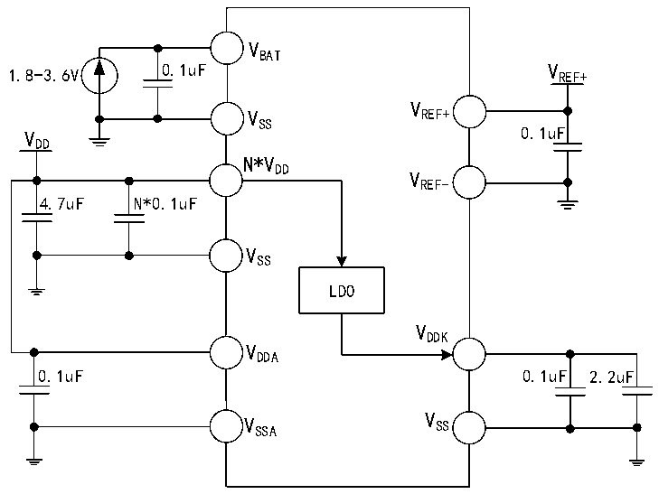

<!-- source-page: 49 -->

[← p.48](0048.md) · [index](../README.md) · [PDF p.49](https://ch32-riscv-ug.github.io/CH32V407/datasheet_en/CH32V407DS0.PDF#page=49) · [p.50 →](0050.md)

<!-- header: CH32V407/V467 Datasheet https://wch-ic.com -->

# Chapter 3 Electrical Characteristics

## 3.1 Test Conditions

Unless otherwise specified and marked, all voltages are referenced to VSS.  
All minimum and maximum values are guaranteed in the worst conditions of ambient temperature, supply voltage  
and clock frequency.  
The typical values for the CH32V407 are provided as design guidelines based on an ambient temperature of 25°C,  
a supply voltage of VDD= VDDA= 3.3V, and a VDDK of 1.2V.  
The typical specifications for the CH32V467 are provided as a design guide based on an ambient temperature of  
25°C, with a supply voltage of VDD= VDDA= 3.3V, resulting in VDD18= 1.8V and VDDK= 1.2V.  
The data based on comprehensive evaluation, design simulation or technology characteristics are not tested in  
production. On the basis of comprehensive evaluation, the minimum and maximum values refer to sample tests.  
Unless otherwise specified that is tested, the characteristic parameters are guaranteed by comprehensive evaluation  
or design.  
Power supply scheme:  

Figure 3-1-1 CH32V407 standard power supply typical circuit  
 <!-- rendered from the PDF; verify at https://ch32-riscv-ug.github.io/CH32V407/datasheet_en/CH32V407DS0.PDF#page=49 -->

🖼 Text parsed from the figure above

VBAT  
1.8-3.6V 0.1uF V REF+  
V  
V REF+  
SS  
V 0.1uF  
DD  
N*VDD  
VREF-  
4.7uF N*0.1uF  
VSS  
LDO  
VDDK  
VDDA  
0.1uF 0.1uF 2.2uF  
V SSA V SS  

<em>Note: For the CH32V407 chip, there are multiple VDD pins on the chip package; pins with the same name</em>  
<em>must be shorted together.</em>  
<em>The main VDD pin (adjacent to the Ethernet signal pin) should be connected to a 0.1uF decoupling capacitor</em>  
<em>in parallel with a capacitor of at least 4.7uF capacity; the remaining VDD pins only need to be connected to a</em>  
<em>0.1uF decoupling capacitor.</em>  
<!-- image: p49-draw-image-00001 bbox=[518.4, 783.36, 537.84, 793.92] -->
<!-- footer: V1.2 46 -->
