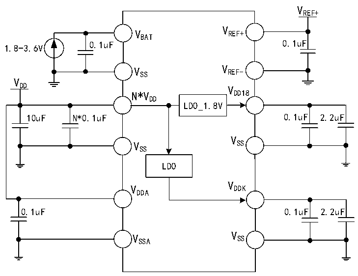

<!-- source-page: 50 -->

[← p.49](0049.md) · [index](../README.md) · [PDF p.50](https://ch32-riscv-ug.github.io/CH32V407/datasheet_en/CH32V407DS0.PDF#page=50) · [p.51 →](0051.md)

<!-- header: CH32V407/V467 Datasheet https://wch-ic.com -->

Figure 3-1-2 CH32V467 standard power supply typical circuit  
 <!-- rendered from the PDF; verify at https://ch32-riscv-ug.github.io/CH32V407/datasheet_en/CH32V407DS0.PDF#page=50 -->

🖼 Text parsed from the figure above

VREF+  
V  
V REF+  
BAT  
0.1uF 0.1uF  
1.8-3.6V  
V SS V REF-  
V  
DD V  
N*V DD18  
DD  
LDO_1.8V  
10uF N*0.1uF 0.1uF 2.2uF  
V  
V SS  
SS  
LDO  
V  
V DDK  
DDA  
0.1uF 0.1uF 2.2uF  
V SSA V SS  

<em>Note: For the CH32V467 chip, there are multiple pins labeled VDD on the chip package; power pins with the</em>  
<em>same name must be shorted together.</em>  
<em>The main VDD pin (adjacent to the Ethernet signal pins) should be connected to a decoupling capacitor</em>  
<em>consisting of a 0.1uF capacitor in parallel with a 10uF capacitor, with a total capacitance not less than the</em>  
<em>combined total capacitance of VDDK and VDD18. The remaining VDD pins only need to be connected to a 0.1uF</em>  
<em>decoupling capacitor.</em>  

## 3.2 Absolute Maximum Ratings

Stresses at or above the absolute maximum ratings listed in the table below may cause permanent damage to  
the device.  

<!-- p50-table-001 (table-3-1@1) pages 50-51 -->
<table><caption>Table 3-1 Absolute maximum ratings</caption><tr><th>Symbol</th><th>Description</th><th>Min.</th><th>Max.</th><th>Unit</th></tr><tr><td style="text-align:left">TA</td><td>Ambient temperature during operation</td><td>-40</td><td>85</td><td>℃</td></tr><tr><td style="text-align:left">TS</td><td>Ambient temperature during storage</td><td>-40</td><td>125</td><td>℃</td></tr><tr><td style="text-align:left">VDD</td><td style="text-align:left">External main supply voltage (including V and V ) DD DDA</td><td>-0.3</td><td>4.0</td><td>V</td></tr><tr><td style="text-align:left">VDDK</td><td>Power decoupling end of core circuit</td><td>-0.2</td><td>1.5</td><td>V</td></tr><tr><td style="text-align:left">VREF+</td><td style="text-align:left">Positive reference voltage of ADC and DAC modules</td><td>-0.3</td><td style="text-align:left">V +0.3DDA</td><td>V</td></tr><tr><td rowspan="3" style="text-align:left">VIN</td><td>Input voltage on FT (tolerant 5V) pin.</td><td>-0.3</td><td>5.5</td><td>V</td></tr><tr><td style="text-align:left">Input voltage on USB 2.0 and Ethernet PHY pins</td><td>-0.3</td><td style="text-align:left">V +0.3DD</td><td>V</td></tr><tr><td style="text-align:left">Input voltage on other pins (supplied by V ) DD</td><td>-0.3</td><td style="text-align:left">V +0.3DD</td><td>V</td></tr><tr><td style="text-align:left">| V | DD_x</td><td style="text-align:left">Voltage difference between V of main power supply pin DD</td><td></td><td>20</td><td>mV</td></tr><tr><td style="text-align:left">| V | SS_x</td><td style="text-align:left">Voltage difference between V of common ground pin SS</td><td></td><td>20</td><td>mV</td></tr><tr><td rowspan="3" style="text-align:left">△ △ VESDIO(HBM)</td><td style="text-align:left">ESD electrostatic discharge voltage (HBM) of I/O pin</td><td colspan="2">4K</td><td>V</td></tr><tr><td>USB pins (PA11, PA12, PB6, PB7)</td><td colspan="2">4K</td><td>V</td></tr><tr><td>ETH pin (MDI*)</td><td colspan="2">4K</td><td>V</td></tr><tr><td style="text-align:left">IVDD</td><td style="text-align:left">Total current of all V main supply pins DD</td><td></td><td>250</td><td>mA</td></tr><tr><td style="text-align:left">IVSS</td><td style="text-align:left">Total current of all V common ground pins SS</td><td></td><td>250</td><td>mA</td></tr><tr><td rowspan="2" style="text-align:left">IIO</td><td>Sink current on any I/O and control pin</td><td></td><td>25</td><td rowspan="2">mA</td></tr><tr><td style="text-align:left">Output current on any I/O and control pin</td><td></td><td>-25</td></tr></table>

<!-- image: p50-draw-image-00001 bbox=[518.4, 783.36, 537.84, 793.92] -->
<!-- footer: V1.2 47 -->
