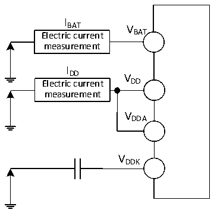

<!-- source-page: 52 -->

[← p.51](0051.md) · [index](../README.md) · [PDF p.52](https://ch32-riscv-ug.github.io/CH32V407/datasheet_en/CH32V407DS0.PDF#page=52) · [p.53 →](0053.md)

<!-- header: CH32V407/V467 Datasheet https://wch-ic.com -->

### 3.3.2 Embedded Reset and Power Control Block Characteristics

<!-- p52-table-001 (table-3-4@1) -->
<table><caption>Table 3-4 Reset and voltage monitor</caption><tr><th>Symbol</th><th>Parameter</th><th>Condition</th><th>Min.</th><th>Typ.</th><th>Max.</th><th>Unit</th></tr><tr><td rowspan="8" style="text-align:left">V (1) PVD</td><td rowspan="8" style="text-align:left">Programmable voltage detector level selection</td><td>PLS[1:0] = 00 (rising edge)</td><td></td><td>2.85</td><td></td><td>V</td></tr><tr><td>PLS[1:0] = 00 (falling edge)</td><td></td><td>2.81</td><td></td><td>V</td></tr><tr><td>PLS[1:0] = 01 (rising edge)</td><td></td><td>2.94</td><td></td><td>V</td></tr><tr><td>PLS[1:0] = 01 (falling edge)</td><td></td><td>2.90</td><td></td><td>V</td></tr><tr><td>PLS[1:0] = 10 (rising edge)</td><td></td><td>3.04</td><td></td><td>V</td></tr><tr><td>PLS[1:0] = 10 (falling edge)</td><td></td><td>3.00</td><td></td><td>V</td></tr><tr><td>PLS[1:0] = 11 (rising edge)</td><td></td><td>3.14</td><td></td><td>V</td></tr><tr><td>PLS[1:0] = 11 (falling edge)</td><td></td><td>3.10</td><td></td><td>V</td></tr><tr><td style="text-align:left">VPVDhyst</td><td>PVD hysteresis</td><td></td><td></td><td>0.04</td><td></td><td>V</td></tr><tr><td rowspan="2" style="text-align:left">VPOR/PDR</td><td rowspan="2" style="text-align:left">Power-on/power-down reset threshold</td><td>Rising edge</td><td></td><td>2.72</td><td></td><td>V</td></tr><tr><td>Falling edge</td><td></td><td>2.69</td><td></td><td>V</td></tr><tr><td style="text-align:left">VPDRhyst</td><td>PDR hysteresis</td><td></td><td></td><td>30</td><td></td><td>mV</td></tr><tr><td rowspan="2" style="text-align:left">t RSTTEMPO</td><td>Power on reset</td><td></td><td>16</td><td>28</td><td>30</td><td>ms</td></tr><tr><td>Other reset</td><td></td><td>2</td><td>10</td><td>30</td><td>ms</td></tr></table>

<em>Note: 1. Normal temperature test value.</em>  

### 3.3.3 Embedded Reference Voltage

<!-- p52-table-002 (table-3-5@1) -->
<table><caption>Table 3-5 Embedded reference voltage</caption><tr><th>Symbol</th><th>Parameter</th><th>Condition</th><th>Min.</th><th>Typ.</th><th>Max.</th><th>Unit</th></tr><tr><td style="text-align:left">VREFINT</td><td>Internal reference voltage</td><td style="text-align:left">T = -40℃~85℃ A</td><td>1.17</td><td>1.2</td><td>1.23</td><td>V</td></tr><tr><td style="text-align:left">TS_vrefint</td><td style="text-align:left">ADC sampling time when reading the internal reference voltage</td><td></td><td>8</td><td></td><td></td><td>us</td></tr></table>

### 3.3.4 Supply Current Characteristics

Current consumption is a comprehensive index of a variety of parameters and factors. These parameters and  
factors include operating voltage, ambient temperature, I/O pin load, the software configuration of the  
product, the operating frequency, flip rate of the I/O pin, the location of the program in memory and the  
executed code, etc. The current consumption measurement method is as follows:  

Figure 3-2-1 CH32V407 Current consumption measurement  
 <!-- rendered from the PDF; verify at https://ch32-riscv-ug.github.io/CH32V407/datasheet_en/CH32V407DS0.PDF#page=52 -->

🖼 Text parsed from the figure above

I  
BAT V  
Electric current BAT  
measurement  
I  
DD V  
Electric current DD  
measurement  
VDDA  
VDDK  

<!-- image: p52-draw-image-00001 bbox=[518.4, 783.36, 537.84, 793.92] -->
<!-- footer: V1.2 49 -->
