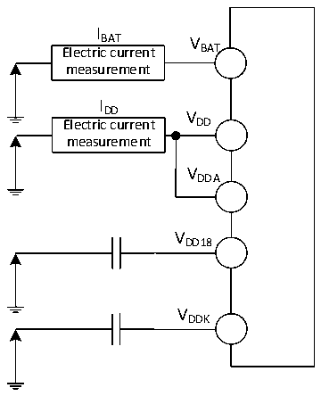

<!-- source-page: 53 -->

[← p.52](0052.md) · [index](../README.md) · [PDF p.53](https://ch32-riscv-ug.github.io/CH32V407/datasheet_en/CH32V407DS0.PDF#page=53) · [p.54 →](0054.md)

<!-- header: CH32V407/V467 Datasheet https://wch-ic.com -->

Figure 3-2-2 CH32V467 Current consumption measurement  
 <!-- rendered from the PDF; verify at https://ch32-riscv-ug.github.io/CH32V407/datasheet_en/CH32V407DS0.PDF#page=53 -->

🖼 Text parsed from the figure above

I  
BAT V  
Electric current BAT  
measurement  
I  
DD V  
Electric current DD  
measurement  
VDDA  
VDD18  
VDDK  

CH32V407 is in the following conditions:  
Under normal operating conditions (VDD= VDDA= 3.3V, VDDK= 1.2V), during testing: Configure all I/O  
ports as pull-down inputs; enable only one of HSE or HSI; set HSE to 25MHz and HSI to 20MHz  
(calibrated); set FPCLK1 and FPCLK2 to FHCLK; enable the PLL when FHCLK&gt; HSE or HSI. Measure the power  
consumption when enabling or disabling all peripheral clocks.  
CH32V467 is in the following conditions:  
Under normal operating conditions (VDD= VDDA= 3.3V, VDD18= 1.8V, VDDK= 1.2V), during testing:  
Configure all I/O ports as pull-down inputs; enable only one of HSE or HSI; set HSE to 25MHz and HSI to  
20MHz (calibrated); set FPCLK1 and FPCLK2 to FHCLK; when FHCLK&gt; HSE or HSI, the PLL is enabled. Measure  
the power consumption when enabling or disabling all peripheral clocks.  

<!-- p53-table-001 (table-3-6@1) pages 53-54 -->
<table><caption>Table 3-6 Typical current consumption of CH32V407 in Run mode, and data processing code runs from internal flash memory</caption><tr><th rowspan="3">Symbol</th><th rowspan="3">Parameter</th><th rowspan="3" colspan="2">Condition</th><th colspan="2">Typ.</th><th rowspan="3">Unit</th></tr><tr><td rowspan="2" style="text-align:left">All peripherals enabled</td><td>All peripherals</td></tr><tr><td>disabled</td></tr><tr><td rowspan="6" style="text-align:left">I (1)(2) DD</td><td rowspan="6" style="text-align:left">Supply current in Run mode</td><td rowspan="6">External clock</td><td style="text-align:left">F = HCLK240MHz</td><td>47.5</td><td>25.0</td><td rowspan="6">mA</td></tr><tr><td style="text-align:left">F = HCLK200MHz</td><td>40.1</td><td>22.6</td></tr><tr><td style="text-align:left">F = HCLK175MHz</td><td>35.3</td><td>19.6</td></tr><tr><td style="text-align:left">F = HCLK120MHz</td><td>30.2</td><td>18.8</td></tr><tr><td style="text-align:left">F = HCLK60MHz</td><td>15.8</td><td>10.3</td></tr><tr><td style="text-align:left">F = HCLK20MHz</td><td>6.1</td><td>3.8</td></tr><tr><td rowspan="6" style="text-align:left">Run in high-speed internal RC oscillator (HSI), HB prescaler is used to reduce the frequency.</td><td style="text-align:left">F = HCLK240MHz</td><td>46.1</td><td>24.1</td></tr><tr><td style="text-align:left">F = HCLK200MHz</td><td>39.1</td><td>21.5</td></tr><tr><td style="text-align:left">F = HCLK175MHz</td><td>35.0</td><td>18.7</td></tr><tr><td style="text-align:left">F = HCLK120MHz</td><td>24.2</td><td>13.0</td></tr><tr><td style="text-align:left">F = HCLK60MHz</td><td>13.2</td><td>7.4</td></tr><tr><td style="text-align:left">F = HCLK20MHz</td><td>4.5</td><td>2.6</td></tr></table>

<!-- image: p53-draw-image-00001 bbox=[518.4, 783.36, 537.84, 793.92] -->
<!-- footer: V1.2 50 -->
