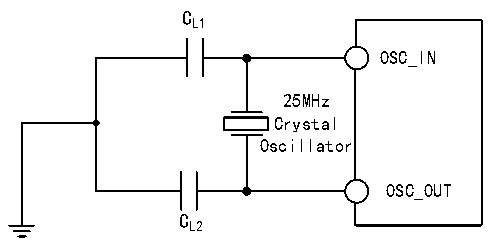

<!-- source-page: 57 -->

[← p.56](0056.md) · [index](../README.md) · [PDF p.57](https://ch32-riscv-ug.github.io/CH32V407/datasheet_en/CH32V407DS0.PDF#page=57) · [p.58 →](0058.md)

<!-- header: CH32V407/V467 Datasheet https://wch-ic.com -->

> ⬆ **Table continued** — rendered in full at [page 56](0056.md). <!-- p57-table-001 -->

<em>Note 1: It is recommended that the crystal&#x27;s ESR does not exceed 80Ω. Prioritize crystals with lower ESR</em>  
<em>values. Refer to the crystal manual for load capacitance requirements.</em>  
<em>2. Start time refers to the time difference from HSEON being activated until HSERDY is set.</em>  
<em>3. Ethernet or high-speed USB applications typically require an HSE; a 25MHz crystal is recommended,</em>  
<em>with a jitter of no more than 30ppm.</em>  
Circuit reference design and requirements:  
The load capacitance of the crystal is subject to the recommendation of the crystal manufacturer, generally  
CL1=CL2.  

Figure 3-5 Typical circuit of external 25M crystal  
 <!-- rendered from the PDF; verify at https://ch32-riscv-ug.github.io/CH32V407/datasheet_en/CH32V407DS0.PDF#page=57 -->

🖼 Text parsed from the figure above

CL1  
OSC_IN  
25MHz  
Crystal  
Oscillator  
OSC_OUT  
CL2  

(fLSE=32.768kHz)  

<!-- p57-table-002 (table-3-12@1) -->
<table><caption>Table 3-12 Low-speed external clock generated by generated from a crystal/ceramic resonator</caption><tr><th>Symbol</th><th>Parameter</th><th>Condition</th><th>Min.</th><th>Typ.</th><th>Max.</th><th>Unit</th></tr><tr><td style="text-align:left">RF</td><td>Feedback resistance</td><td></td><td></td><td>5</td><td></td><td>MΩ</td></tr><tr><td>C</td><td style="text-align:left">Recommended load capacitance and corresponding crystal serial impedance RS</td><td style="text-align:left">R &lt;70kΩS</td><td></td><td></td><td>15</td><td>pF</td></tr><tr><td style="text-align:left">i 2</td><td>LSE drive current</td><td style="text-align:left">V = 3.3VDD</td><td></td><td>0.35</td><td></td><td>uA</td></tr><tr><td style="text-align:left">g m</td><td>Oscillator transconductance</td><td>Startup</td><td></td><td>25.3</td><td></td><td>uA/V</td></tr><tr><td style="text-align:left">t SU(LSE)</td><td>Startup time</td><td style="text-align:left">V is stable DD</td><td></td><td>800</td><td></td><td>mS</td></tr></table>

Circuit reference design and requirements:  
The load capacitance of the crystal is subject to the recommendation of the crystal manufacturer, usually  
CL1=CL2, which is about 12pF.  
<!-- image: p57-draw-image-00001 bbox=[518.4, 783.36, 537.84, 793.92] -->
<!-- footer: V1.2 54 -->
