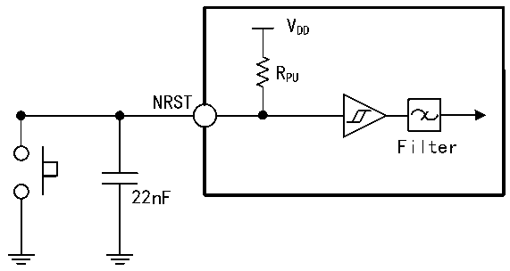

<!-- source-page: 61 -->

[← p.60](0060.md) · [index](../README.md) · [PDF p.61](https://ch32-riscv-ug.github.io/CH32V407/datasheet_en/CH32V407DS0.PDF#page=61) · [p.62 →](0062.md)

<!-- header: CH32V407/V467 Datasheet https://wch-ic.com -->

> ⬆ **Table continued** — rendered in full at [page 60](0060.md). <!-- p61-table-001 -->

<em>Note: 1. When used as GPIO output pins, PC13, PC14, and PC15 can only operate at frequencies below 2</em>  
<em>MHz, with a maximum drive load of 30 pF.</em>  
<em>2. The USB interface I/O complies only with the MODEx[1:0]=10b or 01b parameter.</em>  

### 3.3.11 NRST Pin Characteristics

Circuit reference design and requirements:  

Figure 3-7 Typical circuit of external reset pin  
 <!-- rendered from the PDF; verify at https://ch32-riscv-ug.github.io/CH32V407/datasheet_en/CH32V407DS0.PDF#page=61 -->

🖼 Text parsed from the figure above

VDD  
RPU  
NRST  
Filter  
22nF  

<em>Note: The capacitor shown in the diagram is optional and can be used to filter out key bounce.</em>  

<!-- p61-table-003 (table-3-22@1) pages 61-62 -->
<table><caption>Table 3-22 External reset pin characteristics</caption><tr><th>Symbol</th><th>Parameter</th><th>Condition</th><th>Min.</th><th>Typ.</th><th>Max.</th><th>Unit</th></tr><tr><td style="text-align:left">VIL(NRST)</td><td>NRST input low-level voltage</td><td></td><td>-0.3</td><td></td><td style="text-align:left">0.28*(V -1.8)+0.6DD</td><td>V</td></tr><tr><td style="text-align:left">VIH（NRST）</td><td>NRST input high-level voltage</td><td></td><td style="text-align:left">0.41*(V -1.8)+1.3DD</td><td></td><td style="text-align:left">V +0.3DD</td><td>V</td></tr><tr><td style="text-align:left">V hys(NRST)</td><td style="text-align:left">NRST Schmitt Trigger voltage hysteresis</td><td></td><td>150</td><td></td><td></td><td>mV</td></tr><tr><td style="text-align:left">R (1) PU</td><td>Pull-up equivalent resistance</td><td></td><td>30</td><td>40</td><td>50</td><td>kΩ</td></tr><tr><td style="text-align:left">VF(NRST)</td><td>NRST input filtered pulse width</td><td></td><td></td><td></td><td>100</td><td>ns</td></tr><tr><td style="text-align:left">VNF(NRST)</td><td>NRST input not filtered pulse width</td><td></td><td>300</td><td></td><td></td><td>ns</td></tr></table>

<!-- image: p61-draw-image-00001 bbox=[518.4, 783.36, 537.84, 793.92] -->
<!-- footer: V1.2 58 -->
