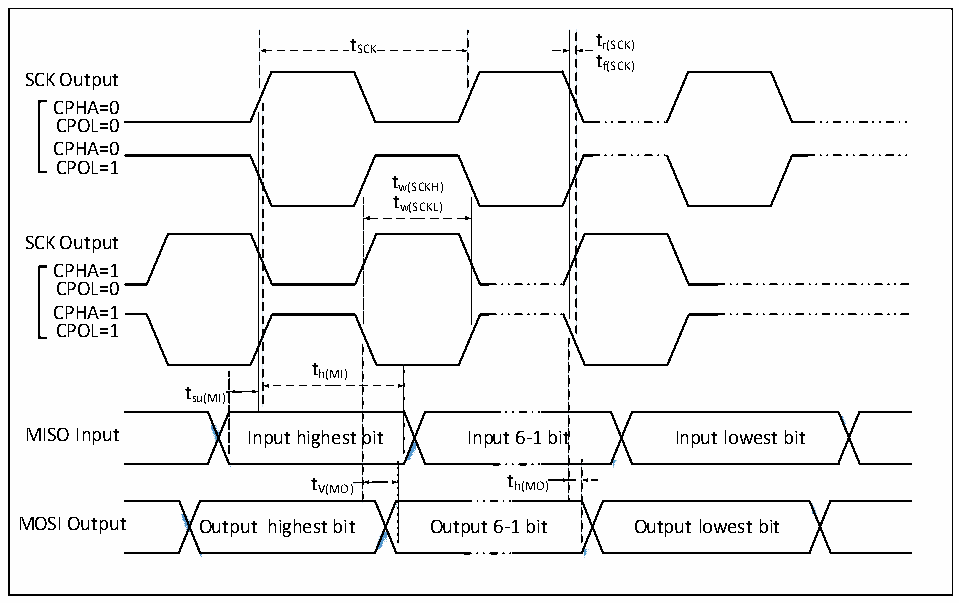

<!-- source-page: 63 -->

[← p.62](0062.md) · [index](../README.md) · [PDF p.63](https://ch32-riscv-ug.github.io/CH32V407/datasheet_en/CH32V407DS0.PDF#page=63) · [p.64 →](0064.md)

<!-- header: CH32V407/V467 Datasheet https://wch-ic.com -->

> ⬆ **Table continued** — rendered in full at [page 62](0062.md). <!-- p63-table-001 -->

### 3.3.14 I3C Interface Characteristics

<!-- p63-table-002 (table-3-25@1) -->
<table><caption>Table 3-25 I3C interface characteristics</caption><tr><th>Symbol</th><th>Parameter</th><th>Condition</th><th>Min.</th><th>Max.</th><th>Unit</th></tr><tr><td style="text-align:left">t (1) r(SDA)_OD</td><td>SDA rise time in open-drain mode</td><td></td><td>100</td><td></td><td>ns</td></tr><tr><td style="text-align:left">t (1) r(SDA)_PP</td><td>SDA rise time in push-pull mode</td><td></td><td>5.1</td><td></td><td>ns</td></tr></table>

<em>Note: 1. tr(SDA)_OD and tr(SDA)_PP are guaranteed design parameters and can be configured via register</em>  
<em>R32_I3C_TIMINGR0. For other timing parameters, refer to the MIPI protocol.</em>  

### 3.3.15 SPI Interface Characteristics

Figure 3-9 SPI timing diagram in Master mode  
 <!-- rendered from the PDF; verify at https://ch32-riscv-ug.github.io/CH32V407/datasheet_en/CH32V407DS0.PDF#page=63 -->

🖼 Text parsed from the figure above

t SCK t r(SCK)  
tf(SCK)  
SCK Output  
CPHA=0  
CPOL=0  
CPHA=0  
CPOL=1  
tw(SCKH)  
tw(SCKL)  
SCK Output  
CPHA=1  
CPOL=0  
CPHA=1  
CPOL=1  
th(MI)  
tsu(MI)  
<!-- image: p63-draw-image-00002 inside the figure -->
<!-- image: p63-draw-image-00003 inside the figure -->
<!-- image: p63-draw-image-00004 inside the figure -->
<!-- image: p63-draw-image-00005 inside the figure -->
bit  t V(MO)  )  
)  
MISO Input Input highest bit Input 6-1 bit Input lowest bit  
t V(MO) t h(MO)  
<!-- image: p63-draw-image-00006 inside the figure -->
<!-- image: p63-draw-image-00007 inside the figure -->
<!-- image: p63-draw-image-00008 inside the figure -->
<!-- image: p63-draw-image-00009 inside the figure -->
MOSI Output Output highest bit Output 6-1 bit Output lowest bit  

<!-- image: p63-draw-image-00001 bbox=[518.4, 783.36, 537.84, 793.92] -->
<!-- footer: V1.2 60 -->
