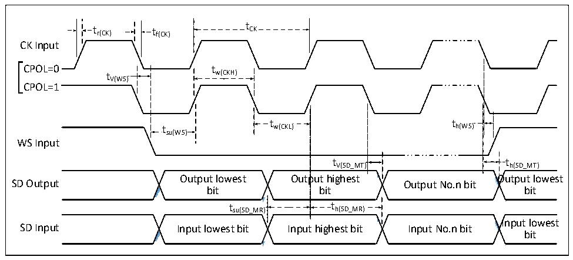

<!-- source-page: 65 -->

[← p.64](0064.md) · [index](../README.md) · [PDF p.65](https://ch32-riscv-ug.github.io/CH32V407/datasheet_en/CH32V407DS0.PDF#page=65) · [p.66 →](0066.md)

<!-- header: CH32V407/V467 Datasheet https://wch-ic.com -->

> ⬆ **Table continued** — rendered in full at [page 64](0064.md). <!-- p65-table-001 -->

### 3.3.16 I2S Interface Characteristics

Figure 3-12 I2S Bus master mode timing diagram  
 <!-- rendered from the PDF; verify at https://ch32-riscv-ug.github.io/CH32V407/datasheet_en/CH32V407DS0.PDF#page=65 -->

🖼 Text parsed from the figure above

t  
t r(CK) t f(CK) CK  
CK Input  
CPOL=0t tw(CKH)  
V(WS)  
CPOL=1  
t t  
t w(CKL) h(WS)  
su(WS)  
WS Input  
t V(SD_MT)  
tV(SD_MT) th(SD_MT)  
<!-- image: p65-draw-image-00002 inside the figure -->
<!-- image: p65-draw-image-00003 inside the figure -->
<!-- image: p65-draw-image-00004 inside the figure -->
<!-- image: p65-draw-image-00005 inside the figure -->
Output lowest Output highest Output lowest  
SD Output Output No.n bit  
bit bit bit  
t  t h(SD_MR)  t  th(SD_MR)  
t su(SD_MR) t h(SD_MR)  
<!-- image: p65-draw-image-00006 inside the figure -->
<!-- image: p65-draw-image-00007 inside the figure -->
<!-- image: p65-draw-image-00008 inside the figure -->
<!-- image: p65-draw-image-00009 inside the figure -->
Input lowest  
SD Input Input lowest bit Input highest bit Input No.n bit  
bit  

<!-- image: p65-draw-image-00001 bbox=[518.4, 783.36, 537.84, 793.92] -->
<!-- footer: V1.2 62 -->
